# Autoware 软件开发指南

    

## 目录

* [一、Autoware 概述及安装指南](#jump1.0)

* [二、Autoware 感知模块解析](#jump2.0)
  
  * [2.1 基于Darknet的Yolov3图像识别](#jump2.1)
  * [2.2 voxel_grid_filter点云降采样程序注解](#jump2.2)
  * [2.3 ring_ground_filter地面点云去除程序注解](#jump2.3)

* [三、Autoware 定位模块解析](#jump3.0)
  
  * [3.0 基础知识](#jump3.0.0)
  * [3.1 ndt_mapping节点解析](#jump3.1)
  * [3.2 ndt_matching节点解析](#jump3.2)

* [四、Autoware 决策规划模块解析](#jump4.0)
  
  * [4.1 节点waypoint_loader](#jump4.1)
  * [4.2 节点waypoint_replanner](#jump4.2)
  * [4.3 节点lane_navi](#jump4.3)
  * [4.4 节点lane_rule](#jump4.4)
  * [4.5 节点lane_select](#jump4.5)
  * [4.6 节点 astar_avoid](#jump4.6)
  * [4.7 节点velocity_set](#jump4.7)

* [五、Autoware 控制模块解析](#jump5.0)
  
  * [5.1 节点pure_pursuit](#jump5.1)
  * [5.2 节点twist_filter](#jump5.2)
  * [5.3 节点listener_car_drive](#jump5.3)

<span id="jump1.0"></span>

## 一、Autoware 概述及安装指南

### 1.1    Autoware简介

​        Autoware最早是由名古屋大学研究小组在加藤伸平教授(Prof. Shinpei  Kato)的领导下于2015年8月正式发布。2015年12月下旬，加藤伸平教授创立了Tier  IV，以维护Autoware并将其应用于真正的自动驾驶汽车。随着时间的流逝，Autoware已成为公认的开源项目。Autoware也是世界上第一个用于自动驾驶技术的“多合一”开源软件。Autoware.ai版本基于ROS 1，并在Apache  2.0许可下可用。Autoware的功能主要适合与城市，但也可以覆盖高速公路。支持以下功能：路径规划、路径跟随、加速/制动/转向控制、数据记录、汽车/行人/物体检测、3D本地化、3D映射、交通信号检测、交通灯识别、车道检测、对象跟踪、传感器校准、传感器融合、面向云的地图连接自动化、智能手机导航、软件仿真、虚拟现实等。

​        Autoware作为第一款开源的自动驾驶框架，当前各大自动驾驶公司的框架几乎都借鉴过，Autoware框架是理解自动驾驶系统知识最好的学习模板之一。其包含了自动驾驶所有关键技术模块：建图、定位、感知、规划和运动控制。

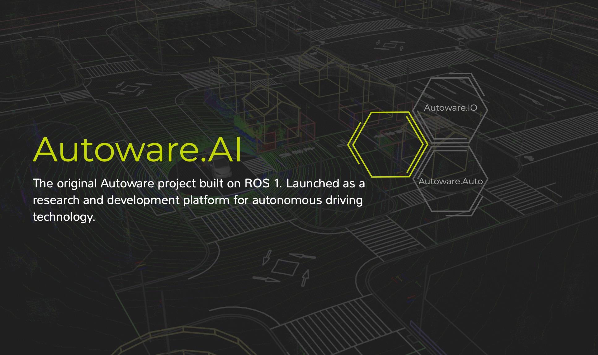

### 1.2    Autoware主体框架

​        autoware主要包括sensing、computing（perception、decision、planning）、actuation等几个部分，如下图所示。

​        sensing模块对应的是各类传感器对真实世界中各类数据的采样，例如camera采样图像、LiDAR采样激光点云等，采样数据属于未处理的原始数据，需要输入到computing模块进行计算处理。

​        computing模块主要是为了对传感器采样的原始数据进行加工处理，最后以为实现安全高效的导航为目的，将规划结果输出给actuation模块。其中computing模块主要分为三个小模块。① perception（感知模块），这部分要处理localization（通过车辆当前采集传感器数据和已有地图进行自身定位，若无地图需要通过SLAM构建地图），然后detection模块负责检测周围与车辆有场景交互的非自身个体（车辆、行人等），prediction模块会对检测初得物体进行未来预测估计，以便提前规划防止碰撞。② decision（决策模块），根据之前感知的结果，Autoware决策一个由有限状态机表示的驾驶行为，以便可以选择适当的计划功能。当前的决策方法是基于规则的系统。③ planning（规划模块），主要是根据决策和起始点和目标点，采用mission和motion模块可以计算出一条kinodynamic的路径。④ actuation模块，表示驱动器模块，如YMC驱动器等，接收planning模块出来的规划结果，通过驱动器实现驱动控制。

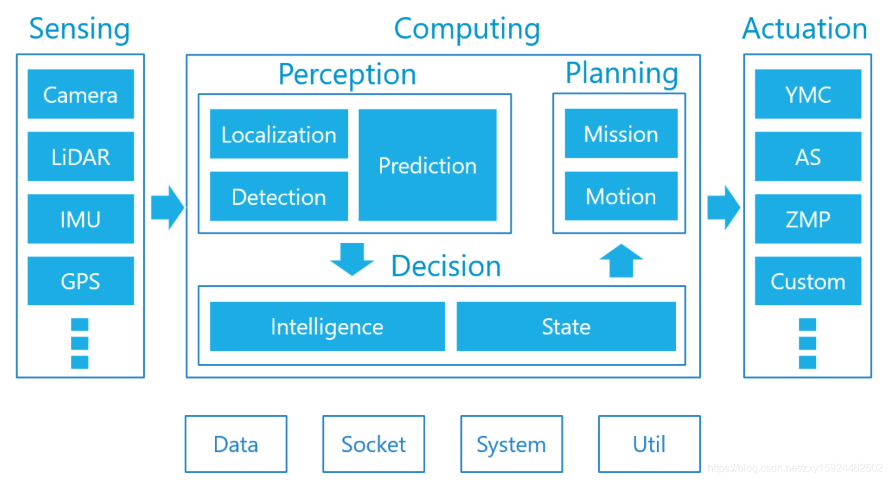

​        其各个模块都有对应不同的ros节点，如下图所示：

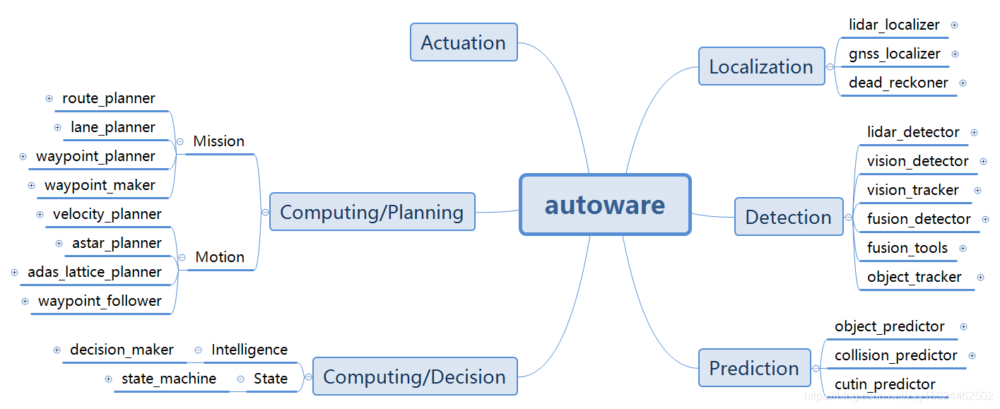

### 1.3    Autoware安装指南

#### 1.3.1    系统版本及驱动确认

​        请确认系统版本为Ubuntu18.04，并正确安装英伟达显卡驱动460版本、CUDA版本10.0、cuDNN版本10.0。系统及驱动安装教程不再赘述。

#### 1.3.2    安装caffe

##### ① caffe相关依赖包

```
$ sudo apt install -y libprotobuf-dev libleveldb-dev libsnappy-dev libopencv-dev libhdf5-serial-dev protobuf-compiler
$ sudo apt install -y --no-install-recommends libboost-all-dev
$ sudo apt install -y libgflags-dev libgoogle-glog-dev liblmdb-dev
```

##### ② 安装caffe

```
sudo apt install caffe-cuda
```

#### 1.3.3    安装eigen3.3.7

```
$ cd && wget http://bitbucket.org/eigen/eigen/get/3.3.7.tar.gz
$ mkdir eigen && tar --strip-components=1 -xzvf 3.3.7.tar.gz -C eigen
$ cd eigen && mkdir build && cd build && cmake .. && make
$ sudo make install
$ cd && rm -rf 3.3.7.tar.gz && rm -rf eigen
```

#### 1.3.4    安装Autoware 1.14

##### ① 安装Ubuntu 18.04 依赖

```
$ sudo apt update
$ sudo apt install -y python-catkin-pkg python-rosdep ros-$ROS_DISTRO-catkin
$ sudo apt install -y python3-pip python3-colcon-common-extensions python3-setuptools python3-vcstool
$ pip3 install -U setuptools
```

##### ② 建立workspace

```
$ mkdir -p autoware.ai/src
$ cd autoware.ai
```

##### ③ 下载Autoware 1.14

```
$ wget -O autoware.ai.repos "https://gitlab.com/autowarefoundation/autoware.ai/autoware/raw/1.14.0/autoware.ai.repos?inline=false"
$ vcs import src < autoware.ai.repos
```

##### ④ 安装ROS依赖

```
$ rosdep update
$ rosdep install -y --from-paths src --ignore-src --rosdistro $ROS_DISTRO
```

##### ⑤ 编译环境

```
$ AUTOWARE_COMPILE_WITH_CUDA=1 colcon build --cmake-args -DCMAKE_BUILD_TYPE=Release
```

### 1.4    参考文献

[1] Autoware Foundation. Autoware-Documentation[DB/OL]. [2023-02-13]. https://autowarefoundation.github.io/autoware-documentation/main/.

[2] Github-Computing Platforms Federated Laboratory. Autoware Manuals[DB/OL]. [2020-05-02]. https://github.com/CPFL/Autoware-Manuals.

<span id="jump2.0"></span>

## 二、Autoware 感知模块解析

​        Autoware是一个完整、系统化的自动驾驶平台，其中，core_perception模块包含了视觉和点云感知处理算法的实现过程。本节以视觉感知算法YoloV3、voxel grid filter及ring ground filter点云处理算法为例简要介绍Autoware感知相关算法原理及代码实现过程，梳理相关框架及逻辑。

<span id="jump2.1"></span>

### 2.1    基于Darknet的Yolov3图像识别

​        Yolo的全称是You Only Look Once，指**只需要**浏览一次就可以识别出图中的物体的类别和位置。Yolo算法是一种**one-stage**的目标检测算法，与**two-stage**目标检测算法（如R-CNN系列）的主要区别在于**two-stage**算法需要先生成proposal(一个有可能包含待检物体的预选框)，然后进行细粒度的物体检测。而**one-stage**算法会直接在网络中提取特征来预测物体分类和位置。**two-stage**算法速度相对较慢但是准确率高，**one-stage**算法准确率没有**two-stage**算法高但是速度较快。

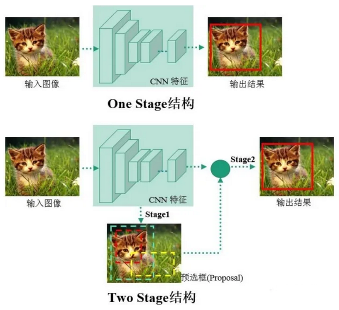

​        Yolo系列算法将图片划分成若干个网格，再基于anchor机制生成先验框，只用一步就生成检测框，这种方法大大提升了算法的预测速度，YOLOv3的论文于2018年发表在CVPR上。整个框架可划分为3个部分：分别为Darknet-53结构(下图Backbone部分)、特征层融合结构(下图黄色梯形concat部分)、以及分类检测结构(下图未画出)。

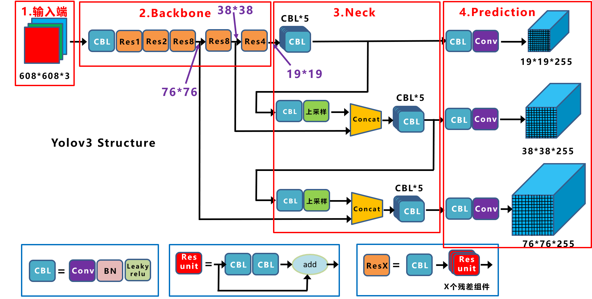

​        从网络结构的输入说起，给一张图像，输入到Darkenet-53网络结构，进行一系列的卷积以及残差网络，分别得到原图像1/8、1/16、1/32的特征图（即feature map），这个过程就是所谓的特征提取过程。在上图也可以看到经过Darkenet-53网络之后有3个分支，分别对应的就是3个不同尺寸的feature map。划分不同尺寸的feature map特征图，是为了让YOLO算法能适应不同大小目标的检测；比如：19×19×255的特征图，其一个特征点就对应原图大小为32×32（608/19=32）的块的检测，适合于大目标的检测；而76×76×255的特征图，其一个特征点对应原图大小为8×8（608/76）的块的检测。适合与小目标的检测，同理38×38×255适合于中目标的检测。但由于提取的这些特征有时不能充分的反应原图中的目标信息。所以接下来需要将3个特征图进行特征融合，以获得更强的特征表现力，从而达到更好的效果；其中由于尺寸不一样，中间需要进行上采样以及下采样（其实就是卷积），使特征图变成相同大小，然后进行堆叠、融合及相应的卷积等操作后，得到最终的3个特征层，即上图中的19×19×255（Y1）、38×38×255（Y2）、76×76×255（Y3），这3个特征图恰好分别为原图像x的1/32、1/16、1/8。

#### 2.1.1    依赖项

* NVIDIA GPU 驱动、 CUDA 
* 基于COCO数据集预训练的[YOLOv3](https://pjreddie.com/media/files/yolov3.weights)权重文件
  详情见 : [YOLO website](https://pjreddie.com/darknet/yolo/).
* weights文件需放置在 `vision_darknet_detect/darknet/data/` 目录下

#### 2.1.2    程序路径

```java
//源代码路径
~/autoware.ai/src/autoware/core_perception/vision_darknet_detect/src/vision_darknet_detect.cpp

//launch文件路径
~/autoware.ai/src/autoware/core_perception/vision_darknet_detect/launch/vision_yolo3_detect.launch

//训练names文件
~/autoware.ai/src/autoware/core_perception/vision_darknet_detect/darknet/cfg/coco.names
```

#### 2.1.3    启动方法

* 终端启动:
  
  - `roslaunch vision_darknet_detect vision_yolo3_detect.launch`

* 从Runtime Manager启动:

​       打开Runtime Manager，上方Computing 选项卡 -> Detection/ vision_detector -> `vision_darknet_detect`，单击 [app] 按钮可更改设置和文件路径等参数。

#### 2.1.4    参数详情

| 参数名                       | 类型       | 说明                                                                                          |
| ------------------------- | -------- | ------------------------------------------------------------------------------------------- |
| `score_threshold`         | *Double* | Detections with a confidence value larger than this value will be displayed. Default `0.5`. |
| `nms_threshold`           | *Double* | Non-Maximum suppresion area threshold ratio to merge proposals. Default `0.45`.             |
| `network_definition_file` | *String* | Network architecture definition configuration file. Default `yolov3.cfg`.                   |
| `pretrained_model_file`   | *String* | Path to pretrained model. Default `yolov3.weights`.                                         |
| `camera_id`               | *String* | Camera workspace. Default `/`.                                                              |
| `image_src`               | *String* | Image source topic. Default `/image_raw`.                                                   |
| `names_file`              | *String* | Path to pretrained model. Default `coco.names`.                                             |

#### 2.1.5    订阅话题名

| Topic           | 消息类型                             | 说明        |
| --------------- | -------------------------------- | --------- |
| `/image_raw`    | `sensor_msgs/Image`              | 要检测的原始图像流 |
| `/config/Yolo3` | `autoware_config_msgs/ConfigSSD` | 阈值的配置调整参数 |

#### 2.1.6    发布话题名

| Topic                       | 消息类型                                 | 说明          |
| --------------------------- | ------------------------------------ | ----------- |
| `/detection/vision_objects` | `autoware_msgs::DetectedObjectArray` | 检测到对象的边界框坐标 |

#### 2.1.7    代码注解

##### ① Yolo3DetectorNode类

​        声明了ROS相关节点及参数类型，定义目标检测所需关键方法。最后在公有域中执行Run。

```c++
class Yolo3DetectorNode {
    //定义ROS中相应节点
    ros::Subscriber      subscriber_image_raw_;
    ros::Subscriber      subscriber_yolo_config_;
    ros::Publisher       publisher_objects_;
    ros::NodeHandle      node_handle_;
    //定义类方法Yolo3Detector
    darknet::Yolo3Detector     yolo_detector_;
    image darknet_image_ = {};
    //定义参数类型
    float     score_threshold_;
    float     nms_threshold_;
    double    image_ratio_;
    uint32_t  image_top_bottom_border_;
    uint32_t  image_left_right_border_;
    std::vector<cv::Scalar>    colors_;
    std::vector<std::string>   custom_names_;
    bool      use_coco_names_;
    //定义目标检测中所使用的方法
    void      convert_rect_to_image_obj(std::vector< RectClassScore<float> >& in_objects,
                                      autoware_msgs::DetectedObjectArray& out_message);
    void      rgbgr_image(image& im);
    image     convert_ipl_to_image(const sensor_msgs::ImageConstPtr& msg);
    void      image_callback(const sensor_msgs::ImageConstPtr& in_image_message);
    void      config_cb(const autoware_config_msgs::ConfigSSD::ConstPtr& param);
    std::vector<std::string>     read_custom_names_file(const std::string& in_path);
//公有化参数域
public:
    void  Run();
};
```

##### ② convert_rect_to_image_obj函数

​        对矩形框预测结果进行处理，包括坐标值转换、目标类别标签获取等，然后发布检测结果。

```c++
void Yolo3DetectorNode::convert_rect_to_image_obj(std::vector< RectClassScore<float> >& in_objects, autoware_msgs::DetectedObjectArray& out_message)
{
    for (unsigned int i = 0; i < in_objects.size(); ++i)
    {
        {
            autoware_msgs::DetectedObject obj;
            //yolov3检测算法中对目标矩形框四个坐标值的处理
            obj.x = (in_objects[i].x /image_ratio_) - image_left_right_border_/image_ratio_;
            obj.y = (in_objects[i].y /image_ratio_) - image_top_bottom_border_/image_ratio_;
            obj.width = in_objects[i].w /image_ratio_;
            obj.height = in_objects[i].h /image_ratio_;
            if (in_objects[i].x < 0)
                obj.x = 0;
            if (in_objects[i].y < 0)
                obj.y = 0;
            if (in_objects[i].w < 0)
                obj.width = 0;
            if (in_objects[i].h < 0)
                obj.height = 0;
            //目标类型分数
            obj.score = in_objects[i].score;
            //使用Coco数据集时，将检测结果与相应的类别标签对应
            //GetClassString()方法用于映射目标类别标签方法
            if (use_coco_names_)
            {
                obj.label = in_objects[i].GetClassString();
            }
            else
            {
                if (in_objects[i].class_type < custom_names_.size())
                    obj.label = custom_names_[in_objects[i].class_type];
                else
                    obj.label = "unknown";
            }
            obj.valid = true;
            //发送检测结果
            out_message.objects.push_back(obj);

        }
    }
}
```

##### ③ rgbgr_image函数

​        rgbgr_image主要用于对输入图片进行通道变换处理，以适应网络的输入类型。

```c++
void Yolo3DetectorNode::rgbgr_image(image& im)
{
    int i;
    for(i = 0; i < im.w*im.h; ++i)
    {
        float swap = im.data[i];
        im.data[i] = im.data[i+im.w*im.h*2];
        im.data[i+im.w*im.h*2] = swap;
    }
}
```

##### ④ convert_ipl_to_image函数

​        convert_ipl_to_image函数主要对输入图片的尺寸进行处理以适应网络输入大小。当图片尺寸与输入大小不符，计算比值并将其作为缩放因子对图片进行裁剪填充处理，最后进行归一化以提高网络训练的数值稳定性。

```c++
image Yolo3DetectorNode::convert_ipl_to_image(const sensor_msgs::ImageConstPtr& msg)
{
    //cv_bridge定义opencv类型的cv_image
    cv_bridge::CvImagePtr cv_image = cv_bridge::toCvCopy(msg, "bgr8");
    cv::Mat mat_image = cv_image->image;

    int network_input_width = yolo_detector_.get_network_width();
    int network_input_height = yolo_detector_.get_network_height();

    int image_height = msg->height,
            image_width = msg->width;

    IplImage ipl_image;
    cv::Mat final_mat;

    if (network_input_width!=image_width
        || network_input_height != image_height)
    {
        //网络输入和图像不符时，计算两者比值
        image_ratio_ = (double ) network_input_width /  (double)mat_image.cols;
        //对图像进行resize，缩放因子为网络输入与图像的比值
        cv::resize(mat_image, final_mat, cv::Size(), image_ratio_, image_ratio_);
        //填充
        image_top_bottom_border_ = abs(final_mat.rows-network_input_height)/2;
        image_left_right_border_ = abs(final_mat.cols-network_input_width)/2;
        cv::copyMakeBorder(final_mat, final_mat,
                           image_top_bottom_border_, image_top_bottom_border_,
                           image_left_right_border_, image_left_right_border_,
                           cv::BORDER_CONSTANT, cv::Scalar(0,0,0));
    }
    else
        final_mat = mat_image;

    ipl_image = final_mat;

    unsigned char *data = (unsigned char *)ipl_image.imageData;
    int h = ipl_image.height;
    int w = ipl_image.width;
    int c = ipl_image.nChannels;
    int step = ipl_image.widthStep;
    int i, j, k;

    image darknet_image = make_image(w, h, c);
    //填充后的图像进行归一化
    for(i = 0; i < h; ++i){
        for(k= 0; k < c; ++k){
            for(j = 0; j < w; ++j){
                darknet_image.data[k*w*h + i*w + j] = data[i*step + j*c + k]/255.;
            }
        }
    }
    rgbgr_image(darknet_image);
    return darknet_image;
}
```

##### ⑤ image_callback函数

​        image_callback函数通过convert_ipl_to_image对图片预处理，然后利用convert_rect_to_image_obj将检测结果进一步转换为具体的目标信息并发布。

```c++
void Yolo3DetectorNode::image_callback(const sensor_msgs::ImageConstPtr& in_image_message)
{
    std::vector< RectClassScore<float> > detections;
    //调用convert_ipl_to_image对图片resize
    darknet_image_ = convert_ipl_to_image(in_image_message);
    //以resize后的图像作为yolov3检测器的输入
    detections = yolo_detector_.detect(darknet_image_);
    autoware_msgs::DetectedObjectArray output_message;
    output_message.header = in_image_message->header;
    //调用convert_rect_to_image_obj()将检测结果转换为相应的目标信息
    convert_rect_to_image_obj(detections, output_message);
    //发布检测结果
    publisher_objects_.publish(output_message);
    free(darknet_image_.data);
}
```

##### ⑥ read_custom_names_file函数

​        read_custom_names_file函数主要用于获取文件路径、文件名等信息

```c++
std::vector<std::string> Yolo3DetectorNode::read_custom_names_file(const std::string& in_names_path)
{
    //文件路径
    std::ifstream file(in_names_path);
    std::string str;
    //文件名
    std::vector<std::string> names;
    while (std::getline(file, str))
    {
        names.push_back(str);
        std::cout << str <<  std::endl;
    }
    return names;
}
```

##### ⑦ Run函数

​        首先声明了ROS函数命名空间，并通过节点名判断来接受相应的参数信息，然后调用yolo_detector检测器通过配置文件、预训练模型文件、像素均值等参数来初始化yolov3模型进行目标检测。

```c++
void Yolo3DetectorNode::Run()
{
    //ROS构造函数指定命名空间
    ros::NodeHandle private_node_handle("~");
    //声明标准字符变量接受图片
    std::string image_raw_topic_str;
    if (private_node_handle.getParam("image_raw_node", image_raw_topic_str))
    {
        ROS_INFO("Setting image node to %s", image_raw_topic_str.c_str());
    }
    else
    {
        ROS_INFO("No image node received, defaulting to /image_raw, you can use _image_raw_node:=YOUR_TOPIC");
        image_raw_topic_str = "/image_raw";
    }
    //声明标准字符变量，接收网络配置文件
    std::string network_definition_file;
    //声明标准字符变量，接收预训练模型文件
    std::string pretrained_model_file, names_file;
    //判断是否有网络配置文件节点名
    if (private_node_handle.getParam("network_definition_file", network_definition_file))
    {
        ROS_INFO("Network Definition File (Config): %s", network_definition_file.c_str());
    }
    else
    {
        ROS_INFO("No Network Definition File was received. Finishing execution.");
        return;
    }
    //判断是否有预训练模型节点名
    if (private_node_handle.getParam("pretrained_model_file", pretrained_model_file))
    {
        ROS_INFO("Pretrained Model File (Weights): %s", pretrained_model_file.c_str());
    }
    else
    {
        ROS_INFO("No Pretrained Model File was received. Finishing execution.");
        return;
    }
    if (private_node_handle.getParam("names_file", names_file))
    {
        ROS_INFO("Names File: %s", names_file.c_str());
        use_coco_names_ = false;
        custom_names_ = read_custom_names_file(names_file);
    }
    else
    {
        ROS_INFO("No Names file was received. Using default COCO names.");
        use_coco_names_ = true;
    }
    //定义私有节点参数score_threshold，阈值为0.5
    private_node_handle.param<float>("score_threshold", score_threshold_, 0.5);
    ROS_INFO("[%s] score_threshold: %f",__APP_NAME__, score_threshold_);
    //定义私有节点参数nms_threshold，阈值为0.45
    private_node_handle.param<float>("nms_threshold", nms_threshold_, 0.45);
    ROS_INFO("[%s] nms_threshold: %f",__APP_NAME__, nms_threshold_);

    //调用yolo_detector_函数，初始化模型
    ROS_INFO("Initializing Yolo on Darknet...");
    yolo_detector_.load(network_definition_file, pretrained_model_file, score_threshold_, nms_threshold_);
    ROS_INFO("Initialization complete.");

    #if (CV_MAJOR_VERSION <= 2)
        cv::generateColors(colors_, 80);
    #else
        generateColors(colors_, 80);
    #endif

    publisher_objects_ = node_handle_.advertise<autoware_msgs::DetectedObjectArray>("/detection/image_detector/objects", 1);

    ROS_INFO("Subscribing to... %s", image_raw_topic_str.c_str());
    subscriber_image_raw_ = node_handle_.subscribe(image_raw_topic_str, 1, &Yolo3DetectorNode::image_callback, this);

    std::string config_topic("/config");
    config_topic += "/Yolo3";
    subscriber_yolo_config_ = node_handle_.subscribe(config_topic, 1, &Yolo3DetectorNode::config_cb, this);

    ROS_INFO_STREAM( __APP_NAME__ << "" );

    ros::spin();
    ROS_INFO("END Yolo");

}
```

<span id="jump2.2"></span>

### 2.2    voxel_grid_filter点云降采样程序注解

#### 2.2.1    启动方法

* 终端启动:
  
  - `roslaunch points_downsampler points_downsample.launch`

* 从Runtime Manager启动:

​       打开Runtime Manager，上方Sensing 选项卡 -> Points Downsampler -> `voxel_grid_filter`，单击 [app] 按钮可更改设置等参数。

#### 2.2.2    点云消息数据结构

激光雷达雷达坐标系名称：`velodyne`    点云话题名：`/points_raw`

消息类型为`sensor_msgs/PointCloud2`，下面为消息类型的详细介绍。

```c++
header:         // 点云头
  seq:          // 序列号
  stamp:        // 话题时间戳
  frame_id:     // 点云坐标系名称
height:         // 点云的二维结构。如果云是无序的，则高度为1，宽度为点云的长度。
width:          // 点云的长度
fields:         // 描述二进制数据blob中的通道及其布局。
is_bigendian:   // 数据存储方式，包括大端与小端
point_step:     // 一个点占的字节数 
row_step:       // 一行的长度占用的字节数
data:[]         // 点云数据
is_dense:       // 有没有非法数据点
```

#### 2.2.3    程序路径

```java
// 源代码路径
~/autoware.ai/src/autoware/core_perception/points_downsampler/nodes/voxel_grid_filter/voxel_grid_filter.cpp

// launch启动文件路径
~/autoware.ai/src/autoware/core_perception/points_downsampler/launch/points_downsample.launch
```

#### 2.2.4    参数详情

| 参数名                 | 类型       | 说明            |
| ------------------- | -------- | ------------- |
| `voxel_leaf_size`   | *int*    | 滤波器处理时采用的体素大小 |
| `measurement_range` | *double* | 测量距离          |
| `output_log`        | *bool*   | 是否输出log       |
| `points_topic`      | *string* | 点云接收话题名       |

#### 2.2.5    订阅话题名

| 话题名                         | 消息类型                                         |
| --------------------------- | -------------------------------------------- |
| `/config/voxel_grid_filter` | `autoware_config_msgs/ConfigVoxelGridFilter` |
| `/points_raw`               | `sensor_msgs/PointCloud2`                    |

#### 2.2.6    发布话题名

| 话题名                        | 消息类型                                        |
| -------------------------- | ------------------------------------------- |
| `/filtered_points`         | `sensor_msgs::PointCloud2`                  |
| `/points_downsampler_info` | `points_downsampler::PointsDownsamplerInfo` |

#### 2.2.7    代码注解

##### ① main函数

​        main函数主要初始化ROS，订阅点云及参数信息，初始化发布者。使用体素化网格方法实现降采样，即减少点的数量，减少点云数据，并同时保持点云的形状特征，在提高配准、曲面重建、形状识别等算法速度中非常实用。PCL实现的VoxelGrid类通过输入的点云数据创建一个三维体素栅格（可把体素栅格想象为微小的空间三维立方体的集合），然后在每个体素（即 三维立方体）内，用体素中所有点的重心来近似显示体素中其他点，这样该体素就内所有点就用一个重心点最终表示，对于所有体素处理后得到过滤后的点云。这种方法比用体素中心来逼近的方法更慢，但它对于采样点对应曲面的表示更为准确。

```c++
int main(int argc, char** argv)
{
  ros::init(argc, argv, "voxel_grid_filter");

  ros::NodeHandle nh;
  ros::NodeHandle private_nh("~");
  //参数服务器获取激光点云topic以及是否输出log
  private_nh.getParam("points_topic", POINTS_TOPIC);
  private_nh.getParam("output_log", _output_log);
  //输出log
  if(_output_log == true){
    char buffer[80];
    std::time_t now = std::time(NULL);
    std::tm *pnow = std::localtime(&now);
    std::strftime(buffer,80,"%Y%m%d_%H%M%S",pnow);
    filename = "voxel_grid_filter_" + std::string(buffer) + ".csv";
    ofs.open(filename.c_str(), std::ios::app);
  }
  //参数服务器获取激光测量距离参数
  private_nh.param<double>("measurement_range", measurement_range, MAX_MEASUREMENT_RANGE);

  // 发布降采样点云、info
  filtered_points_pub = nh.advertise<sensor_msgs::PointCloud2>("/filtered_points", 10);
  points_downsampler_info_pub = nh.advertise<points_downsampler::PointsDownsamplerInfo>("/points_downsampler_info", 1000);

  // 订阅config、点云话题
  ros::Subscriber config_sub = nh.subscribe("config/voxel_grid_filter", 10, config_callback);
  ros::Subscriber scan_sub = nh.subscribe(POINTS_TOPIC, 10, scan_callback);

  ros::spin();
  return 0;
}
```

##### ② config_callback函数

​        config_callback 回调函数的参数为降采样参数消息(autoware_config_msgs::ConfigVoxelGridFilter.msg）。此处接收降采样参数及测量距离范围信息。

```c++
static void config_callback(const autoware_config_msgs::ConfigVoxelGridFilter::ConstPtr& input)
{
  voxel_leaf_size = input->voxel_leaf_size;
  measurement_range = input->measurement_range;
}
```

##### ③ scan_callback函数

​        scan_callback函数接收激光雷达sensor_msgs::PointCloud2类型消息，并对点云进行降采样处理。

​        PCL点云降采样库详情请见：[pcl::VoxelGrid<pcl::PointXYZI>官方文档web](https://docs.ros.org/en/hydro/api/pcl/html/classpcl_1_1VoxelGrid.html)

```c++
static void scan_callback(const sensor_msgs::PointCloud2::ConstPtr& input)
{
  // 声明pcl::PointCloud<pcl::PointXYZI>类型的点云数据用来储存接收到的点云
  pcl::PointCloud<pcl::PointXYZI> scan;
  // 点云类型转换sensor_msgs::PointCloud2 -> pcl::PointCloud<pcl::PointXYZI>
  pcl::fromROSMsg(*input, scan);

  // 判断要使用的激光点距离是否超限，并移除超限的激光点
  if(measurement_range != MAX_MEASUREMENT_RANGE){
    scan = removePointsByRange(scan, 0, measurement_range);
  }

  pcl::PointCloud<pcl::PointXYZI>::Ptr scan_ptr(new pcl::PointCloud<pcl::PointXYZI>(scan));
  pcl::PointCloud<pcl::PointXYZI>::Ptr filtered_scan_ptr(new pcl::PointCloud<pcl::PointXYZI>());

  sensor_msgs::PointCloud2 filtered_msg;

  filter_start = std::chrono::system_clock::now();

  // 若voxel_leaf_size < 0.1，voxel_grid_filter无法完成降采样(PCL规范)
  if (voxel_leaf_size >= 0.1)
  {
    // 使用VoxelGrid滤波器对点云进行降采样 
    pcl::VoxelGrid<pcl::PointXYZI> voxel_grid_filter;
    voxel_grid_filter.setLeafSize(voxel_leaf_size, voxel_leaf_size, voxel_leaf_size);
    voxel_grid_filter.setInputCloud(scan_ptr);
    voxel_grid_filter.filter(*filtered_scan_ptr);
    pcl::toROSMsg(*filtered_scan_ptr, filtered_msg);
  }
  else    // 若设置的voxel_leaf_size<0.1，无法降采样，直接输出原始点云
  {
    pcl::toROSMsg(*scan_ptr, filtered_msg);
  }
  // 记录降采样结束时间
  filter_end = std::chrono::system_clock::now();
  // 发布filtered_msg降采样后点云消息
  filtered_msg.header = input->header;
  filtered_points_pub.publish(filtered_msg);

  // 发布points_downsampler_info_msg降采样info消息
  points_downsampler_info_msg.header = input->header;
  //...（下略）

}
```

<span id="jump2.3"></span>

### 2.3    ring_ground_filter地面点云去除程序注解

#### 2.3.1    启动方法

* 终端启动:
  
  - `roslaunch points_preprocessor ring_ground_filter.launch`

* 从Runtime Manager启动:

​       打开Runtime Manager，上方Sensing 选项卡 -> Points Preprocessor -> `ring_ground_filter`，单击 [app] 按钮可更改设置等参数。

#### 2.3.2    程序路径

```java
// 源代码路径
~/autoware.ai/src/autoware/core_perception/points_preprocessor/nodes/ring_ground_filter/ring_ground_filter.cpp

// launch启动文件路径
~/autoware.ai/src/autoware/core_perception/points_preprocessor/launch/ring_ground_filter.launch
```

#### 2.3.3    参数详情

| 参数名              | 类型       | 说明                      |
| ---------------- | -------- | ----------------------- |
| `point_topic`    | *string* | 点云接收话题名                 |
| `remove_floor`   | *bool*   | 是否移除地面                  |
| `sensor_model`   | *int*    | 激光雷达发射线束数量(16,32,64)    |
| `sensor_height`  | *double* | 激光雷达安装高度                |
| `max_slope`      | *double* | 环境地面最大坡度                |
| `vertical_thres` | *double* | 障碍物和地面的差异度，大于这个值则被认为是障碍 |

#### 2.3.4    订阅话题名

| 话题名           | 消息类型                       |
| ------------- | -------------------------- |
| `/points_raw` | `sensor_msgs::PointCloud2` |

#### 2.3.5    发布话题名

| 话题名                 | 消息类型                       | 说明     |
| ------------------- | -------------------------- | ------ |
| `/points_no_ground` | `sensor_msgs::PointCloud2` | 去除地面点云 |
| `/points_ground`    | `sensor_msgs::PointCloud2` | 地面点云   |

#### 2.3.6    代码注解

##### ① VelodyneCallback函数

​        VelodyneCallback函数主要接收来自激光雷达的点云信息，将原始点云数据传给FilterGround函数处理，并发布处理好的地面点云、去除地面点云数据。

```c++
void GroundFilter::VelodyneCallback(const pcl::PointCloud<velodyne_pointcloud::PointXYZIR>::ConstPtr &in_cloud_msg)
{
  // 声明pcl::PointCloud<velodyne_pointcloud::PointXYZIR>类型的点云数据
  pcl::PointCloud<velodyne_pointcloud::PointXYZIR> vertical_points;
  pcl::PointCloud<velodyne_pointcloud::PointXYZIR> ground_points;
  vertical_points.header = in_cloud_msg->header;
  ground_points.header = in_cloud_msg->header;
  //初始化清空
  vertical_points.clear();
  ground_points.clear();

  // 调用FilterGround函数进行地面过滤
  FilterGround(in_cloud_msg, vertical_points, ground_points);

  if (!floor_removal_)
  {
    vertical_points = *in_cloud_msg;
  }
  //发布处理完毕的点云
  groundless_points_pub_.publish(vertical_points);
  ground_points_pub_.publish(ground_points);
}
```

##### ② FilterGround函数

​        FilterGround函数用于将VelodyneCallback传入的点云进行地面去除，并输出处理好的地面点云、去除地面点云数据。首先，将所有与点集具有相同水平角的点分组，然后逐点集进行计算。在每个点集中，此算法应用两步滤波器，该滤波器使用两个连续点的角度和距离来区分地面点云和垂直地面(障碍物)点云。

* (1) 基于角度的滤波器
  
    ​        两步滤波器的第一步是基于角度的滤波器，若两个连续点的角度小于角度阈值，则将其添加进“候选组”，计算一直持续到角度大于阈值为止，然后检查“候选组”的大小。如果点数足够大，这一点集中的所有点都会被标记为地面点云。

* (2) 基于距离的滤波器
  
   ​        通过比较连续点与动态阈值之间的距离来过滤上一步的其余点。如果这些点彼此足够接近，则将其标记为垂直地面的点云(障碍物点云)，其余的点被标记为地面点云。
  
   算法具体流程图及伪代码请见：[round_filter介绍pdf](https://github.com/CPFL/Autoware-Manuals/blob/master/en/pdfs/ground_filter.pdf)        

```c++
void GroundFilter::FilterGround(const pcl::PointCloud<velodyne_pointcloud::PointXYZIR>::ConstPtr &in_cloud_msg,
      pcl::PointCloud<velodyne_pointcloud::PointXYZIR> &out_groundless_points,
      pcl::PointCloud<velodyne_pointcloud::PointXYZIR> &out_ground_points)
{
  velodyne_pointcloud::PointXYZIR point;
  InitDepthMap(horizontal_res_);

  // 计算点云集中每个点的角度，并使每个激光点对应到列表中的行和列
  for (size_t i = 0; i < in_cloud_msg->points.size(); i++)
  {
    double u = atan2(in_cloud_msg->points[i].y,in_cloud_msg->points[i].x) * 180/M_PI;
    if (u < 0) { u = 360 + u; }
    int column = horizontal_res_ - (int)((double)horizontal_res_ * u / 360.0) - 1;
    int row = vertical_res_ - 1 - in_cloud_msg->points[i].ring;
    index_map_.at<int>(row, column) = i;
  }

  // 按每条激光线束上点的数量遍历(以16线雷达为例，每条环形线有1000个激光点)
  for (int i = 0; i < horizontal_res_; i++)
  {
    Label point_class[vertical_res_];
    int point_index[vertical_res_];
    int point_index_size = 0;
    double z_max = 0;
    double z_min = 0;
    double r_ref = 0;
    std::copy(class_label_, class_label_ + vertical_res_, point_class);
    // 按激光线束ID遍历每线激光
    for (int j = 0; j < vertical_res_; j++)
    {
      // 如果存在列表中(j,i)这个点，且此点没有被分类到任何一个点云集
      if (index_map_.at<int>(j,i) > -1 && point_class[j] == UNKNOWN)
      {
        // 读取每点xyz坐标
        double x0 = in_cloud_msg->points[index_map_.at<int>(j, i)].x;
        double y0 = in_cloud_msg->points[index_map_.at<int>(j, i)].y;
        double z0 = in_cloud_msg->points[index_map_.at<int>(j, i)].z;
        // 计算该点距离
        double r0 = sqrt(x0*x0 + y0*y0);
        double r_diff = fabs(r0 - r_ref);
        if (r_diff < radius_table_[j] || r_ref == 0)
        {
          r_ref = r0;
          if (z0 > z_max || r_ref == 0) z_max = z0;
          if (z0 < z_min || r_ref == 0) z_min = z0;
          point_index[point_index_size] = j;
          point_index_size++;
        }
        else
        {
          // 判断点云集类型
          if (point_index_size > 1 && (z_max - z_min) > vertical_thres_)
          {
            // 点云类型为非地面点云(障碍物)
            for (int m = 0; m < point_index_size; m++)
            {
              //...(下略)
              point_class[point_index[m]] = VERTICAL;
            }
            // 重置point_index_size
            point_index_size = 0;
          }
          else // 点云类型为地面点云
          {
            for (int m = 0; m < point_index_size; m++)
            {
              //...(下略)
              point_class[point_index[m]] = GROUND;
            }
            // 重置point_index_size
            point_index_size = 0;
          }
          r_ref = r0;
          z_max = z0;
          z_min = z0;
          point_index[point_index_size] = j;
          point_index_size++;
        }
      }
      // 判断剩余的点云
      if (j == vertical_res_ - 1 && point_index_size != 0)
      {
          // 点云类型为非地面点云(障碍物)
          if (point_index_size > 1 && (z_max - z_min) > vertical_thres_)
          {
            for (int m = 0; m < point_index_size; m++)
            {
              //...(下略)
              point_class[point_index[m]] = VERTICAL;
            }
            point_index_size = 0;
          }
          // 点云类型为地面点云
          else
          {
            for (int m = 0; m < point_index_size; m++)
            {
              //...(下略)
              point_class[point_index[m]] = GROUND;
            }
            point_index_size = 0;
          }
      }
    }
  }
}
```

### 2.4    参考文献

[1] YOLO: Real-Time Object Detection[OB/OL].[2018-3-25]. https://pjreddie.com/darknet/yolo/.

[2] Redmon J, Farhadi A. YOLOv3: An Incremental Improvement[J]. arXiv: Computer Vision and Pattern Recognition,2018.

[3] Redmon J, Farhadi A. YOLO9000: Better, faster and stronger[C]. Computer Vision and Patter Recognition, 2017: 6517-6525.

[4] Redmon J, Farhadi A. YOLOv3: An incremental improvement[J]. arXiv: Computer Vision and Pattern Recognition, 2018.

[5] Simon M, Milz S, Amende K, et al. Complex-YOLO: Real-time 3D object  detection on point clouds[J]. arXiv: Computer Vision and Pattern Recognition, 2018.

[6] PCL VoxelGrid Class Template Reference[OB/OL]. [2015-8-26]. https://docs.ros.org/en/hydro/api/pcl/html/classpcl_1_1VoxelGrid.html.

[7] Nagoya University. Ground Filter Method[OB/OL]. [2017-8-4]. https://github.com/CPFL/Autoware-Manuals/blob/master/en/pdfs/ground_filter.pdf.

<span id="jump3.0"></span>

## 三、Autoware 定位模块解析

​        自动驾驶车辆在行驶过程中需要为决策模块提供自身在车道上的精确位姿，精度一般需要达到厘米级别。目前主流的自动驾驶定位技术大致有三种，分别是基于GNSS定位、基于航迹推算的定位，以及基于环境特征匹配的定位方法。其中基于环境特征匹配的方法采用激光雷达获取点云数据，然后与地图中的点云数据进行特征匹配，实现精确定位。

<span id="jump3.0.0"></span>

### 3.0    基础知识

#### 3.0.1    三维空间描述与坐标变换

​        无人驾驶汽车在三维空间中运动与工作，为准确描述其在运动过程中车辆本身与相关传感器的相对位姿关系，需要建立包括车体自身在内的各个元器件所对应三维坐标系间的关系。

##### 1、位置描述

​        车辆在三维空间中运动时，我们首先对整个空间建立一个三维坐标系，即World坐标系。建立好之后我们可以用一个向量来表示车辆在World坐标系中的位置。车辆本身也同样建立一个固定在车体上的坐标系base_link，一般满足右手坐标系规则。

##### 2、姿态描述

​        车辆在World坐标系中的位置确定之后，车辆与World之间的坐标原点的距离也随之确定。欲求得车辆的姿态，我们需要一个固定坐标系World，求出base_link相对于World坐标系的关系，使用旋转矩阵来表示。

​        假设World坐标系的单位正交基底为 **_e1,e2,e3_** ，base_link坐标系的单位正交基底为 **_γ1,γ2,γ3_** ，两坐标系间存在旋转关系。那么对于同一个向量 **_α_** 在两坐标系下的坐标分别为 **_(α1,α2,α3)_** 和 **_(β1,β2,β3)_** ，此时有


​        等式两端同乘 **_[e1,e2,e3]_** 的转置矩阵得到


​       通过上述变换，得到旋转矩阵 **_R_** ，其描述了向量从base_link坐标系到World坐标系的旋转变换关系。


##### 3、运动描述

​        我们一般用位姿来描述刚体的运动，此时我们通过变换矩阵 **_T_** 来表示位姿在坐标系之间的变换关系。 **_R_** 表示旋转矩阵，**_t_** 表示平移向量。所以向量 **_α_** 从base_link到World的转换关系可以由下式表示。

$$\begin{array}{c}
\boldsymbol{T}=\left[\begin{array}{ll}
\boldsymbol{R} & \boldsymbol{t} \\
0 & 1
\end{array}\right] \\
{\left[\begin{array}{l}
\alpha_{1} \\
\alpha_{2} \\
\alpha_{3}
\end{array}\right]=\boldsymbol{T}\left[\begin{array}{l}
\beta_{1} \\
\beta_{2} \\
\beta_{3}
\end{array}\right]}
\end{array}$$

#### 3.0.2    正态分布变换算法NDT

​        NDT，Normal Distributions Transform正态分布变换算法是一种统计学模型。如果一组随机向量满足正态分布，那么它的概率密度函数为：


​        其中D表示维度，表示均值向量，表示随机向量的协方差矩阵。由于扫描得到的激光点云数据点是三维空间点坐标，所以需要采用三维正态分布。NDT能够通过概率的形式描述点云的分部情况，这有利于减少配准所需要的时间。

​        下面简要介绍一下NDT算法的主要流程。

##### 1、NDT算法的主要流程

###### ① 栅格化目标点云

​        首先要将激光雷达收到的点云进行栅格化，点云配准一般是对两个点云数据进行两两配准，需要先固定一个点云数据，另外一个点云数据再通过旋转平移来和固定点云进行匹配拼接。这里的固定点云就是目标点云，平移旋转的点云就是源点云。栅格化目标点云主要是利用立方体将激光点云所在空间进行均匀划分，使得激光点处于相应的立方体中，这一步作为NDT算法的第一步非常重要。

###### ② 注册激光点云数据

​        在第一步栅格化完成后，将点云加载到网格内，计算均值向量，其中表示网格中所有扫描点的坐标。


​        然后计算协方差矩阵并求出每个网格内的正态分布概率密度函数。需要注意，由于需要用到协方差矩阵的逆矩阵，所以每个网格中包含的激光点不可少于三个，一般至少要保证有五个点。

###### ③ 求出源点云相对于目标点云的初始坐标变换参数

​        坐标变换通常涉及到平移与旋转，平移通过平移向量表示，旋转则可以通过旋转矩阵表示，旋转是关于自身zyx三个固定轴的旋转，转角分别用**α、β、γ**表示，分别与yaw，pitch，roll对应。通过计算旋转平移矩阵，可以得到同一个激光点云在这两个点云坐标系下的位置坐标变换关系。

​        这一步是为了寻找一个合适的初始坐标变换使得源点云大致处于目标点云的坐标平面当中。这一步提供的变换参数的初值，为下一步变换参数的迭代提供距离最优点较近的初值。在自动驾驶里初始值的提供可以依靠GNSS、Odom或者IMU惯性导航，利用这些传感器获取车辆的当前位姿，通过坐标变换得到相对于目标点云的坐标变换参数，也就是旋转矩阵 **_R_** 和平移向量 **_t_** 。

###### ④ 源点云进行初始坐标变换，并计算在目标点云网格中的概率

​        源点云根据初始变换参数将坐标转换到目标点云中。此时源点云分布在目标点云网格中，转换后源点云的坐标X'由对应所在的网格的正态分布概率密度函数，求出激光点坐标为X‘的概率。将每个点的概率乘积起来作为目标似然函数。通过似然函数找到概率乘积最大时候的坐标转换关系。

​        简单来说就是由最大的概率找到最优的坐标变换。


###### ⑤ 高斯牛顿法进行优化，找出最佳变换参数p完成点云配准

##### 2、点云配准原理

​        在激光点云地图建图过程中，由于激光雷达扫描距离存在限制，一次扫描难以获取完整的目标环境，并且距离激光雷达越远，点云就会变得越稀疏，所以需要经过连续多次扫描，然后将每次扫描的点云数据进行配准拼接，最终才能形成连续完整的激光点云地图。

​        从不同角度扫描同一场景所得到的的点云数据统一转换到同一坐标系的过程叫做**点云配准**。简单地说就是将离散的点云数据在统一的坐标系下拼接成一整个完整的点云数据。通常点云配准算法能够利用两个点集之间的最小距离或者利用统计学方法，得到两个点集之间的变换关系，使得点云达到变换配准的效果。问题关键在于如何得到激光点云之间的RT矩阵。通常可以直接利用PCL开源点云库来对相关点云数据进行处理，PCL点云库中包含了基于NDT正态分布变换等多种点云配准算法。C++ PCL库架构图如下图所示，PCL更多资料见：[PCL学习指南](https://zhuanlan.zhihu.com/p/268524083)

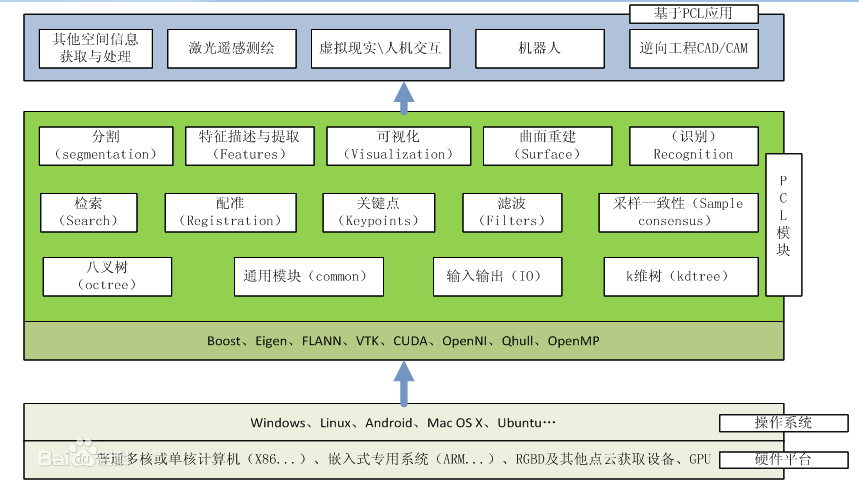

点云配准具体的步骤如下：

###### ① 输入实时点云并下采样

​        激光雷达扫描得到的激光点云数据需要去除距离车体较近与较远的激光点集，然后利用**体素滤波**过滤剩下的激光点云数据，在保持点云统计特征的情况下，降低激光点云数据集的尺寸大小，最好将**降采样后的过滤点云**作为NDT配准算法的输入源点云以降低运算时间，节省资源。

###### ② 输入源点云(全局地图)

​        加载全局地图作为NDT配准的输入目标点云。特别的，建图时第一帧激光点云作为初始全局地图。

###### ③ 输入初始位姿

​        为了快速得到准确的配准结果，需要给NDT算法提供良好的初始值，该节点通过IMU、Odom以及两者联合来求得初始位姿估计。

###### ④ 点云配准

​        将前三者得到的结果作为参数传入到NDT配准算法中进行激光点云配准。

##### 3、伪代码

​        具体详见4中两篇参考论文，此处以二维举例。

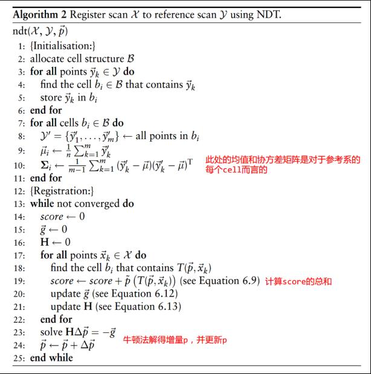

##### 4、参考论文

 [[1] Biber P, Straßer W. The normal distributions transform: A new approach  to laser scan matching[C] IROS 2003 . IEEE, 2003, 3: 2743-2748.](https://www.researchgate.net/publication/4045903_The_Normal_Distributions_Transform_A_New_Approach_to_Laser_Scan_Matching)

 [[2] Merten H. The three-dimensional normal-distributions transform[J]. threshold, 2008, 10: 3.](http://130.243.105.49/Research/mro/publications/2009/Magnusson_2009-Doctoral_Thesis-3D_NDT.pdf)

<span id="jump3.1"></span>

### 3.1    ndt_mapping节点解析

​        ndt_mapping主要利用的是scan_to_map的方式实现激光点云建图，该方法经常使用在SLAM同时定位与建图中，当激光雷达进行扫描建图的时候，由于受到扫描距离等因素的限制，使得激光雷达不能一次扫描得到完整的环境地图，因此需要进行连续多次的扫描。最终扫描得到的整个环境地图就是全局地图map，而其中scan表示当前扫描得到的激光点云数据，可以通过固定目标点云地图submap，然后利用NDT配准算法，将每一帧扫描得到的激光点云数据scan变换到目标点云submap中，并使得两者拼接在一起，最终得到拼接完整的全局地图map。ndt_mapping简要流程如下图所示。

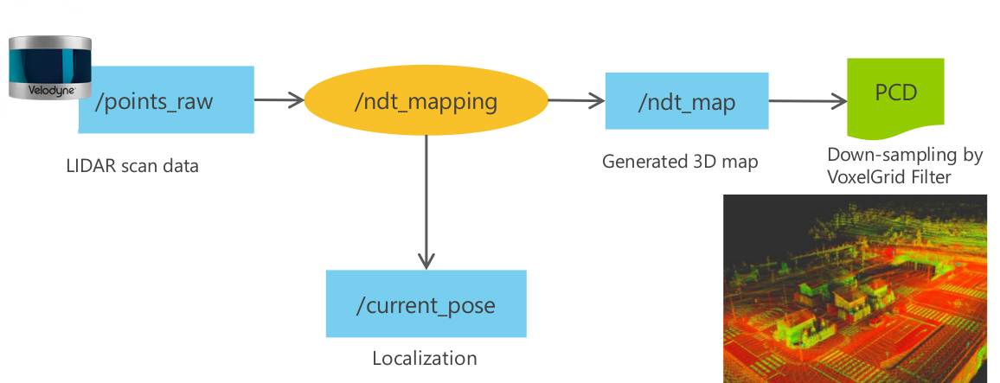

#### 3.1.1    启动方法

* 终端启动:
  
  - `roslaunch lidar_localizer ndt_mapping.launch`

* 从Runtime Manager启动:

​       打开Runtime Manager，上方Computing 选项卡 -> Localization/ lidar_localizer -> `ndt_mapping`，单击 [app] 按钮可更改设置等参数。

#### 3.1.2    程序路径

```java
//源代码路径
~/autoware.ai/src/autoware/core_perception/lidar_localizer/nodes/ndt_mapping/ndt_mapping.cpp

//launch文件路径
~/autoware.ai/src/autoware/core_perception/lidar_localizer/launch/ndt_mapping.launch
```

#### 3.1.3    参数详情

| 参数名                        | 类型       | 说明          |
| -------------------------- | -------- | ----------- |
| `method_type`              | *int*    | ndt使用算法类型   |
| `use_odom`                 | *bool*   | 是否使用里程计减少误差 |
| `use_imu`                  | *bool*   | 是否使用IMU减少误差 |
| `imu_upside_down`          | *bool*   | IMU坐标系是否翻转  |
| `imu_topic`                | *String* | IMU话题名      |
| `incremental_voxel_update` | *bool*   | 是否更新增量体素    |

#### 3.1.4    订阅话题名

| 话题名                          | 消息类型                                          |
| ---------------------------- | --------------------------------------------- |
| `/config/ndt_mapping`        | `autoware_config_msgs/ConfigNDTMapping`       |
| `/config/ndt_mapping_output` | `autoware_config_msgs/ConfigNDTMappingOutput` |
| `/points_raw`                | `sensor_msgs/PointCloud2`                     |
| `/vehicle/odom`              | `nav_msgs/Odometry`                           |
| `/imu_raw`                   | `sensor_msgs/Imu`                             |
| `/vehicle/twist`             | `geometry_msgs/TwistStamped`                  |

#### 3.1.5    发布话题名

| 话题名             | 消息类型                        |
| --------------- | --------------------------- |
| `/ndt_map`      | `sensor_msgs/PointCloud2`   |
| `/current_pose` | `geometry_msgs/PoseStamped` |

#### 3.1.6    代码注解

##### ① 主函数

​        主函数初始化位姿、ROS节点及参数，并写入日志文件。从参数服务器中获取参数值，计算变换矩阵tf_btol，最后发布与订阅相关消息。

```c++
//私有句柄调用getparam函数从参数服务器上得到参数值，若无参数则置为默认值  
private_nh.getParam("method_type", method_type_tmp);
_method_type = static_cast<MethodType>(method_type_tmp);
private_nh.getParam("use_gnss", _use_gnss);
private_nh.getParam("queue_size", _queue_size);
private_nh.getParam("offset", _offset);
//...(下略)
```

​        计算map与base_link的坐标转换关系

```c++
//    初始平移向量tl_btol，激光雷达相对于车身底盘坐标系的位姿
Eigen::Translation3f tl_btol(tf_x, tf_y, tf_z);// tl: translation
//    初始化旋转向量，分别绕着x、y、z轴旋转
tf::Matrix3x3(tf_baselink2primarylidar.getRotation()).getRPY( tf_roll, tf_pitch,tf_yaw);
Eigen::AngleAxisf rot_x_btol(tf_roll, Eigen::Vector3f::UnitX());  // rot: rotation
Eigen::AngleAxisf rot_y_btol(tf_pitch, Eigen::Vector3f::UnitY());
Eigen::AngleAxisf rot_z_btol(tf_yaw, Eigen::Vector3f::UnitZ());
tf_btol = (tl_btol * rot_z_btol * rot_y_btol * rot_x_btol).matrix();
tf_ltob = tf_btol.inverse();
//...(下略)
```

##### ② param_callback函数

​        param_callback函数通过autoware_config_msgs::ConfigNDTMapping文件进行参数配置，主要设置ndt算法配准时的参数。其中定义了配准时的消息、网格大小、高斯牛顿法步长等参数。

```c++
static void param_callback(const autoware_config_msgs::ConfigNDTMapping::ConstPtr& input)
{
      //设置ndt参数：分辨率、步长，最大迭代次数、体素叶大小、激光扫描范围等
    ndt_res = input->resolution;    //resolution表示点云网格化时网格的边长，过大会影响精度，过小则影响内存使用
      step_size = input->step_size;    //step_size设置利用牛顿法优化的最大步长
      trans_eps = input->trans_epsilon;    //trans_epsilon设置两连续变换的最大差值用于判断是否收敛至阈值
      max_iter = input->max_iterations;    //max_iterations设置优化迭代的最大次数
      voxel_leaf_size = input->leaf_size;    //leaf_size设置体素滤波叶的大小用于原始点云过滤
    //激光点云有效扫描距离
      min_scan_range = input->min_scan_range;
      max_scan_range = input->max_scan_range;
      min_add_scan_shift = input->min_add_scan_shift;
    //...(下略)
}
```

##### ③ output_callback函数

​        output_callback主要使用体素滤波将原始点云数据进行过滤，在保持点云特性的情况下降低点云数量，然后将滤波后的点云通过ROS发布，并写入PCD文件。

```c++
static void output_callback(const autoware_config_msgs::ConfigNDTMappingOutput::ConstPtr& input)
{
  double filter_res = input->filter_res;
  std::string filename = input->filename;
  //...(下略)

  pcl::PointCloud<pcl::PointXYZI>::Ptr map_ptr(new pcl::PointCloud<pcl::PointXYZI>(map));
  pcl::PointCloud<pcl::PointXYZI>::Ptr map_filtered(new pcl::PointCloud<pcl::PointXYZI>());
  map_ptr->header.frame_id = "map";
  map_filtered->header.frame_id = "map";
  sensor_msgs::PointCloud2::Ptr map_msg_ptr(new sensor_msgs::PointCloud2);

  // 运用体素滤波，如果不滤波则输出原始点云，并将pcl::PointCloud<pcl::PointXYZI>转化为sensor_msgs::PointCloud2类型
  if (filter_res == 0.0)
  {
    std::cout << "Original: " << map_ptr->points.size() << " points." << std::endl;
    pcl::toROSMsg(*map_ptr, *map_msg_ptr);
  }
  else
  {
    // 声明体素滤波对象voxel_grid_filter
    pcl::VoxelGrid<pcl::PointXYZI> voxel_grid_filter;
    // 设置体素滤波网格大小，网格是边长为filter_res的立方体
    voxel_grid_filter.setLeafSize(filter_res, filter_res, filter_res);
    // 将map作为输入地图
    voxel_grid_filter.setInputCloud(map_ptr);
    // 点云下采样并保存结果至map_filtered
    voxel_grid_filter.filter(*map_filtered);
    std::cout << "Original: " << map_ptr->points.size() << " points." << std::endl;
    std::cout << "Filtered: " << map_filtered->points.size() << " points." << std::endl;
    // 将点云类型转换为ROS可用的sensor_msgs::PointCloud2格式
    pcl::toROSMsg(*map_filtered, *map_msg_ptr);
  }
  // 发布过滤点云消息
  ndt_map_pub.publish(*map_msg_ptr);

  // 点云数据写入PCD文件
  if (filter_res == 0.0)
  {
    pcl::io::savePCDFileASCII(filename, *map_ptr);
    std::cout << "Saved " << map_ptr->points.size() << " data points to " << filename << "." << std::endl;
  }
  else
  {
    pcl::io::savePCDFileASCII(filename, *map_filtered);
    std::cout << "Saved " << map_filtered->points.size() << " data points to " << filename << "." << std::endl;
  }
}
```

##### ④ points_callback函数

​        points_callback函数由ros::Subscriber points_sub = nh.subscribe("points_raw", 100000, points_callback)调用，参数为激光雷达所取到的 sensormsgs::PointCloud2 类型的激光点云数据，r表示激光点云中每一个点与激光雷达的距离，这用来后续滤除距离车体较近与较远的激光点集。p表示原始激光点云中的点对象，类型为pcl::PointXYZI。函数声明了两个类型为pcl::PointxYZI的点云对象 tmp, scan。 tmp表示临时的原始点云数据，scan 表示的是 tmp 滤除距离激光雷达过近和过远的激光点的点云数据。t_localizer 与 t_base_ link 分别表示为激光雷达与车体相对于 map 坐标系的变换矩阵，并且均初始化为4阶单位阵。需要注意的是，NDT配准算法是将激光雷达获取到的激光点云与地图目标点云进行配准，激光点云是相对于激光雷达坐标系，所以进行 NDT 配准的时候求出的是激光雷达相对于全局地图坐标系 map 的变换关系 t_localizer。要想求得车身底盘相对于全局地图map 坐标系的变换关系，需要在t_localizer 的基础上补偿一个激光雷达与车身底盘之间的变换矩阵tf_ltob。

​        函数获取当前时间戳作为当前的点云扫描时间，然后利用 pcl:fromROSMsg 函数将输入的 sensor msgs:PointCloud2 类型的点云数据转化为 PCL 使用的数据类型。

```c++
static void points_callback(const sensor_msgs::PointCloud2::ConstPtr& input)
{
  // r表示点云到激光雷达的距离
  double r;
  pcl::PointXYZI p;
  // 声明点云对象tmp, scan
  pcl::PointCloud<pcl::PointXYZI> tmp, scan;
  pcl::PointCloud<pcl::PointXYZI>::Ptr filtered_scan_ptr(new pcl::PointCloud<pcl::PointXYZI>());
  pcl::PointCloud<pcl::PointXYZI>::Ptr transformed_scan_ptr(new pcl::PointCloud<pcl::PointXYZI>());
  tf::Quaternion q;

  Eigen::Matrix4f t_localizer(Eigen::Matrix4f::Identity());
  Eigen::Matrix4f t_base_link(Eigen::Matrix4f::Identity());
  // 声明tf发布者br
  static tf::TransformBroadcaster br;
  // 声明变换对象transform
  tf::Transform transform;
  // 获取当前帧点云扫描时间戳
  current_scan_time = input->header.stamp;
  // 点云类型转换
  pcl::fromROSMsg(*input, tmp);
```

​        这一部分代码块主要实现上一步提到的滤除距离车体过近与过远的激光点集。tmp 是原始的激光点云数据，在for循环中逐一获取tmp中的点云数据，然后利用r=√x^2+y^2求出激光点与激光雷达之间的距离，其中，x,y分别表示激光点的横纵坐标。当r在最小扫描距离以及最大扫描距离之间时，则将激光点添加至 scan 点云容器中。

```c++
  // 处理tmp点云容器中的点
  for (pcl::PointCloud<pcl::PointXYZI>::const_iterator item = tmp.begin(); item != tmp.end(); item++)
  {
    p.x = (double)item->x;
    p.y = (double)item->y;
    p.z = (double)item->z;
    p.intensity = (double)item->intensity;
    // 计算点与激光雷达的欧氏距离r，逐一判断每个点，将满足扫描距离的点插入scan
    r = sqrt(pow(p.x, 2.0) + pow(p.y, 2.0));
    if (min_scan_range < r && r < max_scan_range)
    {
      scan.push_back(p);
    }
  }
  pcl::PointCloud<pcl::PointXYZI>::Ptr scan_ptr(new pcl::PointCloud<pcl::PointXYZI>(scan));
```

​        激光点云地图需要初始化载入，实际上是将第一帧激光点云加入到map中。initial_scan_loaded 用来表示初始化载入是否成功，当地图没有初始化载入时，则将第一帧点云数据通过 pcl::transformPointcloud 函数进行转换后加入到map，pcl::transformPointCloud 函数的第一个参数为输入点云，第二个参数为输出点云，第三个参数为变换矩阵tf_btol.

```c++
  // 将初始化点云加入地图，若点云地图未初始化
  if (initial_scan_loaded == 0)
  {
    // 通过tf_btol变换矩阵作为输入将原始点云进行转化
    pcl::transformPointCloud(*scan_ptr, *transformed_scan_ptr, tf_btol);
    // 将转换后的点云加入map进行拼接，实际上是作为第一帧点云图像
    map += *transformed_scan_ptr;
    initial_scan_loaded = 1;
  }
```

​        即使筛选掉距离激光雷达过近与过远的激光点，scan_ptr 中含有的激光点的数量仍然较大，所以函数通过体素滤波来降低点云数据的规模。PCL提供的VoxelGrid 类将输入点云集合空间进行三维网格化，然后以每一个网格(每一个立方体)内所有点的重心来代表体素内的所有点，体素内所有点由一个点来表示，这减少了数据规模，而且还保持了输入点云的形状特征。体素滤波主要设置网格大小voxel_leaf_ size， 然后将scan_ptr过滤，得到输出点云*filtered_scan_ptr。

```c++
  // 对scan_ptr输入点云进行体素过滤
  pcl::VoxelGrid<pcl::PointXYZI> voxel_grid_filter;
  voxel_grid_filter.setLeafSize(voxel_leaf_size, voxel_leaf_size, voxel_leaf_size);
  voxel_grid_filter.setInputCloud(scan_ptr);
  voxel_grid_filter.filter(*filtered_scan_ptr);
  pcl::PointCloud<pcl::PointXYZI>::Ptr map_ptr(new pcl::PointCloud<pcl::PointXYZI>(map));
```

​        根据 method_type 参数进行相应的NDT参数设置，在ndt配准算法中Epsilon参数主要表示平移向量和旋转角度的临界递增量，当增量小于该参数时，配准算法结束，完成配准，该参数是 NDT 配准算法的收敛条件。步长参数step_size表示的是牛顿迭代法允许的最大步长，ndt_res 表示的是 NDT 配淮算法的网格划分分辨率的大小，分辨率大则网格所含点的数量整体较多，一般不少于5个。max_iter 表示的是牛顿迭代法的最大迭代次数，filtered_scan_ptr 作为 NDT 算法的输入源点云。

```c++
 // 设置转换参数Epsilon、最大步长、网格大小最大迭代次数，设置输入点云为已过滤点云
  if (_method_type == MethodType::PCL_GENERIC)
  {
    ndt.setTransformationEpsilon(trans_eps);
    ndt.setStepSize(step_size);
    ndt.setResolution(ndt_res);
    ndt.setMaximumIterations(max_iter);
    ndt.setInputSource(filtered_scan_ptr);
  }
  //...(下略)
```

​        全局地图map 初始化之后，ndt.setlnputTarget 函数将第一帧点云作为 NDT 配准算法的输入目标点云。结合上一段代码可以得到 NDT 目标点云为map全局地图，NDT 源点云为每一次接收到的降采样过滤点云 filtered_scan_ptr。

```c++
// 将第一张地图map_ptr设置输入NDT点云
  static bool is_first_map = true;
  if (is_first_map == true)
  {
    if (_method_type == MethodType::PCL_GENERIC)
      ndt.setInputTarget(map_ptr);
    //...(下略)
    is_first_map = false;
  }
```

​        NDT 配准算法需要提供一个位姿初值，该位姿初值用来计算配准算法的初始变换矩阵，然后再利用牛顿迭代法进行不断选代优化直至达到收敛或者最大迭代次数。Autoware利用IMU、里程计数据融合提供一个更加准确的位姿初值。车辆位姿是随着时间变化的，上一时刻的位姿加上位姿的变化量得到当前时刻的位姿，NDT配准算法所需要的初始位置可以利用前一帧位姿加上前后两帧位姿变化来得到。根据传感器的使用情况，来选择初始位姿计算方法。其中，imu_odom_calc, imu_calc, odom_calc 分别表示选择 imu 与里程计联合，单独使用imu或里程计时的初值计算函数。当不使用 IMU 与里程计计算初值的肘候，使用 guess_pose 作为 NDT 配准算法的初始位姿 guess_pose_for_ndt。代码中使用 guess_pose_for_ndt 初始位姿来构造初始变换矩阵。

```c++
  guess_pose.x = previous_pose.x + diff_x;
  guess_pose.y = previous_pose.y + diff_y;
  guess_pose.z = previous_pose.z + diff_z;
  guess_pose.roll = previous_pose.roll;
  guess_pose.pitch = previous_pose.pitch;
  guess_pose.yaw = previous_pose.yaw + diff_yaw;
  // 选择使用初值的计算方法，第一种使用imu与里程计融合
  if (_use_imu == true && _use_odom == true)
    imu_odom_calc(current_scan_time);
  if (_use_imu == true && _use_odom == false)
    imu_calc(current_scan_time);
  if (_use_imu == false && _use_odom == true)
    odom_calc(current_scan_time);
  // 声明NDT初值
  pose guess_pose_for_ndt;
  if (_use_imu == true && _use_odom == true)
    guess_pose_for_ndt = guess_pose_imu_odom;
  else if (_use_imu == true && _use_odom == false)
    guess_pose_for_ndt = guess_pose_imu;
  else if (_use_imu == false && _use_odom == true)
    guess_pose_for_ndt = guess_pose_odom;
  else    // 若未使用imu或里程计，用guess_pose
    guess_pose_for_ndt = guess_pose;
  // 利用guess_pose_for_ndt位置的位姿旋转量来初始化xyz轴的旋转向量
  Eigen::AngleAxisf init_rotation_x(guess_pose_for_ndt.roll, Eigen::Vector3f::UnitX());
  Eigen::AngleAxisf init_rotation_y(guess_pose_for_ndt.pitch, Eigen::Vector3f::UnitY());
  Eigen::AngleAxisf init_rotation_z(guess_pose_for_ndt.yaw, Eigen::Vector3f::UnitZ());
  // 使用guess_pose_for_ndt的三维坐标初始化平移向量
  Eigen::Translation3f init_translation(guess_pose_for_ndt.x, guess_pose_for_ndt.y, guess_pose_for_ndt.z);
  Eigen::Matrix4f init_guess =
      (init_translation * init_rotation_z * init_rotation_y * init_rotation_x).matrix() * tf_btol;
```

​        这段代码主要进行了 NDT 的配准操作。代码首先获取当前时间戳作为配准计时的起始时间t4，然后根据方法类型进行 NDT 配准。ndt.align 函数开始进行 NDT 配准，该函数第一个参数是输出点云，第二个参数是初始化变换矩阵，其中，初始化变换矩阵是上一步得到的 init_guess，ndt.align 实际上调用了 ndt.computeTransformation  函数得到最终的配准点云。代码使用 ndt.getFitnessScore()计算匹配得分，一般来说匹配得分小于 1。t_localizer 表示的是 NDT 配准算法得到的激光雷达相对于map 坐标系的最终变换矩阵。

```c++
  t3_end = ros::Time::now();
  d3 = t3_end - t3_start;
  t4_start = ros::Time::now();
  pcl::PointCloud<pcl::PointXYZI>::Ptr output_cloud(new pcl::PointCloud<pcl::PointXYZI>);
  // 根据_method_type类型进行配准
  if (_method_type == MethodType::PCL_GENERIC)
  {
    // 开始配准，ndt.align以init_guess为初值进行迭代优化
    ndt.align(*output_cloud, init_guess);
    // 利用ndt.getFitnessScore()计算目标点云与源点云最近点间的欧式距离平方和作为匹配得分
    fitness_score = ndt.getFitnessScore();
    // 通过NDT配准得到最终雷达相对于map坐标系的变换矩阵t_localizer
    t_localizer = ndt.getFinalTransformation();
    // 判断是否收敛
    has_converged = ndt.hasConverged();
    // 得到最后的迭代次数
    final_num_iteration = ndt.getFinalNumIteration();
    transformation_probability = ndt.getTransformationProbability();
  }
  //...(下略)
```

​        这段代码首先求出车体相对于原点的变换矩阵 t_base link，然后pcl::transformPointcloud 函数主要将降采样后的原始点云 scan 变换为点云*transformed_scan_ptr，变换时采用的变换矩阵为基于 NDT  配准方法得到的变换矩阵。mat_l，mat_b 分别表示激光雷达与车体相对于全局地图map的旋转矩阵，分别由 t_localizer与t_base_ link 矩阵的前三列与前三行进行对应赋值。ndt_pose 表示 NDT 配准后的车辆在全局地图中的位姿，其坐标位置由t_base_link 变换矩阵的平移向量进行赋值。
​        此时的 ndt_pose 作为当前时刻的位姿估计 current_pose。最后利用当前扫描时间current_scan_time 减去上一帧扫描时间 previous_scan_time 得到激光雷达的扫描间隔时间scan_duration。

```c++
  t_base_link = t_localizer * tf_ltob;
  // 将原始图像经过NDT变换后输出点云transformed_scan_ptr
  pcl::transformPointCloud(*scan_ptr, *transformed_scan_ptr, t_localizer);
  tf::Matrix3x3 mat_l, mat_b;
  // t_localize为4*4的变换矩阵，其中前三行前三列为旋转矩阵，第四列第三行为平移向量
  mat_l.setValue(static_cast<double>(t_localizer(0, 0)), static_cast<double>(t_localizer(0, 1)),
                 static_cast<double>(t_localizer(0, 2)), static_cast<double>(t_localizer(1, 0)),
                 static_cast<double>(t_localizer(1, 1)), static_cast<double>(t_localizer(1, 2)),
                 static_cast<double>(t_localizer(2, 0)), static_cast<double>(t_localizer(2, 1)),
                 static_cast<double>(t_localizer(2, 2)));

  mat_b.setValue(static_cast<double>(t_base_link(0, 0)), static_cast<double>(t_base_link(0, 1)),
                 static_cast<double>(t_base_link(0, 2)), static_cast<double>(t_base_link(1, 0)),
                 static_cast<double>(t_base_link(1, 1)), static_cast<double>(t_base_link(1, 2)),
                 static_cast<double>(t_base_link(2, 0)), static_cast<double>(t_base_link(2, 1)),
                 static_cast<double>(t_base_link(2, 2)));
  // 更新localizer_pose
  localizer_pose.x = t_localizer(0, 3);
  localizer_pose.y = t_localizer(1, 3);
  localizer_pose.z = t_localizer(2, 3);
  //通过mat_l.getRPY设置localizer_pose的旋转rpy角度
  mat_l.getRPY(localizer_pose.roll, localizer_pose.pitch, localizer_pose.yaw, 1);

  // 更新ndt_pose
  ndt_pose.x = t_base_link(0, 3);
  ndt_pose.y = t_base_link(1, 3);
  ndt_pose.z = t_base_link(2, 3);
  mat_b.getRPY(ndt_pose.roll, ndt_pose.pitch, ndt_pose.yaw, 1);
  // 将NDT配准后的位置作为当前位置
  current_pose.x = ndt_pose.x;
  current_pose.y = ndt_pose.y;
  current_pose.z = ndt_pose.z;
  current_pose.roll = ndt_pose.roll;
  current_pose.pitch = ndt_pose.pitch;
  current_pose.yaw = ndt_pose.yaw;
  // 以当前位置为坐标原点
  transform.setOrigin(tf::Vector3(current_pose.x, current_pose.y, current_pose.z));
  // 当前位置旋转角度RPY，设置四元数Q
  q.setRPY(current_pose.roll, current_pose.pitch, current_pose.yaw);
  transform.setRotation(q);
  // 发布坐标变换信息
  br.sendTransform(tf::StampedTransform(transform, current_scan_time, "map", "base_link"));
  // 计算扫描间隔时间
  scan_duration = current_scan_time - previous_scan_time;
  double secs = scan_duration.toSec();
```

​        这一部分代码计算了相邻两帧之间的位移 diff 和偏航角变化 diff_yaw。 NDT建图过程要求车辆尽量保持匀速行驶，由于相邻两帧时问差较小，所以车辆短时间内近似为匀速模型，利用x，y，z方向的位移变化与激光雷达扫描间隔的比值作为当前的速度 current_velocity。最后代码将当前位姿 current_pose 赋值于前一帧位姿previous_pose， 为下一次 NDT 配准提供计算初值。

```c++
  // 计算相邻位姿偏差 (curren_pos - previous_pos)
  diff_x = current_pose.x - previous_pose.x;
  diff_y = current_pose.y - previous_pose.y;
  diff_z = current_pose.z - previous_pose.z;
  diff_yaw = calcDiffForRadian(current_pose.yaw, previous_pose.yaw);
  diff = sqrt(diff_x * diff_x + diff_y * diff_y + diff_z * diff_z);
  // 利用前后两帧扫描位置偏差与扫描间隔计算此时的瞬时速度
  current_velocity_x = diff_x / secs;
  current_velocity_y = diff_y / secs;
  current_velocity_z = diff_z / secs;
  // 当前位姿current_pose赋予imu当前位姿并更新校正
  current_pose_imu.x = current_pose.x;
  current_pose_imu.y = current_pose.y;
  current_pose_imu.z = current_pose.z;
  current_pose_imu.roll = current_pose.roll;
  current_pose_imu.pitch = current_pose.pitch;
  current_pose_imu.yaw = current_pose.yaw;
  //...(下略)  
```

​        这一部分代码主要负责地图的更新，每隔一定的距离会更新一次地图，这里的距离由 shift 表示。added_pose 是上一帧车辆的位姿，用于判断是否需要更新地图。当前后两帧距离差 shift 大于min_add scan_ shift 最小更新距离时，将转换后的点云数据*transformed scan ptr 加入到 map 全局地图，然后将当前位姿 current_pose 赋値于added_pose 进行位姿更新。最后把当前配准拼接后的点云数据 map_ptr 设置为下一次配准的输入目标点云。

```c++
  // 计算added_pose与current_pose间距离
  double shift = sqrt(pow(current_pose.x - added_pose.x, 2.0) + pow(current_pose.y - added_pose.y, 2.0));
  if (shift >= min_add_scan_shift)
  {
    // 将经过坐标转换后的transformed_scan_ptr加到map中完成拼接
    map += *transformed_scan_ptr;
    added_pose.x = current_pose.x;
    added_pose.y = current_pose.y;
    added_pose.z = current_pose.z;
    added_pose.roll = current_pose.roll;
    added_pose.pitch = current_pose.pitch;
    added_pose.yaw = current_pose.yaw;

    if (_method_type == MethodType::PCL_GENERIC)
      ndt.setInputTarget(map_ptr);
    //...(下略)
  }
  // 声明sensor_msgs::PointCloud2点云对象
  sensor_msgs::PointCloud2::Ptr map_msg_ptr(new sensor_msgs::PointCloud2);
  // 数据类型转换
  pcl::toROSMsg(*map_ptr, *map_msg_ptr);
  // 发布点云
  ndt_map_pub.publish(*map_msg_ptr);
  //...(下略)
}
```

##### ⑤ odom_callback函数

​        odom_callback 函数由ros::Subscriber odom_sub = nh.subscribe("vehicle/odom", 100000, odom_callback)所调用。odom_callback 函数以里程计接收到的数据作为函数参数，主要调用 odom_calc 初值计算函数，该函数以接收到的里程计数据时间戳作为输入参数，求得 NDT 的初始位姿估计。

```c++
static void odom_callback(const nav_msgs::Odometry::ConstPtr& input)
{
  odom = *input;
  odom_calc(input->header.stamp);
}
```

​        odom_calc里程计初始位姿计算函数如下

```c++
static void odom_calc(ros::Time current_time)
{
  static ros::Time previous_time = current_time;
  // 获取两帧时间差
  double diff_time = (current_time - previous_time).toSec();
  // 计算两帧时间间隔内的里程计旋转角度
  double diff_odom_roll = odom.twist.twist.angular.x * diff_time;
  double diff_odom_pitch = odom.twist.twist.angular.y * diff_time;
  double diff_odom_yaw = odom.twist.twist.angular.z * diff_time;
  // 更新当前里程计位置的角度
  current_pose_odom.roll += diff_odom_roll;
  current_pose_odom.pitch += diff_odom_pitch;
  current_pose_odom.yaw += diff_odom_yaw;
  // diff_distance为x方向的变化距离，offset为车身不稳定造成的计算偏差
  double diff_distance = odom.twist.twist.linear.x * diff_time;
  offset_odom_x += diff_distance * cos(-current_pose_odom.pitch) * cos(current_pose_odom.yaw);
  offset_odom_y += diff_distance * cos(-current_pose_odom.pitch) * sin(current_pose_odom.yaw);
  offset_odom_z += diff_distance * sin(-current_pose_odom.pitch);

  offset_odom_roll += diff_odom_roll;
  offset_odom_pitch += diff_odom_pitch;
  offset_odom_yaw += diff_odom_yaw;
  // 对初始位置修正
  guess_pose_odom.x = previous_pose.x + offset_odom_x;
  guess_pose_odom.y = previous_pose.y + offset_odom_y;
  guess_pose_odom.z = previous_pose.z + offset_odom_z;
  guess_pose_odom.roll = previous_pose.roll + offset_odom_roll;
  guess_pose_odom.pitch = previous_pose.pitch + offset_odom_pitch;
  guess_pose_odom.yaw = previous_pose.yaw + offset_odom_yaw;
  previous_time = current_time;
}
```

##### ⑥ imu_callback函数

​        imu_callback函数由ros::Subscriber imu_sub = nh.subscribe(_imu_topic, 100000, imu_callback)调用。该函数主要是利用 imu_calc (input->header.stamp)  函数计算位置初值，为 NDT 配准提供初始位置。

```c++
static void imu_callback(const sensor_msgs::Imu::Ptr& input)
{
  if (_imu_upside_down)
    imuUpsideDown(input);
  // 接收到imu消息的时候获取当前时间戳
  const ros::Time current_time = input->header.stamp;
  static ros::Time previous_time = current_time;
  // 计算前后两次接收消息的微小时间差
  const double diff_time = (current_time - previous_time).toSec();
  double imu_roll, imu_pitch, imu_yaw;
  // 声明用于转换的四元数
  tf::Quaternion imu_orientation;
  // 将IMU采集到的四元数消息转化为TF类型
  tf::quaternionMsgToTF(input->orientation, imu_orientation);
  // 初始化3*3旋转矩阵，使用getRPY获取当前rpy旋转角
  tf::Matrix3x3(imu_orientation).getRPY(imu_roll, imu_pitch, imu_yaw);
  // 转化为弧度
  imu_roll = wrapToPmPi(imu_roll);
  imu_pitch = wrapToPmPi(imu_pitch);
  imu_yaw = wrapToPmPi(imu_yaw);

  static double previous_imu_roll = imu_roll, previous_imu_pitch = imu_pitch, previous_imu_yaw = imu_yaw;
  const double diff_imu_roll = calcDiffForRadian(imu_roll, previous_imu_roll);
  const double diff_imu_pitch = calcDiffForRadian(imu_pitch, previous_imu_pitch);
  const double diff_imu_yaw = calcDiffForRadian(imu_yaw, previous_imu_yaw);

  imu.header = input->header;
  // 获取imu在x方向的线性加速度
  imu.linear_acceleration.x = input->linear_acceleration.x;
  imu.linear_acceleration.y = 0;
  imu.linear_acceleration.z = 0;

  if (diff_time != 0)
  {
    // 若时间差不等于0，imu在工作，计算imu瞬时角速度
    imu.angular_velocity.x = diff_imu_roll / diff_time;
    imu.angular_velocity.y = diff_imu_pitch / diff_time;
    imu.angular_velocity.z = diff_imu_yaw / diff_time;
  }
  else
  {
    // 否则角速度置0
    imu.angular_velocity.x = 0;
    imu.angular_velocity.y = 0;
    imu.angular_velocity.z = 0;
  }

  // 计算位置初值，提供初始位置
  imu_calc(input->header.stamp);

  previous_time = current_time;
  previous_imu_roll = imu_roll;
  previous_imu_pitch = imu_pitch;
  previous_imu_yaw = imu_yaw;
}
```

<span id="jump3.2"></span>

### 3.2    ndt_matching节点解析

​        ndt_matching节点首先读取points_map_loader发布的点云地图，将此地图设置为target。同时，使用上述2.2小节中voxel_grid_filter将激光雷达发布的/points_raw话题发布的/sensor_msgs/PointCloud2点云消息降采样，将降采样后的点云设置为source。此后利用ndt进行配准，得出齐次变换矩阵，可以得到车的几个坐标系的位置信息，从而进行定位。

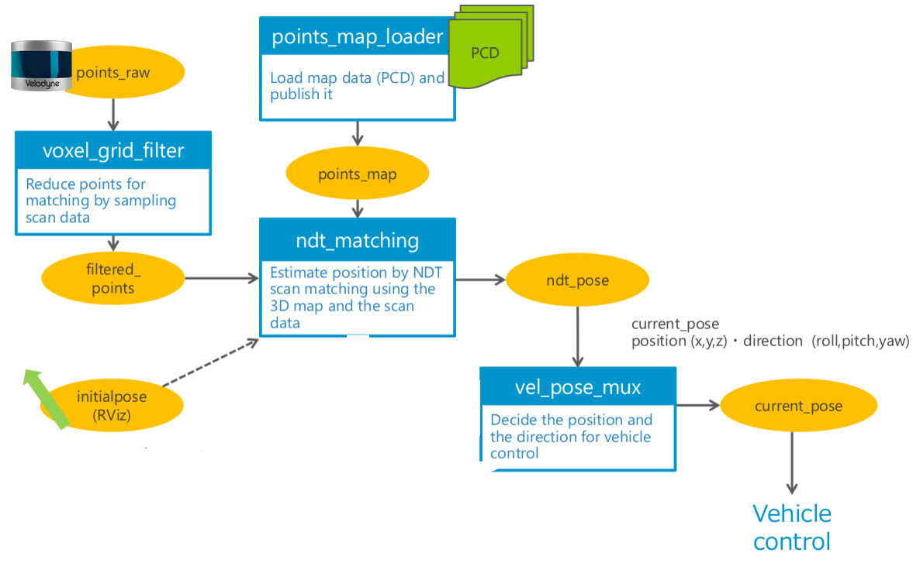

#### 3.2.1    启动方法

* 终端启动:
  
  - `roslaunch lidar_localizer ndt_matching.launch`

* 从Runtime Manager启动:

​       打开Runtime Manager，上方Computing 选项卡 -> Localization/ lidar_localizer -> `ndt_matching`，单击 [app] 按钮可更改设置等参数。

#### 3.2.2    程序路径

```java
//源代码路径
~/autoware.ai/src/autoware/core_perception/lidar_localizer/nodes/ndt_matching/ndt_matching.cpp

//launch启动文件路径
~/autoware.ai/src/autoware/core_perception/lidar_localizer/launch/ndt_matching.launch
```

#### 3.2.3    参数详情

| 参数名                   | 类型       | 说明                                           |
| --------------------- | -------- | -------------------------------------------- |
| `method_type`         | *int*    | ndt使用算法类型                                    |
| `use_gnss`            | *bool*   | 是否使用gnss                                     |
| `use_odom`            | *bool*   | 是否使用里程计减少误差                                  |
| `use_imu`             | *bool*   | 是否使用IMU减少误差                                  |
| `imu_upside_down`     | *bool*   | IMU坐标系是否翻转                                   |
| `imu_topic`           | *String* | IMU话题名                                       |
| `queue_size`          | *int*    | 消息缓冲区大小                                      |
| `offset`              | *String* | 位姿偏移校正                                       |
| `get_height`          | *bool*   | z轴高度较正                                       |
| `use_local_transform` | *bool*   | 使用本地tf                                       |
| `sync`                | *bool*   | 是否将话题名/points_raw映射为/sync_drivers/points_raw |
| `output_log_data`     | *bool*   | 是否输出log                                      |
| `output_tf_frame_id`  | *String* | tf frameID 默认为base_link                      |
| `gnss_reinit_fitness` | *double* | 比较fitness_core的参考，默认值为500.0                  |

#### 3.2.4    订阅话题名

| 话题名                | 消息类型                                      |
| ------------------ | ----------------------------------------- |
| `/config/ndt`      | `autoware_config_msgs/ConfigNDT`          |
| `/gnss_pose`       | `geometry_msgs/PoseStamped`               |
| `/initialpose`     | `geometry_msgs/PoseWithCovarianceStamped` |
| `/filtered_points` | `sensor_msgs/PointCloud2`                 |
| `/vehicle/odom`    | `nav_msgs/Odometry`                       |
| `/imu_raw`         | `sensor_msgs/Imu`                         |
| `/vehicle/twist`   | `geometry_msgs/TwistStamped`              |

#### 3.2.5    发布话题名

| 话题名                      | 消息类型                            |
| ------------------------ | ------------------------------- |
| `/predict_pose`          | `geometry_msgs::PoseStamped`    |
| `/predict_pose_imu`      | `geometry_msgs::PoseStamped`    |
| `/predict_pose_odom`     | `geometry_msgs::PoseStamped`    |
| `/predict_pose_imu_odom` | `geometry_msgs::PoseStamped`    |
| `/ndt_pose`              | `geometry_msgs::PoseStamped`    |
| `/localizer_pose`        | `geometry_msgs::PoseStamped`    |
| `/estimate_twist`        | `geometry_msgs::TwistStamped`   |
| `/estimated_vel_mps`     | `std_msgs::Float32`             |
| `/estimated_vel_kmph`    | `std_msgs::Float32`             |
| `/estimated_vel`         | `geometry_msgs::Vector3Stamped` |
| `/time_ndt_matching`     | `std_msgs::Float32`             |
| `/ndt_stat`              | `autoware_msgs::NDTStat`        |
| `/ndt_reliability`       | `std_msgs::Float32`             |

#### 3.2.6    代码注解

##### ① 流程简介

​        ndt_matching节点与ndt_mapping节点结构相似，不同之处在于ndt_matching利用scan_to_matching方法实现定位。该方法将已知的高精度地图map作为全局地图global map，利用激光雷达获取当前帧的激光点云数据scan，与固定不动的全局地图global_map进行ndt配准，求出最终车体相对于全局地图的位姿，从而实现精准定位。具体步骤如下: 

​        ①由激光雷达获取的激光点云数据降采样作为 NDT 算法的输入源点云，这部分与 ndt mapping 一致
​        ②将全局地图 global map 作为 NDT 算法的输入目标点云；
​        ③此处 GNSS 的主要目标是实现重定位，当 imu 与odom 产生累计误差影响到NDT 配准算法的效果，或者是使用 gnss 时并未将 gnss 位姿初始化的时候，此时将当前gnss 位姿作为准确的车辆位姿信息，它能够及时纠正 imu 与odom 的累计误差；
​        ④利用 imu, odom 等传感器获取 NDT 所需的初始位姿估计；
​        ⑤进行 NDT 配准;
​        ⑥求得车辆相对于 全局地图的位姿 current pose。

​        ndt matching 节点的main 函数(源码略)与 ndt mapping 节点很相似，主要进行话题消息的发布，发布的话题有/predict pose (预测的位姿），/predict pose imu(利用imu 预测的位姿），/predict_pose_odom （利用里程计预测得到的位姿），/predict_pose_imu_odom (利用里程计与 imu 联合得到的位姿)等参数。订阅的话题有config/ndt (ndt 配置参数），gnss_pose(使用gnss 得到的位姿)，initial_pos(初始位姿)，filtered_points（过滤处理后的激光点集），/vehicle/odom（里程汁消息）。

##### ② param_callback函数

​        param_callback 回调函数的参数为 NDT 配置参数消息(autoware_config_msgs::ConfigNDT.msg）。函数判断 _use_gnss 与 NDT 配置参数 init_pos_gnss 是否相等，use_gnss 表示使用 gnss 进行位姿估计，init_pos_gnss 用来表示 gnss 的初始位置。如果 use_gnss与 init_pos_gnss 不相等，则 init_pos_set=0, 表示未进行位姿初始化。当 use_gnss==0, 即不使用 gnss, 以及 NDT 参数配置中的车辆初始位姿与 initial_pose 不相等的时候，令 init_pos_set=0。该代码主要判断 gnss 使用参数与 gnss 初始位姿是否初始化。

```c++
static void param_callback(const autoware_config_msgs::ConfigNDT::ConstPtr& input)
{
  if (_use_gnss != input->init_pos_gnss)
  {
    // 使用gnss时要对gnss位置初始化，如果两者不匹配，将初始位置init_pos_set置为0
    init_pos_set = 0;
  }
  else if (_use_gnss == 0 &&
           (initial_pose.x != input->x || initial_pose.y != input->y || initial_pose.z != input->z ||
            initial_pose.roll != input->roll || initial_pose.pitch != input->pitch || initial_pose.yaw != input->yaw))
  {
    init_pos_set = 0;
  }

  _use_gnss = input->init_pos_gnss;
```

​        该代码主要对 NDT 配准的参数进行设置，根据方法类型的不同，将 ConfigNDT消息中的参数作为输入加载到 NDT 配准算法中。其中加载的 NDT 参数有:收敛条件、最大步长、分辨率(网格划分大小)以及最大迭代次数。

```c++
  if (input->step_size != step_size)
  {
    step_size = input->step_size;
    // 按照方法类型不同使用ndt.setResolution(ndt_res)函数设置NDT网格大小
    if (_method_type == MethodType::PCL_GENERIC)
      ndt.setStepSize(step_size);
    //...(下略)
  }
  // 设置ndt算法收敛条件
  if (input->trans_epsilon != trans_eps)
  {
    trans_eps = input->trans_epsilon;
    //...(下略)
  }
  // 设置最大迭代次数
  if (input->max_iterations != max_iter)
  {
    max_iter = input->max_iterations;
    //...(下略)
  }
```

​        该代码块主要判断是否使用 GNSS 、是否已初始化车辆位姿，当未使用 GNSS 并且未初始化车辆位姿时，利用 NDT 配置消息进行位姿初始化。当使用局部变换的时候，需要补偿一个局部变换矩阵 local_transform.inverse()，从而求得车辆相对于全局地图 map 的初始位姿。局部变换矩阵 local_transform 表示的是world 坐标系与地面坐标系 map 之间的变换关系。

```c++
 if (_use_gnss == 0 && init_pos_set == 0)
  {
    // 如果未使用gnss且未初始化车辆位姿，则用ndt参数配置消息中的位姿进行初始化
    initial_pose.x = input->x;
    //...(下略)
    if (_use_local_transform == true)
    {
      // 如果使用局部变换，在求初始位姿时要补偿一个局部变换矩阵local_transform.inverse()
      tf2::Vector3 v(input->x, input->y, input->z);
      tf2::Quaternion q;
      q.setRPY(input->roll, input->pitch, input->yaw);
      tf2::Transform transform(q, v);
      initial_pose.x = (local_transform.inverse() * transform).getOrigin().getX();
      initial_pose.y = (local_transform.inverse() * transform).getOrigin().getY();
      initial_pose.z = (local_transform.inverse() * transform).getOrigin().getZ();
      tf2::Matrix3x3 m(q);
      m.getRPY(initial_pose.roll, initial_pose.pitch, initial_pose.yaw);
      std::cout << "initial_pose.x: " << initial_pose.x << std::endl;
      //...(下略)
    }

    // 设置初始位姿
    localizer_pose.x = initial_pose.x;
    localizer_pose.y = initial_pose.y;
    //...(下略)
  }
}
```

##### ③ gnss_callback函数

​        gnss_callback主要实现GNSS重定位功能，用来纠正IMU与里程计的积分累计误差，当ndt配准结果较差，也需要GNSS重定位来提供配准初值。

```c++
static void gnss_callback(const geometry_msgs::PoseStamped::ConstPtr& input)
{
  // 将GNSS的旋转参数保存至tf类型的旋转四元数
  tf2::Quaternion gnss_q(input->pose.orientation.x, input->pose.orientation.y, input->pose.orientation.z,
                        input->pose.orientation.w);
  // 将位置四元数转换为旋转矩阵gnss_m
  tf2::Matrix3x3 gnss_m(gnss_q);
  // current_gnss_pose表示当前GNSS的位置
  pose current_gnss_pose;
  current_gnss_pose.x = input->pose.position.x;
  current_gnss_pose.y = input->pose.position.y;
  current_gnss_pose.z = input->pose.position.z;
  // 利用gnss_m.getRPY得到旋转矩阵的RPY旋转角，分别以三个参数输出
  gnss_m.getRPY(current_gnss_pose.roll, current_gnss_pose.pitch, current_gnss_pose.yaw);

  static pose previous_gnss_pose = current_gnss_pose;
  //记录当前接受到GNSS消息的时间
  ros::Time current_gnss_time = input->header.stamp;
  static ros::Time previous_gnss_time = current_gnss_time;
  //如果使用GNSS且初始位置为0或fitness_score>=500,则进行GNSS重定位，并计算当前位置与先前位置的偏差
  //注意：ndt的fitness_score越低越好，一般小于1
  if ((_use_gnss == 1 && init_pos_set == 0) || fitness_score >= _gnss_reinit_fitness)
  {
    previous_pose.x = previous_gnss_pose.x;
    previous_pose.y = previous_gnss_pose.y;
    //...(下略)
  }
  previous_gnss_pose.x = current_gnss_pose.x;
  //...(下略)
}
```

##### ④ map_callback函数

​        map_callback函数主要用于载入激光雷达数据作为初始全局地图map，并将初始全局地图map作为ndt配准算法的目标点云。函数按收到的 sensor_msgs::PointCloud2 类型的点云数据为输入参数，首先判断地图尺寸  points_map_num 与输入点云的宽度是否相等。初始状态时 points_map_num 默认为 0。车辆处于初始状态时，激光点云地图未加载，此时更新 map 地图大小为输入激光点云的大小。利用 pcl::fromROSMsg  函数将输入点云进行转换，并保存至map。最后根据方法类型的不同，对 NDT 参数进行设置，主要设置网格大小、NDT 算法的目标点云、最大迭代次数、最大迭代步长以及收敛阈值Epsilon，添加最大迭代次数能够增加程序鲁棒性，避免程序在错误迭代方向运行时间过长。最后代码利用 4 阶单位矩阵作为初始变换矩阵，来对第一帧点云进行配准，输出结果保存至output_cloud，至此地图加载成功。下面为详细代码注解。

```c++
static void map_callback(const sensor_msgs::PointCloud2::ConstPtr& input)
{
  // 若points_map_num不等于输入点云宽度，更新点云参数
  if (points_map_num != input->width)
  {
    std::cout << "Update points_map." << std::endl;

    points_map_num = input->width;
    // 将输入激光点云类型从sensor_msgs::PointCloud2转换为pcl类型
    pcl::fromROSMsg(*input, map);

    if (_use_local_transform == true)
    {
      // 如果局部变换存在，向外广播局部变换
      // local_transform表示world坐标系与map坐标系之间的变换
      tf2_ros::Buffer tf_buffer;
      tf2_ros::TransformListener tf_listener(tf_buffer);
      geometry_msgs::TransformStamped local_transform_msg;
      try
      {
        local_transform_msg = tf_buffer.lookupTransform("map", "world", ros::Time::now(), ros::Duration(3.0));
      }
      catch (tf2::TransformException& ex)
      {
        ROS_ERROR("%s", ex.what());
      }
      // 将map坐标系转换为world坐标系
      tf2::fromMsg(local_transform_msg, local_transform);
      pcl::transformPointCloud(map, map, tf2::transformToEigen(local_transform_msg).matrix().inverse().cast<float>());
    }

    pcl::PointCloud<pcl::PointXYZ>::Ptr map_ptr(new pcl::PointCloud<pcl::PointXYZ>(map));

    // 根据方法类型不同设置要进行ndt配准的点云
    if (_method_type == MethodType::PCL_GENERIC)
    {
      pcl::NormalDistributionsTransform<pcl::PointXYZ, pcl::PointXYZ> new_ndt;
      pcl::PointCloud<pcl::PointXYZ>::Ptr output_cloud(new pcl::PointCloud<pcl::PointXYZ>);
      // 设置网格大小
      new_ndt.setResolution(ndt_res);
      // 将map_ptr作为ndt输入点云
      new_ndt.setInputTarget(map_ptr);
      // 设置最大迭代次数
      new_ndt.setMaximumIterations(max_iter);
      // 设置步长大小
      new_ndt.setStepSize(step_size);
      new_ndt.setTransformationEpsilon(trans_eps);
      // 利用单位矩阵作为初始坐标变换矩阵来进行ndt配准
      // 此时为第一帧点云配准
      new_ndt.align(*output_cloud, Eigen::Matrix4f::Identity());
      pthread_mutex_lock(&mutex);
      ndt = new_ndt;
      pthread_mutex_unlock(&mutex);
    }
    //...（下略）
    // 地图载入成功
    map_loaded = 1;
  }
}
```

##### ⑤ points_callback 函数

​        该回调函数主要进行多传感器之间的融合定位。函数首先融合 IMU 和odom 数据得到较为准确的位置估计，然后利用 filtered_points 将点云数据加入到 NDT 的算法内，计算得到一个 NDT 的预测位姿。最后，该位姿与 IMU 和 odom 融合得到的位姿进行比较，得出更准确的位姿。

​        Points_callback 回调函数以接收到的激光点云数据为输入参数，当全局点云地图载入成功并且车辆位姿初始化成功之后，ndt_matching 开始配准。代码利用
std:chrono::system_clock::now 函数来获取当前系统的时间并将其作为定位匹配的起始时间 matching_start。然后获取当前接收到的激光点云时间戳作为当前扫描时间current_scan_time。利用 pcl::fromROSMsg 函数将输入点云转换为 pcl::PointCloud< pcl:PointXYZ >类型的点云数据并存储于 filtered_scan。最后将filtered_scan 作为 NDT 算法的输入源点云，与 NDT 算法目标点云全局地图 map 进行匹配。

```c++
static void points_callback(const sensor_msgs::PointCloud2::ConstPtr& input)
{
  health_checker_ptr_->CHECK_RATE("topic_rate_filtered_points_slow", 8, 5, 1, "topic filtered_points subscribe rate slow.");
  // 默认地图载入状态为0
  if (map_loaded == 1 && init_pos_set == 1)
  {
    // 获取配准开始时间
    matching_start = std::chrono::system_clock::now();

    static tf2_ros::TransformBroadcaster br;
    tf2::Transform transform;
    tf2::Quaternion predict_q, ndt_q, current_q, localizer_q;

    pcl::PointXYZ p;
    // 声明pcl::PointCloud<pcl::PointXYZ>类型的点云数据用来储存过滤后的点云
    pcl::PointCloud<pcl::PointXYZ> filtered_scan;
    // 获取当前接收点云的扫描时间
    ros::Time current_scan_time = input->header.stamp;
    static ros::Time previous_scan_time = current_scan_time;
    // 将当前sensor_msgs::PointCloud2转化为PCL类型
    pcl::fromROSMsg(*input, filtered_scan);
    pcl::PointCloud<pcl::PointXYZ>::Ptr filtered_scan_ptr(new pcl::PointCloud<pcl::PointXYZ>(filtered_scan));
    // 获取点云数量
    int scan_points_num = filtered_scan_ptr->size();
    // 单位矩阵初始化车身底盘base_link和localizer关于原点的坐标变换矩阵
    Eigen::Matrix4f t(Eigen::Matrix4f::Identity());   // base_link
    Eigen::Matrix4f t2(Eigen::Matrix4f::Identity());  // localizer
    // 声明配准起止时间与getFitnessScore起止时间
    std::chrono::time_point<std::chrono::system_clock> align_start, align_end, getFitnessScore_start,
        getFitnessScore_end;
    static double align_time, getFitnessScore_time = 0.0;

    pthread_mutex_lock(&mutex);
    // 按照不同方法类型将filtered_scan_ptr作为ndt输入点云
    if (_method_type == MethodType::PCL_GENERIC)
      ndt.setInputSource(filtered_scan_ptr);
    //...(下略)
```

​        该代码主要计算得出 NDT 配准算法所需要的初始位姿。offset 有三种情况，当 offset 为线性值的时候，利用匀速运动模型计算出 offset 的大小;当 offset 为二次模型，即加速度不为0的时候。offset 的x与y方向的分量利用vt+(1/2)at^2求出，y方向的分量与偏航角保持匀速运动模型；第三种情况是 offset 为 0。代码利用previous_pose (前一帧位姿)+offset(两帧时间内的偏差量)得到 predict_pose (当前预测的车辆位姿)。然后代码根据  imu、odom 的使用情况估计 NDT 所需当前初始位姿，这一步与ndt mapping  类似。最后如果使用传感器来获取位姿，则将相应传感器估计得到的当前位姿作为 predict_pose_for_ndt (ndt 配准所需的初值），否则将 predict_pose (当前预测的车辆位姿）作为 NDT 配准所需的初值。

```c++
 // 计算前后两帧激光扫描时间差
    double diff_time = (current_scan_time - previous_scan_time).toSec();
    // _offset为线性时，位置偏差和航向角等于速度乘前后帧时间差
    if (_offset == "linear")
    {
      offset_x = current_velocity_x * diff_time;
      offset_y = current_velocity_y * diff_time;
      offset_z = current_velocity_z * diff_time;
      offset_yaw = angular_velocity * diff_time;
    }
    // _offset为二次类型，则利用vt+at^2表示x、y，z、yaw与线性一致
    else if (_offset == "quadratic")
    {
      offset_x = (current_velocity_x + current_accel_x * diff_time) * diff_time;
      offset_y = (current_velocity_y + current_accel_y * diff_time) * diff_time;
      offset_z = current_velocity_z * diff_time;
      offset_yaw = angular_velocity * diff_time;
    }
    else if (_offset == "zero")
    {
      offset_x = 0.0;
      offset_y = 0.0;
      offset_z = 0.0;
      offset_yaw = 0.0;
    }
    // 估计位置的坐标xyz=前一帧+偏移量、rp角度与前一帧角度相等，yaw随车变化
    predict_pose.x = previous_pose.x + offset_x;
    predict_pose.y = previous_pose.y + offset_y;
    predict_pose.z = previous_pose.z + offset_z;
    predict_pose.roll = previous_pose.roll;
    predict_pose.pitch = previous_pose.pitch;
    predict_pose.yaw = previous_pose.yaw + offset_yaw;
    // 根据imu和odom使用情况，采用不同方法对ndt配准的初始位置进行计算，与mapping保持一致
    if (_use_imu == true && _use_odom == true)
      imu_odom_calc(current_scan_time);
    if (_use_imu == true && _use_odom == false)
      imu_calc(current_scan_time);
    if (_use_imu == false && _use_odom == true)
      odom_calc(current_scan_time);
    // 根据使用方法不同，赋予ndt位置预测初值
    pose predict_pose_for_ndt;
    if (_use_imu == true && _use_odom == true)
      predict_pose_for_ndt = predict_pose_imu_odom;
    else if (_use_imu == true && _use_odom == false)
      predict_pose_for_ndt = predict_pose_imu;
    else if (_use_imu == false && _use_odom == true)
      predict_pose_for_ndt = predict_pose_odom;
    else
      predict_pose_for_ndt = predict_pose;
```

​        该部分代码主要求出激光雷达坐标系相对于全局地图坐标系的初始变换矩阵init_guess, 该矩阵的计算需要补偿一个变换矩阵tf_btol,即车身底盘坐标系 base_link到激光雷达坐标系的变换矩阵，这一变换矩阵由 main 函数得出。代码获取当前系统时间戳作为 NDT 配准起始时间，然后利用 ndt.align(*output_cloud, init_guess) 函数以初始变换矩阵 init_guess 为参数，得到输出点云 output_cloud，然后计算 NDT 配准的结果，最后计算配准时间。t *tf_btol.inverse函数得到车身底盘相对于全局地图坐标系的最终变换矩阵t2。

```c++
    // 将predict_pose_for_ndt位置的xyz坐标作为init_translation初始平移的构造函数参数
    Eigen::Translation3f init_translation(predict_pose_for_ndt.x, predict_pose_for_ndt.y, predict_pose_for_ndt.z);
    Eigen::AngleAxisf init_rotation_x(predict_pose_for_ndt.roll, Eigen::Vector3f::UnitX());
    Eigen::AngleAxisf init_rotation_y(predict_pose_for_ndt.pitch, Eigen::Vector3f::UnitY());
    Eigen::AngleAxisf init_rotation_z(predict_pose_for_ndt.yaw, Eigen::Vector3f::UnitZ());
    // init_guess表示激光雷达坐标系相对于全局地图坐标系的坐标变换矩阵
    Eigen::Matrix4f init_guess = (init_translation * init_rotation_z * init_rotation_y * init_rotation_x) * tf_btol;

    pcl::PointCloud<pcl::PointXYZ>::Ptr output_cloud(new pcl::PointCloud<pcl::PointXYZ>);
    // 根据不同方法进行ndt配准
    if (_method_type == MethodType::PCL_GENERIC)
    {
      // 获取当前时间戳作为配准开始时间
      align_start = std::chrono::system_clock::now();
      // 利用初始变换矩阵init_guess进行ndt配准，将结果存到output_cloud
      ndt.align(*output_cloud, init_guess);
      // 获取配准结束时间
      align_end = std::chrono::system_clock::now();
      // 是否收敛
      has_converged = ndt.hasConverged();
      // 获取ndt配准最终变换矩阵
      t = ndt.getFinalTransformation();
      // 得到迭代次数
      iteration = ndt.getFinalNumIteration();

      getFitnessScore_start = std::chrono::system_clock::now();
      fitness_score = ndt.getFitnessScore();
      getFitnessScore_end = std::chrono::system_clock::now();

      trans_probability = ndt.getTransformationProbability();
    }
    //...(下略)

    // 计算配准时间
    align_time = std::chrono::duration_cast<std::chrono::microseconds>(align_end - align_start).count() / 1000.0;
    // 计算此时车身底盘相对于全局地图坐标系的最终变换矩阵
    t2 = t * tf_btol.inverse();
    getFitnessScore_time =
        std::chrono::duration_cast<std::chrono::microseconds>(getFitnessScore_end - getFitnessScore_start).count() /
        1000.0;
    pthread_mutex_unlock(&mutex);
```

​        该代码主要计算当前激光雷达与车身底盘相对于全局地图坐标系的位姿。激光雷达 localizer 相对于全局地图 map 的旋转矩阵mat_l和位置坐标 localizer_pose.x, localizer_pose.y, localizer_pose.z 由 NDT 配准得到的变换矩阵 _t_ 求得。代码利用mat_l.getRPY(localizer_pose.roll, localizer_pose.pitch, localizer_pose.yaw, 1） 函数求出激光雷达的旋转欧拉角rpy。同理，利用 _t2_ (车身底盘相对于 map 的变换矩阵）求出ndt_pose(ndt 算法得到的车体相对于 map 的位姿)。然后代码将 NDT 配准算法得到的车辆定位 ndt_pose 与 ndt 算法提供的初值 predict_pose_for_ndt 进行比较，求出两者之间的误差 predict_pose_error。当误差小于阈值 PREDICT_POSE_THRESHOLD时，使用ndt_pose 作为当前位姿估计 current_pose，否则使用 predict_pose_for_ndt作为 current_pose。        

```c++
    // localizer的旋转矩阵
    tf2::Matrix3x3 mat_l;
    // 将ndt最终变换的矩阵赋予mat_l
    mat_l.setValue(static_cast<double>(t(0, 0)), static_cast<double>(t(0, 1)), static_cast<double>(t(0, 2)),
                   static_cast<double>(t(1, 0)), static_cast<double>(t(1, 1)), static_cast<double>(t(1, 2)),
                   static_cast<double>(t(2, 0)), static_cast<double>(t(2, 1)), static_cast<double>(t(2, 2)));

    // 更新localizer_pose的位置向量
    localizer_pose.x = t(0, 3);
    localizer_pose.y = t(1, 3);
    localizer_pose.z = t(2, 3);
    // 最终变换的旋转rpy角度值赋予localizer_pose的rpy角度值
    mat_l.getRPY(localizer_pose.roll, localizer_pose.pitch, localizer_pose.yaw, 1);
    // 相对于base_link的旋转矩阵mat_b由t2变换矩阵赋值
    tf2::Matrix3x3 mat_b;  // base_link
    mat_b.setValue(static_cast<double>(t2(0, 0)), static_cast<double>(t2(0, 1)), static_cast<double>(t2(0, 2)),
                   static_cast<double>(t2(1, 0)), static_cast<double>(t2(1, 1)), static_cast<double>(t2(1, 2)),
                   static_cast<double>(t2(2, 0)), static_cast<double>(t2(2, 1)), static_cast<double>(t2(2, 2)));

    // ndt_pose的坐标由车身底盘相对于map的平移向量来赋值，计算车辆在全局地图坐标系下的位置
    ndt_pose.x = t2(0, 3);
    ndt_pose.y = t2(1, 3);
    ndt_pose.z = t2(2, 3);
    mat_b.getRPY(ndt_pose.roll, ndt_pose.pitch, ndt_pose.yaw, 1);

    // 计算ndt_pose和predict_pose间的误差
    predict_pose_error = sqrt((ndt_pose.x - predict_pose_for_ndt.x) * (ndt_pose.x - predict_pose_for_ndt.x) +
                              (ndt_pose.y - predict_pose_for_ndt.y) * (ndt_pose.y - predict_pose_for_ndt.y) +
                              (ndt_pose.z - predict_pose_for_ndt.z) * (ndt_pose.z - predict_pose_for_ndt.z));
    //...(下略)
```

​        该部分代码主要发布 base link 坐标系到全局地图坐标系 map 之间的变换关系，主要通过 sendTransform 函数进行变换消息的广播，其中，第一个参数为 base link到 map 的坐标变换 transform，第二个参数为发布时间，第三个参数为父坐标系 map,最后一个参数为子坐标系 base_link。然后计算并发送ndt_matching 匹配定位的耗时time_ndt_matching.data，最后发布 NDT 的状态参数信息，current_scan_time, time_ndt_matching.data, iteration, fitness_score, current_velocity, current _accel.

```c++
    //...(上略)
    // 注：current_pose 经由 vel_pose_mux 发布
    // 发布车辆预测位姿
    predict_pose_pub.publish(predict_pose_msg);
    health_checker_ptr_->CHECK_RATE("topic_rate_ndt_pose_slow", 8, 5, 1, "topic ndt_pose publish rate slow.");
    // 发布ndt位姿
    ndt_pose_pub.publish(ndt_pose_msg);
    // 发布激光雷达当前预测位姿
    localizer_pose_pub.publish(localizer_pose_msg);

    // 发布 TF "base_link" -> "map"
    transform.setOrigin(tf2::Vector3(current_pose.x, current_pose.y, current_pose.z));
    transform.setRotation(current_q);
    if (_use_local_transform == true)
    {
      transform = local_transform * transform;
    }
    tf2::Stamped<tf2::Transform> tf(transform, current_scan_time, "map");
    geometry_msgs::TransformStamped tf_msg = tf2::toMsg(tf);
    tf_msg.child_frame_id = _output_tf_frame_id;
    br.sendTransform(tf_msg);
    // 记录匹配结束时间
    matching_end = std::chrono::system_clock::now();
    // 记录匹配耗时，存入time_ndt_matching.data并发布
    exe_time = std::chrono::duration_cast<std::chrono::microseconds>(matching_end - matching_start).count() / 1000.0;
    time_ndt_matching.data = exe_time;
    health_checker_ptr_->CHECK_MAX_VALUE("time_ndt_matching", time_ndt_matching.data, 50, 70, 100, "value time_ndt_matching is too high.");
    // 发布配准时间信息
    time_ndt_matching_pub.publish(time_ndt_matching);

    // 设置预计速度信息/estimate_twist并发布
    estimate_twist_msg.header.stamp = current_scan_time;
    //...(下略)
    estimated_vel_pub.publish(estimate_vel_msg);

    // 设置ndt状态信息/ndt_stat并发布
    ndt_stat_msg.header.stamp = current_scan_time;
    //...(下略)
    ndt_reliability_pub.publish(ndt_reliability);
```

​        最后一部分代码更新当前位姿 current_pose 为上一帧的位姿 previous_pose，速度做同样处理，为下次的ndt_matching 匹配定位做铺垫。ndt_matching 节点的odom_callback 与 imu_callback 这两个回调函数与 ndt_mapping节点里的同名回调函数内容是相同的，这里不再赘述。

```c++
    // 相邻两帧的位姿偏差归零
    offset_imu_x = 0.0;
    //...(下略)
    offset_odom_x = 0.0;
    //...(下略)
    offset_imu_odom_x = 0.0;
    //...(下略)

    // 更新当前位姿为上一帧位姿
    previous_pose.x = current_pose.x;
    //...(下略)

    // 更新当前扫描时间为上一帧扫描时间
    previous_scan_time = current_scan_time;
    // 更新速度
    previous_previous_velocity = previous_velocity;
    //...(下略)
  }
}
```

##### ⑥ thread_func函数

​        thread_func函数主要是额外开启一个线程检测并更新地图。

```c++
void* thread_func(void* args)
{
  // 开启一个线程检测并更新地图
  ros::NodeHandle nh_map;
  ros::CallbackQueue map_callback_queue;
  nh_map.setCallbackQueue(&map_callback_queue);

  ros::Subscriber map_sub = nh_map.subscribe("points_map", 10, map_callback);
  ros::Rate ros_rate(10);
  while (nh_map.ok())
  {
    map_callback_queue.callAvailable(ros::WallDuration());
    ros_rate.sleep();
  }
  return nullptr;
}
```

### 3.3    参考文献

 [[1] Biber P, Straßer W. The normal distributions transform: A new approach  to laser scan matching[C] IROS 2003 . IEEE, 2003, 3: 2743-2748.](https://www.researchgate.net/publication/4045903_The_Normal_Distributions_Transform_A_New_Approach_to_Laser_Scan_Matching)

 [[2] Merten H. The three-dimensional normal-distributions transform[J]. threshold, 2008, 10: 3.](http://130.243.105.49/Research/mro/publications/2009/Magnusson_2009-Doctoral_Thesis-3D_NDT.pdf)

 [3] 双愚. PCL(Point Cloud Library)学习指南&资料推荐（2023版）[OB/OL]. [2023-02-05].https://zhuanlan.zhihu.com/p/268524083.

 [4] Badue C, Guidolini R, Carneiro R V, et al. Self-driving cars: A survey [J]. arXiv: Robotics, 2019.

 [5] 高翔,张涛等. 视觉 SLAM 十四讲：从理论到实践[M]，北京：电子工业出版社，2017. 

 [6] Adam Shan. 无人驾驶汽车系统入门(十三）一正态分布变换 (NDT) 配准与无人车定位[DB/OL]. [2020-04-11]. https://blog.csdn.net/AdamShan/article/details/79230612.

 [7] Martin M. The Three-dimensional normal-distributions transform - An efficient representation for registration, surface analysis, and loop  detection[D]. Orebro: Orebro University, 2009.

 [8] 田大新,段续庭等. Autoware与自动驾驶技术，北京：科学出版社，2020.

<span id="jump4.0"></span>

## 四、Autoware 决策规划模块解析

​        Autoware的决策规划模块主要时基于感知的输出结果，进行全局路径规划和局部路径规划。全局路径规划在车辆启动或重启的时候被确定，局部路径根据车辆的状态实时更新。例如，如果车辆在障碍物前或在停止线前，车辆状态变为“stop”，那么车辆的速度就被规划为0。如果车辆遇到一个障碍物且状态为“avoid”，那么局部跟踪路径就会被重新规划绕过障碍物，基础节点及他们之间的关系（话题之间的订阅/发布）如下图所示。

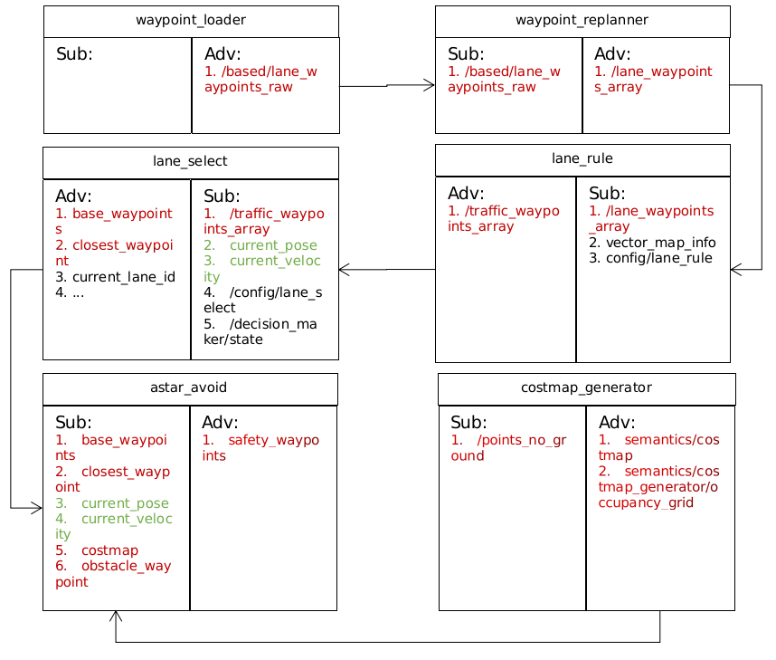

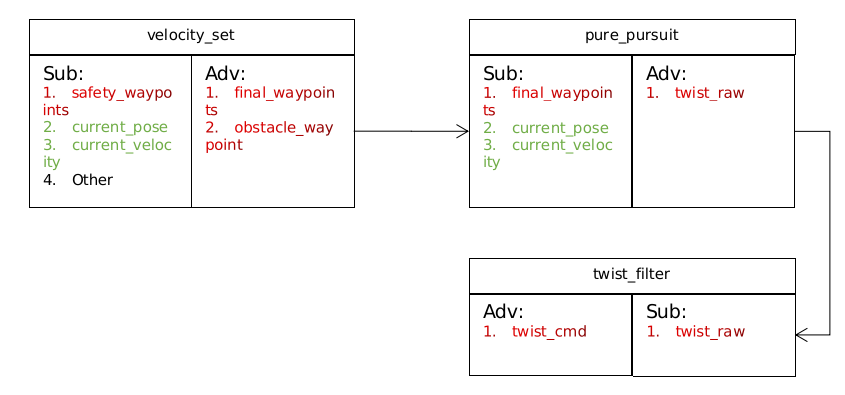

​        本节对Autoware决策规划模块内的基础ROS节点（waypoint_loader, waypoint_replanner, lane_rule, lane_select, astar_avoid,velocity_set, pure_pursuit等节点）做简略分析。

<span id="jump4.1"></span>

### 4.1    节点waypoint_loader

​        节点`waypoint_loader`的主要作用：从本地文件加载采集的轨迹点。

#### 4.1.1    启动方法

* 终端启动:
  
  - roslaunch waypoint_maker waypoint_loader.launch

* 从Runtime Manager启动:

​       打开Runtime Manager，上方computing 选项卡 -> Motion Planning ->waypoint_maker->waypoint_loader，单击 [app] 按钮可更改设置等参数。

#### 4.1.2    程序路径

```java
//源代码路径
src/autoware/core_planning/waypoint_maker/nodes/waypoint_loader
```

#### 4.1.3    参数详情

| 参数名              | 类型       | 说明    |
| ---------------- | -------- | ----- |
| `multi_lane_csv` | *string* | 路标点文件 |

#### 4.1.4    主要结构体

​        autoware_msg::Lane结构体

```c++
autoware_msgs::Lane
{
    Header header
    int32 increment
    int32 lane_id
    Waypoint[] waypoints

    uint32 lane_index
    float32 cost
    float32 closest_object_distance
    float32 closest_object_velocity
    bool is_blocked
}
```

```c++
std_msgs::Header
{
    //序列号
    uint32 seq
    //时间戳
    time stamp
    //表示数据来源于哪一个frame
    string frame_id
}
```

```c++
autoware_msgs::Waypoint
{
    //全局id
    int32 gid 
    //局部id
    int32 lid 
    //位姿信息
    geometry_msgs/PoseStamped pose
    //速度，角速度等信息
    geometry_msgs/TwistStamped twist
    //道路信息
    DTLane dtlane
    int32 change_flag
    //路点信息
    WaypointState wpstate

    uint32 lane_id
    uint32 left_lane_id
    uint32 right_lane_id
    uint32 stop_line_id
    float32 cost
    float32 time_cost

    # Lane Direction
    # FORWARD        = 0
    # FORWARD_LEFT       = 1
    # FORWARD_RIGHT      = 2
    # BACKWARD        = 3 
    # BACKWARD_LEFT      = 4
    # BACKWARD_RIGHT    = 5
    # STANDSTILL       = 6
    uint32 direction
}
```

```c++
geometry_msgs/PoseStamped
{
    Header header
    Pose pose
}
geometry_msgs/Pose
{
    Point position
    Quaternion orientation
}
geometry_msgs/Point
{
    float64 x
    float64 y
    float64 z
}
geometry_msgs/Quaternion
{
    float64 x
    float64 y
    float64 z
    float64 w
}
```

```c++
geometry_msgs/TwistStamped
{
    Header header
    Twist twist
}
geometry_msgs/Twist
{
    Vector3  linear
    Vector3  angular
}
geometry_msgs/Vector3
{
    float64 x
    float64 y
    float64 z
}
```

#### 4.1.5    代码注解

##### ① main函数

​        main函数在`waypoint_loader_node.cpp`中，节点的功能主要通过WaypointLoaderNode对象的run函数实现。

```c++
int main(int argc, char** argv)
{
    ros::init(argc, argv, "waypoint_loader");
     waypoint_maker::WaypointLoaderNode wln;
     wln.run();
     return 0;
} 
```

##### ② run函数

​        读取存储的轨迹点文件数据，并发布至话题“/based/lane_waypoints_raw”

```c++
void WaypointLoaderNode::run()
{
     multi_file_path_.clear();
     parseColumns(multi_lane_csv_, &multi_file_path_);
     autoware_msgs::LaneArray lane_array;
     createLaneArray(multi_file_path_, &lane_array);
     lane_pub_.publish(lane_array);
     output_lane_array_ = lane_array;
    ros::spin();
}
```

##### ③ parseColumns函数

​        parseColumns函数以”，“ 作为分隔符号将字符串line分成若干段，并将其中的空格全部去除，依次储存至字符串向量columns中

```c++
void parseColumns(const std::string& line, std::vector<std::string>* columns)
{
  std::istringstream ss(line);
  std::string column;
  //以”，“为分隔符截取字符串中的每一段
  while (std::getline(ss, column, ','))
  {
    //将每段字符串中的空格删除  
    while (1) 
    {   
      //返回区间[begin()，end()）中第一个值等于" "的元素位置；若未找到，返回end。返回的是迭代器或指针，即位置信息
      auto res = std::find(column.begin(), column.end(), ' ');
      if (res == column.end())
      {   
        break;
      }   
      column.erase(res);
    }   
    if (!column.empty())
    {   
      columns->emplace_back(column);
    }   
  }
}
```

##### ④ createLaneArray函数

​        将paths中各个本地路径对应文件中包含的信息分别填入lane 中，再将lane依次填入lane_array

```c++
void WaypointLoaderNode::createLaneWaypoint(const std::string& file_path, autoware_msgs::Lane* lane)
{
  //检查文件file_path中数据是否合规
  if (!verifyFileConsistency(file_path.c_str()))
  {
    ROS_ERROR("lane data is something wrong...");
    return;
  }

  ROS_INFO("lane data is valid. publishing...");
  //判断文件数据存储格式
  FileFormat format = checkFileFormat(file_path.c_str());
  std::vector<autoware_msgs::Waypoint> wps;
  if (format == FileFormat::ver1)
  {
    loadWaypointsForVer1(file_path.c_str(), &wps);
  }
  else if (format == FileFormat::ver2)
  {
    loadWaypointsForVer2(file_path.c_str(), &wps);
  }
  else
  {
    //读取文件内容存入waypoints中
    loadWaypointsForVer3(file_path.c_str(), &wps);
  }
  lane->header.frame_id = "/map";
  lane->header.stamp = ros::Time(0);
  lane->waypoints = wps;
}
```

##### ⑤ verifyFileConsistency函数

​        verifyFileConsistency函数的作用时“验证文件一致性”。首先ifstream以输入的方式打开filename，如果打开失败则直接返回失败；如果成功则执行checkFileFormat函数，文件格式以下图为例

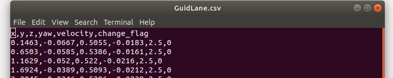

```c++
bool WaypointLoaderNode::verifyFileConsistency(const char* filename)
{
  ROS_INFO("verify...");
  std::ifstream ifs(filename);

  if (!ifs)
  {
    return false;
  }

  // 检查该文件内数据的存储格式
  FileFormat format = checkFileFormat(filename);
  ROS_INFO("format: %d", static_cast<int>(format));
  if (format == FileFormat::unknown)
  {
    ROS_ERROR("unknown file format");
    return false;
  }

  std::string line;
  //删掉第一行
  std::getline(ifs, line);
  size_t ncol = format == FileFormat::ver1 ? 4  // x,y,z,velocity
                                             :
                                             format == FileFormat::ver2 ? 5  // x,y,z,yaw,velocity
                                                                          :
                                                                          countColumns(line);

  //从第二行开始，检验每一行列数是否跟第一行列数一致
  while (std::getline(ifs, line))
  {
    if (countColumns(line) != ncol)
    {
      return false;
    }
  }
  return true;
}
```

##### ⑥ checkFileFormat函数

​        主要作用为判断文件格式

```c++
FileFormat WaypointLoaderNode::checkFileFormat(const char* filename)
{
  std::ifstream ifs(filename);

  if (!ifs)
  {
    return FileFormat::unknown;
  }

  // 读取第一行
  std::string line;
  std::getline(ifs, line);

  // 分析第一行
  std::vector<std::string> parsed_columns;
  parseColumns(line, &parsed_columns);

  // 检查第一个元素是否由数字组成
  // Note: 浮点型数字因为包含小数点，所以会返回False
  if (!std::any_of(parsed_columns.at(0).cbegin(), parsed_columns.at(0).cend(), isdigit))
  {
    return FileFormat::ver3;
  }

  // 如果元素只由数字组成，则以“，”作为分隔符，计算此行有几个元素组成
  int num_of_columns = countColumns(line);
  ROS_INFO("columns size: %d", num_of_columns);

  return (num_of_columns == 3 ? FileFormat::ver1  // "x y z (velocity)"
                                :
                                num_of_columns == 4 ? FileFormat::ver2  // "x y z yaw (velocity)
                                                      :
                                                      FileFormat::unknown);
}
```

##### ⑦loadWaypointsForVer3函数

​        加载文件内容并解析

```c++
void WaypointLoaderNode::loadWaypointsForVer3(const char* filename, std::vector<autoware_msgs::Waypoint>* wps)
{
  std::ifstream ifs(filename);

  if (!ifs)
  {
    return;
  }

  std::string line;
  std::getline(ifs, line);  // 读取第一行
  std::vector<std::string> contents;
  parseColumns(line, &contents);

  // 从第二行开始解析
  while (std::getline(ifs, line))
  {
    autoware_msgs::Waypoint wp;
    // 解析该行，构造waypoint结构体
    parseWaypointForVer3(line, contents, &wp);
    wps->emplace_back(wp);
  }
}
```

##### ⑧parseWaypointForVer3函数

​        解析输入字符串，构造waypoint结构体

```c++
void WaypointLoaderNode::parseWaypointForVer3(const std::string& line, const std::vector<std::string>& contents,
                                              autoware_msgs::Waypoint* wp)
{
  std::vector<std::string> columns;
  parseColumns(line, &columns);
  std::unordered_map<std::string, std::string> map;
  for (size_t i = 0; i < contents.size(); i++)
  {
    map[contents.at(i)] = columns.at(i);
  }

  wp->pose.pose.position.x = std::stod(map["x"]);
  wp->pose.pose.position.y = std::stod(map["y"]);
  wp->pose.pose.position.z = std::stod(map["z"]);
  wp->pose.pose.orientation = tf::createQuaternionMsgFromYaw(std::stod(map["yaw"]));
  wp->twist.twist.linear.x = kmph2mps(std::stod(map["velocity"]));
  wp->change_flag = std::stoi(map["change_flag"]);
  wp->wpstate.steering_state = (map.find("steering_flag") != map.end()) ? std::stoi(map["steering_flag"]) : 0;
  wp->wpstate.accel_state = (map.find("accel_flag") != map.end()) ? std::stoi(map["accel_flag"]) : 0;
  wp->wpstate.stop_state = (map.find("stop_flag") != map.end()) ? std::stoi(map["stop_flag"]) : 0;
  wp->wpstate.event_state = (map.find("event_flag") != map.end()) ? std::stoi(map["event_flag"]) : 0;
}
```
<span id="jump4.2"></span>

### 4.2    节点waypoint_replanner

​        节点`waypoint_replanner`的主要作用：在加载的轨迹点基础上重新对他们的速度进行设置。

#### 4.2.1    启动方法

* 终端启动:
  
  - roslaunch waypoint_maker waypoint_loader.launch

* 从Runtime Manager启动:

​       打开Runtime Manager，上方computing 选项卡 -> Motion Planning ->waypoint_maker->waypoint_loader，单击 [app] 按钮可更改设置等参数。

#### 4.2.2    程序路径

```java
src/autoware/core_planning/waypoint_maker/nodes/waypoint_replanner
```

#### 4.2.3    参数详情

| 参数名                  | 类型     | 说明         |
| -------------------- | ------ | ---------- |
| `replanning_mode`    | *bool* | 重规划模式      |
| velocity_max         | double | 最大速度（km/h) |
| velocity_min         | double | 最小速度（km/h) |
| accel_limit          | double | 加速限制       |
| decel_limit          | double | 减速限制       |
| resample_mode        | bool   | 重采样模式      |
| resample_interval    | bool   | 重采样间隔      |
| replan_curve_mode    | bool   | 重规划曲线模式    |
| replan_endpoint_mode | bool   | 重规划结束点模式   |

#### 4.2.4    代码注解

##### ① main函数

​        main函数在`waypoint_replanner_node.cpp`中。

```c++
int main(int argc, char** argv)
{
  ros::init(argc, argv, "waypoint_replanner");
  waypoint_maker::WaypointReplannerNode wr; 
  ros::spin();

  return 0;
}
```

​        在main函数中只做了一件事，新建WaypointReplannerNode对象`wr`， 因此转到WaypointReplannerNode类的构造函数， 构造函数内实现了话题的订阅和发布。其中订阅的“/based/waypoints_raw”就是前面waypoint_loader节点所发布的话题。

```c++
WaypointReplannerNode::WaypointReplannerNode() : pnh_("~"), is_first_publish_(true)
{
  WaypointReplannerConfig temp_config;

  //...(下略)
  if (use_decision_maker_)
  {
    lane_pub_ = nh_.advertise<autoware_msgs::LaneArray>("/based/lane_waypoints_array", 10, true);
  }
  else
  {
    lane_pub_ = nh_.advertise<autoware_msgs::LaneArray>("/lane_waypoints_array", 10, true);
  }

  lane_sub_ = nh_.subscribe("/based/lane_waypoints_raw", 1, &WaypointReplannerNode::laneCallback, this);
  config_sub_ = nh_.subscribe("/config/waypoint_replanner", 1, &WaypointReplannerNode::configCallback, this);
}
```

##### ② configCallback函数

​        configCallback函数为话题“/config/waypoint_replanner”的回调函数，主要进行一些成员变量的初始化。

```c++
void WaypointReplannerNode::configCallback(const autoware_config_msgs::ConfigWaypointReplanner::ConstPtr& conf)
{
    //重规划模式
     replanning_mode_ = conf->replanning_mode;
    //实时调整模式
     realtime_tuning_mode_ = conf->realtime_tuning_mode;
     use_decision_maker_ = conf->use_decision_maker;
     replanner_.initParameter(conf);
     if (!lane_array_.lanes.empty() && (is_first_publish_ || realtime_tuning_mode_))
     {
          publishLaneArray();
     }
} 
```

##### ③ laneCallback函数

​        laneCallback函数为话题“/based/lane_waypoints_raw”的回调函数，在加载的轨迹点基础上重新规划并发布话题“lane_waypoints_array”。

```C++
void WaypointReplannerNode::laneCallback(const autoware_msgs::LaneArray::ConstPtr& lane_array)
{
     lane_array_ = *lane_array;
     publishLaneArray();
} 
```

##### ④ publishLaneArray函数

​        如果replanning_mode 为true，则调用replan函数重新规划。

```c++
void WaypointReplannerNode::publishLaneArray()
{
    autoware_msgs::LaneArray array(lane_array_);

     if (replanning_mode_)
     {
        //重规划路径
         replan(array);
    }
    //发布重新规划过的路径集合
     lane_pub_.publish(array);
     is_first_publish_ = false;
}
```

##### ⑤ replan函数

​        replan函数内遍历`lane_array.lanes`。对每一条Lane，replanner_都调replanLaneWaypointVel函数。

```c++
void WaypointReplannerNode::replan(autoware_msgs::LaneArray& lane_array)
{
     for (auto &el : lane_array.lanes)
     {
        //重规划路标点速度
          replanner_.replanLaneWaypointVel(el);
     }
}
```

##### ⑥ replanLaneWaypointVel函数

​        lanLaneWaypointVel函数用于重规轨迹点的速度。

```c++
void replanLaneWaypointVel(autoware_msgs::Lane& lane)
{
 //...(上略)
     unsigned long last = lane.waypoints.size() - 1;
     limitVelocityByRange(0, last, config_.velocity_max, lane);
     if (config_.resample_mode)
     {
        //重采样路标点
         resampleLaneWaypoint(config_.resample_interval, lane, dir);
         last = lane.waypoints.size() - 1;
     }

     // 根据每个航路点的曲率设置速度
     if (config_.replan_curve_mode)
     {
          std::vector<double> curve_radius;
          createRadiusList(lane, curve_radius);
          setVelocityByRange(0, last, config_.velocity_max, lane);
          for (unsigned long i = 0; i < curve_radius.size(); i++)
          {  
               lane.waypoints[i].twist.twist.linear.x = std::fmin(lane.waypoints[i].twist.twist.linear.x,
                        std::sqrt(config_.lateral_accel_limit * std::fmax(curve_radius[i], config_.radius_min)));
          }  
          limitVelocityByRange(0, last, config_.velocity_max, lane);
     }

     // 设置车道末端的速度
     if (config_.replan_endpoint_mode)
     {
          // 将最后一个航点的速度置0
          setVelocityByRange(last - 1, last, 0.0, lane);
          // 为除最后一个航点之外的其他航点设置最小速度
          raiseVelocityByRange(0, last - 1, config_.velocity_min, lane);
          // 再次平滑速度
          limitVelocityByRange(0, last, config_.velocity_max, lane);
     }
     if (dir == LaneDirection::Backward)
     {
          changeVelSign(lane, false);
     }
}
```

##### ⑦ limitVelocityByRange函数

​        代码略，通过加速度与速度之间的关系进一步对速度进行修正。

 

​        其中，a为最大加速度，x为距离（根据前后两个轨迹点的位置算得）。由此可以计算处在最大加速度的限制条件下，下一轨迹点的速度最大/最小值。据此进行修正。

##### ⑧ resampleLaneWaypoint函数

​        重采样轨迹点

```c++
void resampleLaneWaypoint(const double resample_interval, autoware_msgs::Lane& lane, LaneDirection dir)
{
  if (lane.waypoints.size() < 2)
  {
    return;
  }
  autoware_msgs::Lane original_lane(lane);
  ...
  for (unsigned long i = 1; i < original_lane.waypoints.size(); i++)
  {
    //采样三个轨迹点
    //[0] = previous point, [1] = target point, [2] = next point
    CbufGPoint curve_point = getCrvPointsOnResample(lane, original_lane, i);
    const std::vector<double> curve_param = calcCurveParam(curve_point);
    lane.waypoints.back().twist.twist = original_lane.waypoints[i - 1].twist.twist;
    lane.waypoints.back().wpstate = original_lane.waypoints[i - 1].wpstate;
    lane.waypoints.back().change_flag = original_lane.waypoints[i - 1].change_flag;
    // 如果直行
    if (curve_param.empty())
    {
      resampleOnStraight(curve_point, lane, dir);
    }
    // 如果转弯
    else
    {
      resampleOnCurve(curve_point[1], curve_param, lane, dir);
    }
  }
  ...
}
```

##### ⑨getCrvPointsOnResample函数

​        在lane和original_lane上选择三个点作为圆弧上的点

```c++
const CbufGPoint getCrvPointsOnResample(
    const autoware_msgs::Lane& lane, const autoware_msgs::Lane& original_lane, unsigned long original_index) const
{
  unsigned long id = original_index;
  CbufGPoint curve_point(3);
  const unsigned int n = (config_.lookup_crv_width - 1) / 2;
  const autoware_msgs::Waypoint cp[3] = {
    (lane.waypoints.size() < n) ? lane.waypoints.front() : lane.waypoints[lane.waypoints.size() - n],
    original_lane.waypoints[id],
    (id < original_lane.waypoints.size() - n) ? original_lane.waypoints[id + n] : original_lane.waypoints.back()
  };
  for (int i = 0; i < 3; i++)
  {
    curve_point.push_back(cp[i].pose.pose.position);
  }
  return curve_point;
}
```

##### ⑩calcCurveParam函数

​        计算圆的三个参数[center_x , center_y, radius]，首先根据轨迹点p0, p1, p2，计算下面各式：

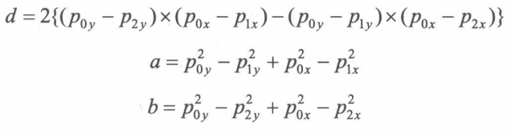

由上面各式，进一步计算得到曲线的中心点和曲率

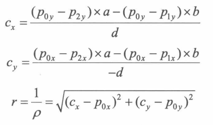

”根据圆上三点求圆心和半径”这一问题有多种解法，主流的有两种：（1）分别通过其中两点的中垂线交点求圆心；（2）通过三个点到圆心距离相等联立方程求解。

```c++
const std::vector<double> WaypointReplanner::calcCurveParam(CbufGPoint p) const
{
  for (int i = 0; i < 3; i++, p.push_back(p.front()))  // if exception occured, change points order
  {
    //根据向量叉乘的模的值判断是否在一条直线上，如过模值小于1e-8则近似认为三点在一条直线上，圆的参数为空
    const double d = 2 * ((p[0].y - p[2].y) * (p[0].x - p[1].x) - (p[0].y - p[1].y) * (p[0].x - p[2].x));
    if (fabs(d) < 1e-8)
    {
      continue;
    }
    const std::vector<double> x2 = { p[0].x * p[0].x, p[1].x * p[1].x, p[2].x * p[2].x };
    const std::vector<double> y2 = { p[0].y * p[0].y, p[1].y * p[1].y, p[2].y * p[2].y };
    const double a = y2[0] - y2[1] + x2[0] - x2[1];
    const double b = y2[0] - y2[2] + x2[0] - x2[2];
    std::vector<double> param(3);
    const double cx = param[0] = ((p[0].y - p[2].y) * a - (p[0].y - p[1].y) * b) / d;
    const double cy = param[1] = ((p[0].x - p[2].x) * a - (p[0].x - p[1].x) * b) / -d;
    param[2] = sqrt((cx - p[0].x) * (cx - p[0].x) + (cy - p[0].y) * (cy - p[0].y));
    return param;
  }
  return std::vector<double>();  // error
}
```

<span id="jump4.3"></span>

### 4.3    节点lane_navi

​        节点lane_navi的主要作用：根据路由请求在矢量地图中寻找通往目的地的各条可行路径，并发布至话题“/lane_waypoints_array”。

#### 4.3.1    程序路径

```java
src/autoware/core_planning/lane_planner/nodes/lane_navi 
```

代码略。

<span id="jump4.4"></span>

### 4.4    节点lane_rule

​        节点lane_rule的主要作用：对话题“/lane_waypoints_array”上轨迹点的速度方面进一步修正，为红灯时在停车线内减速停车等场景提供支持，发布话题“/traffic_waypoints_array"。

#### 4.4.1    程序路径

```java
src/autoware/core_planning/lane_planner/nodes/lane_rule
```

代码略。

<span id="jump4.5"></span>

### 4.5    节点lane_select

​        节点lane_select的主要作用：判断当前车道，同时规划从当前车道切换至其他车道的轨迹，接着根据话题“state”中的驾驶状态（是否需要换道）发布当前车道数据/换到轨迹数据至话题“base_waypoints”供其他节点继续规划。

#### 4.5.1    启动方法

* 终端启动:
  
  - roslaunch lane_planner lane_select.launch
  - 从Runtime Manager启动:

​       打开Runtime Manager，上方computing 选项卡 -> mission_planning ->lane_planner->lane_select，单击 [app] 按钮可更改设置等参数。

#### 4.5.2    程序路径

```java
src/autoware/core_planning/lane_planner/nodes/lane_select
```

#### 4.5.3    代码注解

##### ① main函数

​        main函数在`lane_select_node.cpp`中。节点lane_select启动时新建LaneSelectNode对象，其构造函数中首先对一些成员变量进行赋值，接着调用initForROS函数设置订阅者/发布者，设置参数。

```c++
int main(int argc, char **argv)
{
 ros::init(argc, argv, "lane_select");
 lane_planner::LaneSelectNode lsn;
 lsn.run();

 return 0;
}
```

##### ② initForRos函数

​        该函数设置参数，设置订阅者和发布者

```c++
void LaneSelectNode::initForROS()
{
  // setup subscriber
  sub1_ = nh_.subscribe("traffic_waypoints_array", 1, &LaneSelectNode::callbackFromLaneArray, this);
  sub2_.subscribe(nh_, "current_pose", 1);
  sub3_.subscribe(nh_, "current_velocity", 1);
  ...
  // setup publisher
  pub1_ = nh_.advertise<autoware_msgs::Lane>("base_waypoints", 1, true);
  pub2_ = nh_.advertise<std_msgs::Int32>("closest_waypoint", 1);
  ...

  // get from rosparam
  ...

  // Kick off a timer to publish base_waypoints, closest_waypoint, change_flag, current_lane_id, and vehicle_location
  timer_ = nh_.createTimer(ros::Duration(1.0/update_rate_), &LaneSelectNode::processing, this);
}
```

##### ③ callbackFromLaneArray函数

​        主要功能构建tuple_vec_成员变量，使用tuple_vec_ 来存储laneArray相关变量。  tuple_vec_ 数据类型为std::vector<std::tuple<autoware_msgs::Lane, int32_t, ChangeFlag>>

tuple元素的定义依次为：lane, closest_waypoint on the lane to ego-vehicle, lane change flag ，

```c++
void LaneSelectNode::callbackFromLaneArray(const autoware_msgs::LaneArrayConstPtr &msg)
{
  tuple_vec_.clear();
  tuple_vec_.shrink_to_fit();
  tuple_vec_.reserve(msg->lanes.size());
  for (const auto &el : msg->lanes)
  {
    auto t = std::make_tuple(el, -1, ChangeFlag::unknown);
    tuple_vec_.push_back(t);
  }

  lane_array_id_ = msg->id;
  current_lane_idx_ = -1;
  right_lane_idx_ = -1;
  left_lane_idx_ = -1;
  is_new_lane_array_ = true;
  is_lane_array_subscribed_ = true;
}
```

##### ④ processing函数

```c++
void LaneSelectNode::processing(const ros::TimerEvent& e)
{
  //检查相关话题是否订阅成功
  if (!isAllTopicsSubscribed())
    return;

  // 更新每条lane距离自车最近路标点,更新tuple_vec_中closest_waypoint元素的值
  if (!updateClosestWaypointNumberForEachLane())
  {
    publishClosestWaypoint(-1);
    publishVehicleLocation(-1, lane_array_id_);
    resetLaneIdx();
    return;
  }

  if (current_lane_idx_ == -1) {
    // 寻找距离自车最近的车道，更新current_lane_idx_
    findCurrentLane();
  }
  //寻找相邻车道更新left_lane_idx_, right_lane_idx_
  findNeighborLanes();

  if (current_state_ == "LANE_CHANGE")
  {
    try
    {
      //根据current_lane_idx_确定tuple_vec_中的元组，并根据该元组中change_flag值更新current_lane_idx_
      //然后调用findNeighborLanes更新left_lane_idx_, right_lane_idx_
      changeLane();
      //更新change lane中最近路标点及change flag
      std::get<1>(lane_for_change_) =
          getClosestWaypointNumber(std::get<0>(lane_for_change_), current_pose_.pose, current_velocity_.twist,
                                   std::get<1>(lane_for_change_), distance_threshold_, search_closest_waypoint_minimum_dt_);
      std::get<2>(lane_for_change_) = static_cast<ChangeFlag>(
          std::get<0>(lane_for_change_).waypoints.at(std::get<1>(lane_for_change_)).change_flag);
      //发布change lane 相关信息
      publishLane(std::get<0>(lane_for_change_));
      publishClosestWaypoint(std::get<1>(lane_for_change_));
      publishChangeFlag(std::get<2>(lane_for_change_));
      publishVehicleLocation(std::get<1>(lane_for_change_), lane_array_id_);
    }
    catch (std::out_of_range)
    {
      ROS_WARN_THROTTLE(2, "Failed to get closest waypoint num");
    }
  }
  else
  {
    //更新tuple_vec_中每个元组内的change flag数据
    updateChangeFlag();
    //更新lane_for_change_ 
    createLaneForChange();

    if (is_new_lane_array_ || prev_lane_idx_ != current_lane_idx_)
    {
      publishLane(std::get<0>(tuple_vec_.at(current_lane_idx_)));
      prev_lane_idx_ = current_lane_idx_;
      is_new_lane_array_ = false;
    }
       //根据元组tuple_vec_.at(current_lane_idx_)中的信息发布消息到各个话题
    publishClosestWaypoint(std::get<1>(tuple_vec_.at(current_lane_idx_)));
    publishChangeFlag(std::get<2>(tuple_vec_.at(current_lane_idx_)));
    publishVehicleLocation(std::get<1>(tuple_vec_.at(current_lane_idx_)), lane_array_id_);
  }
  publishVisualizer();
  resetSubscriptionFlag();
}
```

<span id="jump4.6"></span>

### 4.6    节点 astar_avoid

​        节点astar_avoid的主要作用：基于几点“lane_select”发布在话题“base_waypoints”上的轨迹， 利用A*算法规划壁障轨迹并发布至话题“safety_waypoints”。

#### 4.6.1    启动方法

* 终端启动:
  
  - roslaunch waypoint_planner astar_avoid.launch
  - 从Runtime Manager启动:

​       打开Runtime Manager，上方computing 选项卡 -> motion_planner ->waypoint_planner->astar_avoid，单击 [app] 按钮可更改设置等参数。

#### 4.6.2    程序路径

```java
src/autoware/core_planning/waypoint_planner/src/astar_avoid
```

#### 4.6.3    参数详情

| 参数名(astar_avoid)         | 类型     | 说明             |
| ------------------------ | ------ | -------------- |
| enable_avoidance         | *bool* | 启用避障功能         |
| avoid_waypoints_velocity | double | 避障时最大速度（km/h)  |
| avoid_start_velocity     | double | 开始避障速度阈值（km/h) |
| replan_interval          | double | 重规划时间间隔（s)     |
| search_waypoints_delta   | int    | 路标点下标搜索增量      |

| 参数名(astar_search)       | 类型       | 说明                                              |
| ----------------------- | -------- | ----------------------------------------------- |
| robot_length            | *double* | 机器人长度                                           |
| robot_width             | double   | 机器人宽度                                           |
| robot_base2back         | double   | 质心到车尾距离                                         |
| minimum_turning_radius  | double   | 最小转弯半径                                          |
| theta_size              | int      | 决定机器人移动时航向角变化步长,<br />移动一步航向角变化360/theta_size 度 |
| angle_goal_range        | double   | 距离目标点角度范围                                       |
| lateral_goal_range      | double   | 距离目标点横向距离范围                                     |
| longitudinal_goal_range | double   | 距离目标点纵向距离范围                                     |
| obstacle_threshold      | double   | 障碍物阈值                                           |

#### 4.6.4    算法介绍-A*搜索算法

​        planAvoidWaypoints函数内调用A* 搜索算法，下面简单介绍下A*搜索算法。

​        A*搜索算法时一个被广泛应用于路径优化领域的算法，它的寻路能力基于启发式的代价函数。

##### ① 栅格化地图

​        A*算法第一步时栅格化地图，具体来说是将连续的地图离散化，用一个大型的二位列表存储地图数据。

##### ② 评估函数

​        A*算法的核心是一个评估函数：


​        其中，G(n)为代价函数，在该环境中G的值代表从起点移动到该方格n的距离代价。H(n)为启发式代价函数，在该环境中H的值代表该方格n到终点的距离代价。 

##### ③ 搜索步骤

​        A*涉及两个重要的列表，openList（开放列表，存储候选节点）和closeList(关闭列表，存储已经走过的节点）。算法先把起点放入openList中，然后重复下面的步骤。

​        遍历openlist，找到F值最小的节点当做当前搜索的起点，用P表示；

​        将P放入closelist中， 作为已经走过的节点。

​        探索P周围相邻节点，计算他们的H值、G值和F值，并把P设置为这些节点的父节点，将这些节点当做探索节点放到Q中。

​        如果Q中的节点不在openlist或closelist中，则将其加入到openlist中；Q中节点已经存在于openlist中的，比较这些节点的F值和他们在openlist中的F值哪个更小（F越小说明路径更优），如果openlist中的F值更小或者二者相等，不做任何改变，否则用Q中的节点替换openlist中的节点； Q中节点已经存在于closelist中的，比较这些节点的F值和他们在closelist中的F值哪个更小，如果closelist中的F值更小或者相等，不做任何改变，否则将其加入到openlist。

​        如果终点在openlist中，则退出搜索，最优路径可以从终点开始，沿着父节点逆向溯源直至起点而获得；如果openlist是空的，则退出，意味着起点到终点没有任何一条可行驶路径。

#### 4.6.5    代码注解

##### ① main函数

​        main函数在`astar_avoid_node.cpp`中，节点的主要功能通过AstarAvoid对象的run函数实现。 

```c++
int main(int argc, char** argv)
{
 ros::init(argc, argv, "astar_avoid");
 AstarAvoid node;
 node.run();

 return 0;
}
```

##### ② AstarAvoid构造函数

​        构造函数主要功能为设置变量，发布者，订阅者。

```c++
AstarAvoid::AstarAvoid()
 : nh_()
 , private_nh_("~")
{
    //...(下略)

     //设置变量
     private_nh_.param<int>("closest_search_size", closest_search_size_, 30);
    //...(下略)

     //设置发布者
     safety_waypoints_pub_ = nh_.advertise<autoware_msgs::Lane>("safety_waypoints", 1, true);
    //...(下略)

     //设置订阅者
     base_waypoints_sub_ = nh_.subscribe("base_waypoints", 1, &AstarAvoid::baseWaypointsCallback, this);
    //...(下略)
 }
```

##### ③ run函数

​        run函数是astar_avoid的功能主体。run函数实际上是一个有限状态机，根据条件切换state_ ，在特定状态更新avoid_waypoints_。

​        函数内AstarAvoid::STATE的定义如下：

```c++
typedef enum STATE
 {
  INITIALIZING = -1, 
  RELAYING = 0,
  STOPPING = 1,
  PLANNING = 2,
  AVOIDING = 3 
 } State;
```

​        run函数代码及状态转移关系如下：

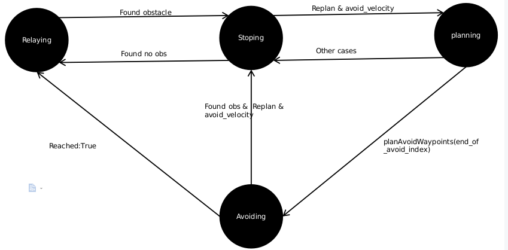

```c++
void AstarAvoid::run()
{
     state_ = AstarAvoid::STATE::INITIALIZING;
     while (ros::ok())
     {
          ros::spinOnce();
        // 检查各回调函数是否正确接收到对应话题的消息
          if (checkInitialized())
          {  
           break;
          }  
          ros::Duration(1.0).sleep();
     }

    //主循环
    int end_of_avoid_index = -1; 
    ros::WallTime start_plan_time = ros::WallTime::now();
    ros::WallTime start_avoid_time = ros::WallTime::now();

    // 重置障碍物坐标
    obstacle_waypoint_index_ = -1; 

    // 启动时设置为中继模式
    state_ = AstarAvoid::STATE::RELAYING;

    // 启动定时器发布话题
    timer_ = nh_.createTimer(ros::Duration(1.0/update_rate_), &AstarAvoid::publishWaypoints, this);

    while (ros::ok())
    {
        ros::spinOnce();
        // 判断是否开启避障模式
        if (!enable_avoidance_)
        {
            rate_->sleep();
            continue;
        }
        bool found_obstacle = (obstacle_waypoint_index_ >= 0);
        //avoid_star_velocity_(km/h)是开始避让时自车车速阈值
        bool avoid_velocity = (current_velocity_.twist.linear.x < avoid_start_velocity_ / 3.6);

        // 更新状态state_
        if (state_ == AstarAvoid::STATE::RELAYING)
        {
            avoid_waypoints_ = base_waypoints_;
            //发现障碍物，从中继模式转为停车模式
            if (found_obstacle)
            {
                ROS_INFO("RELAYING -> STOPPING, Decelerate for stopping");
                state_ = AstarAvoid::STATE::STOPPING;
            }
        }
        else if (state_ == AstarAvoid::STATE::STOPPING)
        {
            //检查重规划时间间隔条件
            bool replan = ((ros::WallTime::now() - start_plan_time).toSec() > replan_interval_);
            //障碍物消失，重新回到中继模式
            if (!found_obstacle)
            {
                ROS_INFO("STOPPING -> RELAYING, Obstacle disappers");
                state_ = AstarAvoid::STATE::RELAYING;
            }
            //障碍物仍然存在，且满足重规划时间间隔和速度要求，从停车模式转为规划模式
            else if (replan && avoid_velocity)
            {
                ROS_INFO("STOPPING -> PLANNING, Start A* planning");
                state_ = AstarAvoid::STATE::PLANNING;
            }
        }
        else if (state_ == AstarAvoid::STATE::PLANNING)
        {
            start_plan_time = ros::WallTime::now();
            //确定规避路线并相应添加到avoid_waypoints_,
            //同时更新传入函数的end_of_avoid_index
            //避障路线规划成功则从规划模式转为避障模式，否则切换为停车模式
            if (planAvoidWaypoints(end_of_avoid_index))
            {
                ROS_INFO("PLANNING -> AVOIDING, Found path");
                state_ = AstarAvoid::STATE::AVOIDING;
                start_avoid_time = ros::WallTime::now();
                closest_waypoint_index_ = -1;
            }
            else
            {
                ROS_INFO("PLANNING -> STOPPING, Cannot find path");
                state_ = AstarAvoid::STATE::STOPPING;
            }
        }
        else if (state_ == AstarAvoid::STATE::AVOIDING)
        {
            updateClosestWaypoint(avoid_waypoints_, current_pose_global_.pose, closest_search_size_);
            //如果自车位置超过避障路线终点，则从避障模式转为中继模式
            if (closest_waypoint_index_ > end_of_avoid_index)
            {
                ROS_INFO("AVOIDING -> RELAYING, Reached goal");
                state_ = AstarAvoid::STATE::RELAYING;
                closest_waypoint_index_ = -1;
            }
            else if (found_obstacle && avoid_velocity)
            {
                bool replan = ((ros::WallTime::now() - start_avoid_time).toSec() > replan_interval_);
                if (replan)
                    {
                        ROS_INFO("AVOIDING -> STOPPING, Abort avoiding");
                        state_ = AstarAvoid::STATE::STOPPING;
                    }
            }
        }
        rate_->sleep();
    }
}
```

##### ④ planAvoidWaypoints函数

​        逐步更新目标位姿，并执行从当前位姿到目标位姿的基于A*算法的增量搜索，确定避障路线并相应添加进avoid_waypoints_。另外，更新传入函数的end_of_avoid_index。

```c++
bool AstarAvoid::planAvoidWaypoints(int& end_of_avoid_index)
{
     bool found_path = false;
     //获得avoid_waypoints_中的“距离最近轨迹点”的下标
     updateClosestWaypoint(avoid_waypoints_, current_pose_global_.pose, closest_search_size_);
     if (closest_waypoint_index_ == -1)
     {
          return false;
     }
     // 逐步更新目标位姿并执行A*搜索
     // search_waypoints_size用于跳过轨迹点以进行增量搜索
     for (int i = search_waypoints_delta_; i < static_cast<int>(search_waypoints_size_); i += search_waypoints_delta_)
     {
          // 更新目标下标goal_waypoint_index
          int goal_waypoint_index = closest_waypoint_index_ + obstacle_waypoint_index_ + i;
          if (goal_waypoint_index >= static_cast<int>(avoid_waypoints_.waypoints.size()))
      {
           break;
      }
      // 更新目标位姿
      goal_pose_global_ = avoid_waypoints_.waypoints[goal_waypoint_index].pose;
      goal_pose_local_.header = costmap_.header

        /*指定goal_pose_local_和goal_pose_global_各自的frame_id,
         *就可以通过transformPose函数获得位姿goal_pose_global_.pose_
         *从global坐标系下转换到costmap_坐标系下的新位姿goal_pose_local_.pose
         */
      goal_pose_local_.pose = transformPose(goal_pose_global_.pose,
                         getTransform(costmap_.header.frame_id, goal_pose_global_.header.frame_id));

      // astar_的定义是 AstarSearch astar_
      // 根据costmap_的信息初始化astar_内A*搜索的代价地图nodes_
      astar_.initialize(costmap_);

      // 启动A*搜索        
      found_path = astar_.makePlan(current_pose_local_.pose, goal_pose_local_.pose);                                     
      static ros::Publisher pub = nh_.advertise<nav_msgs::Path>("debug", 1, true); 
      if (found_path)
      {
           pub.publish(astar_.getPath());
           end_of_avoid_index = goal_waypoint_index;

           //将用于避障的轨迹astar_.getPath()合并进avoid_waypoints
           //并更新end_of_avoid_index
           mergeAvoidWaypoints(astar_.getPath(), end_of_avoid_index);
           if (avoid_waypoints_.waypoints.size() > 0)
           {
                ROS_INFO("Found GOAL at index = %d", goal_waypoint_index);
                astar_.reset();
                return true;
           }
           else
           {
                found_path = false;
           }
      }
      astar_.reset();
     }
     ROS_ERROR("Can't find goal...");
     return false;
}
```

##### ⑤ search函数

​        search函数启动基于A*算法的搜索过程

```c++
bool AstarSearch::search()
{
     ros::WallTime begin = ros::WallTime::now();

     // 开始A*搜索
     // 如果openlist为空，搜索失败img
     while (!openlist_.empty())
     {
      // 检查时间并在搜索时间到达限制时终止
      ros::WallTime now = ros::WallTime::now();
      double msec = (now - begin).toSec() * 1000.0;
      if (msec > time_limit_)
      {
       ROS_DEBUG("Exceed time limit of %lf [ms]", time_limit_);
       return false;
      }

      // 从openlist中弹出最低代价节点
      SimpleNode top_sn = openlist_.top();
      openlist_.pop();

      AstarNode* current_an = &nodes_[top_sn.index_y][top_sn.index_x][top_sn.index_theta];
      //将该节点状态设为CLOSED，即将该节点放入closelist中
      current_an->status = STATUS::CLOSED;

      //目标检查
      if (isGoal(current_an->x, current_an->y, current_an->theta))
      {
       ROS_DEBUG("Search time: %lf [msec]", (now - begin).toSec() * 1000.0);
       setPath(top_sn);
       return true;
      }

      // 拓展节点
      for (const auto& state : state_update_table_[top_sn.index_theta])
      {
           //下一个节点
           double next_x = current_an->x + state.shift_x;
           double next_y = current_an->y + state.shift_y;
           double next_theta = modifyTheta(current_an->theta + state.rotation);
           double move_cost = state.step;
           double move_distance = current_an->move_distance + state.step;

           // 增加反向代价
           if (state.back != current_an->back)
                move_cost *= reverse_weight_;

           // 计算下一个状态的下标
           SimpleNode next_sn;
           geometry_msgs::Point next_pos;
           next_pos.x = next_x;
           next_pos.y = next_y;
           pointToIndex(next_pos, &next_sn.index_x, &next_sn.index_y);
           next_sn.index_theta = top_sn.index_theta + state.index_theta;

           // 避免下标无效
           next_sn.index_theta = (next_sn.index_theta + theta_size_) % theta_size_;

           // 检查下标是否有效
           if (isOutOfRange(next_sn.index_x, next_sn.index_y) || detectCollision(next_sn))
           {
                continue;
           }

           AstarNode* next_an = &nodes_[next_sn.index_y][next_sn.index_x][next_sn.index_theta];
           double next_gc = current_an->gc + move_cost;
           double next_hc = nodes_[next_sn.index_y][next_sn.index_x][0].hc;  // wavefront 或距离变换启发式

           // 增加欧式距离成本
           if (use_potential_heuristic_)
           {
                next_gc += nodes_[next_sn.index_y][next_sn.index_x][0].hc;
                next_hc += calcDistance(next_x, next_y, goal_pose_local_.pose.position.x, goal_pose_local_.pose.position.y);
                distance_heuristic_weight_;
           }
           //...(下略)

           // 下一个节点状态为STATUS::NONE
           if (next_an->status == STATUS::NONE)
           {
                next_an->status = STATUS::OPEN;
                next_an->x = next_x;
                next_an->y = next_y;
                next_an->theta = next_theta;
                next_an->gc = next_gc;
                next_an->hc = next_hc;
                next_an->move_distance = move_distance;
                next_an->back = state.back;
                next_an->parent = current_an;
                next_sn.cost = next_an->gc + next_an->hc;
                openlist_.push(next_sn);
                continue;
           }

           // 下一个节点在openlist或closelist中
           if (next_an->status == STATUS::OPEN || next_an->status == STATUS::CLOSED)
           {
            if (next_gc < next_an->gc)
            {
                next_an->status = STATUS::OPEN;
                next_an->x = next_x;
                next_an->y = next_y;
                next_an->theta = next_theta;
                next_an->gc = next_gc;
                next_an->hc = next_hc;  // already calculated ?
                next_an->move_distance = move_distance;
                next_an->back = state.back;
                next_an->parent = current_an;
                next_sn.cost = next_an->gc + next_an->hc;
                openlist_.push(next_sn);
                continue;
            }
           }
      }  // 状态更新
     }
     // 寻路失败
     ROS_DEBUG("Open list is empty...");
     return false;
}
```

<span id="jump4.7"></span>

### 4.7    节点velocity_set

​        节点velocity_set的主要作用：在节点astar_avoid发布在话题“safety_waypoints”上的轨迹基础上，修正无人车靠近障碍物或停车线的速度。

#### 4.7.1    启动方法

* 终端启动:
  
  - roslaunch waypoint_planner velocity_set_option.launch
  - 从Runtime Manager启动:

​       打开Runtime Manager，上方computing 选项卡 -> motion_planner ->waypoint_planner->velocity_set，单击 [app] 按钮可更改设置等参数。

#### 4.7.2    程序路径

```
src/autoware/core_planning/waypoint_planner/src/velocity_set
```

#### 4.7.3    参数详情

| 参数名                    | 类型       | 说明           |
| ---------------------- | -------- | ------------ |
| remove_points_upto     | `double` | 删除点范围        |
| stop_distance_obstacle | `double` | 障碍物前停车距离     |
| stop_distance_stopline | `double` | 停止线前停车距离     |
| detection_range        | `double` | 障碍物检测范围      |
| deceleration_range     | `double` | 减速检测范围       |
| points_threshold       | `int`    | 点云个数阈值       |
| deceleration_obstacle  | `double` | 前方存在障碍物时减速度值 |
| deceleration_stopline  | `double` | 前方存在停止线时减速度值 |
| velocity_change_limit  | `double` | 速度变化限制（km/h) |

#### 4.7.4    代码注解

##### ① main函数

首先是main函数，main函数在velocity_set.cpp中，主要功能为：

​    1.Crosswalk: 人行横道检测

​    2.obstacleDetection: 检测障碍物位于当前轨迹路标点索引值，并根据距离信息判断当前需要减速还是停车（EControl::STOP、DECELERATE）

3. changeWaypoints: 根据障碍物信息修改waypoints中的速度信息，进而在pure_pursuit节点形成减速或者停车的效果
4. 发布路径及障碍物信息

```c++
int main(int argc, char** argv)
{
    //...(下略)
     //类对象
     CrossWalk crosswalk;
     VelocitySetPath vs_path;
     VelocitySetInfo vs_info;

     // 速度设定路径订阅器
     ros::Subscriber waypoints_sub = nh.subscribe("safety_waypoints", 1, &VelocitySetPath::waypointsCallback, &vs_path);
     ros::Subscriber current_vel_sub =
      nh.subscribe("current_velocity", 1, &VelocitySetPath::currentVelocityCallback, &vs_path);

     // 速度设定信息订阅器
     ros::Subscriber config_sub = nh.subscribe("config/velocity_set", 1, &VelocitySetInfo::configCallback, &vs_info);
     // 点云订阅器
     ros::Subscriber points_sub = nh.subscribe(points_topic, 1, &VelocitySetInfo::pointsCallback, &vs_info);
     //...(下略)

     // 矢量地图订阅器
     if (enable_crosswalk_detection)
     {
          crosswalk.setMultipleDetectionFlag(enable_multiple_crosswalk_detection);
          ros::Subscriber sub_dtlane =
            nh.subscribe("vector_map_info/cross_walk", 1, &CrossWalk::crossWalkCallback, &crosswalk);
          ros::Subscriber sub_area = nh.subscribe("vector_map_info/area", 1, &CrossWalk::areaCallback, &crosswalk);
          ros::Subscriber sub_line = nh.subscribe("vector_map_info/line", 1, &CrossWalk::lineCallback, &crosswalk);
          ros::Subscriber sub_point = nh.subscribe("vector_map_info/point", 1, &CrossWalk::pointCallback, &crosswalk);
     }

     // TF监听
     tf2_ros::Buffer tfBuffer;obstacleDetection
     tf2_ros::TransformListener tfListener(tfBuffer);

     //发布器
     ros::Publisher detection_range_markers_pub = nh.advertise<visualization_msgs::MarkerArray>("detection_range", 1);
     ros::Publisher obstacle_marker_pub = nh.advertise<visualization_msgs::Marker>("obstacle", 1);
     ros::Publisher obstacle_waypoint_pub = nh.advertise<std_msgs::Int32>("obstacle_waypoint", 1, true);
     ros::Publisher stopline_waypoint_pub = nh.advertise<std_msgs::Int32>("stopline_waypoint", 1, true);
     ros::Publisher final_waypoints_pub = nh.advertise<autoware_msgs::Lane>("final_waypoints", 1, true);

     ros::Rate loop_rate(update_rate);
     while (ros::ok())
     {
      ros::spinOnce();
      try
      {
       geometry_msgs::TransformStamped map_to_lidar_tf = tfBuffer.lookupTransform(
            "map", "velodyne", ros::Time::now(), ros::Duration(2.0));
       vs_info.setLocalizerPose(map_to_lidar_tf);
      }
      catch(tf2::TransformException &ex)
      {
        ROS_WARN("Failed to get map->lidar transform. skip computation: %s", ex.what());
        continue;
      }
      // 因为safety_waypoints的第一个元素为距离自车最近轨迹点，所以设置current_closest_waypoint 为0
      int32_t current_closest_waypoint = 0;
      int32_t closest_crosswalk_waypoint = -1;
      if (!vs_info.getSetPose() || !vs_path.getSetPath() || vs_path.getPrevWaypointsSize() == 0)
      {
           loop_rate.sleep();
           continue;
      }
      if (enable_crosswalk_detection)
      {
          //更新crosswalk内的bdID_,detection_points_和set_points
           if (crosswalk.loaded_all && !crosswalk.set_points)
           {
                crosswalk.setCrossWalkPoints();
           }
          // 如果 crosswalk.loaded_all为false, 设置 closest_crosswalk_waypoint为 -1.
          closest_crosswalk_waypoint = crosswalk.findClosestCrosswalk(current_closest_waypoint, vs_path.getPrevWaypoints(), STOP_SEARCH_DISTANCE);
      }
      crosswalk.setDetectionWaypoint(closest_crosswalk_waypoint);
      int32_t traffic_waypoint_idx = -1;

      //障碍物检测并可视化障碍物
      EControl detection_result = obstacleDetection(current_closest_waypoint, vs_path.getPrevWaypoints(), crosswalk, vs_info,detection_range_markers_pub, obstacle_marker_pub, &traffic_waypoint_idx);

      // 根据前方障碍物/停车线情况更新vs_path中的轨迹点速度，并从vs_path中截取部分轨迹发布到话题“final_waypoints”.
      changeWaypoints(vs_info, detection_result, current_closest_waypoint, traffic_waypoint_idx, &vs_path);
      vs_path.setTemporalWaypoints(vs_info.getTemporalWaypointsSize(), current_closest_waypoint, vs_info.getControlPose());
      final_waypoints_pub.publish(vs_path.getTemporalWaypoints());

      // 发布障碍物和停止线信息
      std_msgs::Int32 obstacle_waypoint_index;
      std_msgs::Int32 stopline_waypoint_index;
      if (detection_result == EControl::STOP)
      {
           obstacle_waypoint_index.data = traffic_waypoint_idx;
           stopline_waypoint_index.data = -1;
      }
      else if (detection_result == EControl::STOPLINE)
      {
           obstacle_waypoint_index.data = -1;
           stopline_waypoint_index.data = traffic_waypoint_idx;
      }
      else
      {
           obstacle_waypoint_index.data = -1;
           stopline_waypoint_index.data = -1;
      }
      obstacle_waypoint_pub.publish(obstacle_waypoint_index);
      stopline_waypoint_pub.publish(stopline_waypoint_index);      
      //重置vs_path内的set_path_;清空vs_info中的points_
      vs_path.resetFlag();
      vs_info.clearPoints();
      loop_rate.sleep();
     }
     return 0;
}
```

##### ② VelocitySetPath类中的回调函数waypointsCallback和currentVelocityCallback

​        waypointCallback函数和currentVelocityCallback函数分别是话题“safety_waypoints”和“current_velocity”的回调函数。waypointCallback函数更新vs_path内的 autoware_msgs::Lane类型变量original_waypoints_ 和updated_waypoints_ 以及bool型变量set_path_ 。currentVelocityCallback函数更新vs_path内的current_velocity_变量。

##### ③ VelocitySetInfo类中的回调函数configCallback

```c++
void VelocitySetInfo::configCallback(const autoware_config_msgs::ConfigVelocitySetConstPtr &config)
{
     //相距障碍物的停车距离（m)
     stop_distance_obstacle_ = config->stop_distance_obstacle;
     //相距停止线的停车距离 (m)
     stop_distance_stopline_ = config->stop_distance_stopline;
     //如果障碍物在此范围内，停车
     stop_range_ = config->detection_range;
     //判断为障碍物的阈值
     points_threshold_ = config->threshold_points;
     detection_height_top_ = config->detection_height_top;
     detection_height_bottom_ = config->detection_height_bottom;
     //遇到障碍物时减速的加速度
     deceleration_obstacle_ = config->deceleration_obstacle;
     //遇到停止线时减速的加速度
     deceleration_stopline_ = config->deceleration_stopline;
     //速度变化的限制
     velocity_change_limit_ = config->velocity_change_limit / 3.6; // kmph -> mps
     //如果障碍物在此范围内，减速
     deceleration_range_ = config->deceleration_range;
     temporal_waypoints_size_ = config->temporal_waypoints_size;
}
```

##### ④ obstacleDetection函数

​        obstacleDetection函数主要功能为检测障碍物， 其中包含pointsDetection() 这个函数，而pointsDetection()又包含了detectStopObstacle() 和 detectDecelerateObstacle() 两个重要的函数

​        detectStopObstacle() 函数功能为障碍物检测，需停车， detectDecelerateObstacle() 函数功能为障碍物检测，需减速，

​        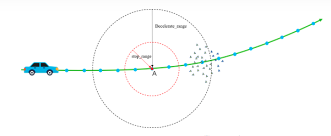

​        detectStopObstacle函数：从车辆位置开始，向后遍历一定数量的路径点(蓝色点)，对每个路径点，遍历所有的点云，如果该路径点stop_range半径内不存在点云，则切换到下一个路径点，再次遍历所有点云；


​        当在某一路径点B的stop_range范围内检测到了点云，且点云数量在合理范围内（大于points_threshold)， 则将障碍物判定为stop_obstacle，需要停车处理。代码如下：

```c++
//对当前位置后的路径点，进行障碍物检测，如果出现points_no_ground点云聚集则视为障碍物点。
int detectStopObstacle(const pcl::PointCloud<pcl::PointXYZ>& points, const int closest_waypoint,
                       const autoware_msgs::Lane& lane, const CrossWalk& crosswalk, double stop_range,
                       double points_threshold, const geometry_msgs::PoseStamped& localizer_pose,
                       ObstaclePoints* obstacle_points, EObstacleType* obstacle_type,
                       const int wpidx_detection_result_by_other_nodes)
{
  int stop_obstacle_waypoint = -1;
  *obstacle_type = EObstacleType::NONE;
  // start search from the closest waypoint
  for (int i = closest_waypoint; i < closest_waypoint + STOP_SEARCH_DISTANCE; i++)//STOP_SEARCH_DISTANCE默认是60M,沿着当前位置向后搜索
  {
    //...
    // waypoint seen by localizer
    geometry_msgs::Point waypoint = calcRelativeCoordinate(lane.waypoints[i].pose.pose.position, localizer_pose.pose);//计算定位点和路径点的相对坐标
    tf::Vector3 tf_waypoint = point2vector(waypoint);
    tf_waypoint.setZ(0);    //不考虑z轴数据，只计算平面距离

    int stop_point_count = 0;
    for (const auto& p : points)//遍历points_no_ground(去除地面后的点云图)中所有的点
    {
      tf::Vector3 point_vector(p.x, p.y, 0);
      // 2D distance between waypoint and points (obstacle)
      double dt = tf::tfDistance(point_vector, tf_waypoint);//计算障碍物点云与路径点之间的距离
      if (dt < stop_range)//dt范围内的点云均视为障碍物stop_obstacle
      {
        stop_point_count++;
        geometry_msgs::Point point_temp;
        point_temp.x = p.x;
        point_temp.y = p.y;
        point_temp.z = p.z;
        obstacle_points->setStopPoint(calcAbsoluteCoordinate(point_temp, localizer_pose.pose));
//把所有的点云放到容器中，
      }
    }
    // there is an obstacle if the number of points exceeded the threshold
    if (stop_point_count > points_threshold)//如果障碍物过于庞大，则视为不可通过，把ObstacleType状态设置为ON_WAYPOINTS。
    {
      stop_obstacle_waypoint = i;
      *obstacle_type = EObstacleType::ON_WAYPOINTS;
      break;
    }
    obstacle_points->clearStopPoints();

    // check next waypoint...
  }
}
```

​        pointsDetection函数调用detectStopObstacle() 和 detectDecelerateObstacle()两个函数，用来检测障碍物及判断控制指令是STOP还是DECELERATION，不考虑人行横道的情况下，流程图及代码如下

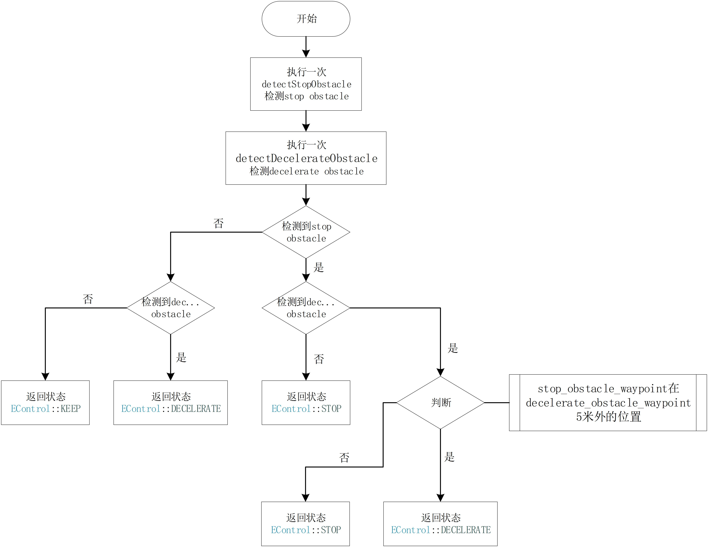

```c++
EControl pointsDetection(const pcl::PointCloud<pcl::PointXYZ>& pcl_points, const int closest_waypoint,
                         const autoware_msgs::Lane& lane, const CrossWalk& crosswalk, const VelocitySetInfo& vs_info,
                         int* obstacle_waypoint, ObstaclePoints* obstacle_points)
{
  // no input for detection || no closest waypoint
  if ((pcl_points.empty() && vs_info.getDetectionResultByOtherNodes() == -1) || closest_waypoint < 0)
    return EControl::KEEP;

  EObstacleType obstacle_type = EObstacleType::NONE;
  int stop_obstacle_waypoint =
      detectStopObstacle(pcl_points, closest_waypoint, lane, crosswalk, vs_info.getStopRange(),
                         vs_info.getPointsThreshold(), vs_info.getLocalizerPose(),
                         obstacle_points, &obstacle_type, vs_info.getDetectionResultByOtherNodes());

  // skip searching deceleration range
  if (vs_info.getDecelerationRange() < 0.01)
  {
    *obstacle_waypoint = stop_obstacle_waypoint;
    if (stop_obstacle_waypoint < 0)
      return EControl::KEEP;
    else if (obstacle_type == EObstacleType::ON_WAYPOINTS || obstacle_type == EObstacleType::ON_CROSSWALK)
      return EControl::STOP;
    else if (obstacle_type == EObstacleType::STOPLINE)
      return EControl::STOPLINE;
    else
      return EControl::OTHERS;
  }

  int decelerate_obstacle_waypoint =
      detectDecelerateObstacle(pcl_points, closest_waypoint, lane, vs_info.getStopRange(), vs_info.getDecelerationRange(),
                               vs_info.getPointsThreshold(), vs_info.getLocalizerPose(), obstacle_points);

  // stop obstacle was not found
  if (stop_obstacle_waypoint < 0)
  {
    *obstacle_waypoint = decelerate_obstacle_waypoint;
    return decelerate_obstacle_waypoint < 0 ? EControl::KEEP : EControl::DECELERATE;
  }

  // stop obstacle was found but decelerate obstacle was not found
  if (decelerate_obstacle_waypoint < 0)
  {
    *obstacle_waypoint = stop_obstacle_waypoint;
    return EControl::STOP;
  }

  // about 5.0 meter
  double waypoint_interval =
      getPlaneDistance(lane.waypoints[0].pose.pose.position, lane.waypoints[1].pose.pose.position);
  int stop_decelerate_threshold = 5 / waypoint_interval;

  // both were found
  if (stop_obstacle_waypoint - decelerate_obstacle_waypoint > stop_decelerate_threshold)
  {
    *obstacle_waypoint = decelerate_obstacle_waypoint;
    return EControl::DECELERATE;
  }
  else
  {
    *obstacle_waypoint = stop_obstacle_waypoint;
    return EControl::STOP;
  }
}
```

​        obstacleDetection函数调用pointsDetection函数实现障碍物检测功能。

```c++
EControl obstacleDetection(int closest_waypoint, const autoware_msgs::Lane& lane, const CrossWalk& crosswalk,
                           const VelocitySetInfo vs_info, const ros::Publisher& detection_range_pub,
                           const ros::Publisher& obstacle_pub, int* obstacle_waypoint)
{
  ObstaclePoints obstacle_points;
  EControl detection_result = pointsDetection(vs_info.getPoints(), closest_waypoint, lane, crosswalk, vs_info,
                                              obstacle_waypoint, &obstacle_points);
  //...
  // stop or decelerate because we found obstacles
  if (detection_result == EControl::STOP || detection_result == EControl::STOPLINE || detection_result == EControl::DECELERATE)
  {
    displayObstacle(detection_result, obstacle_points, obstacle_pub);
    prev_detection = detection_result;
    false_count = 0;
    prev_obstacle_waypoint = *obstacle_waypoint;
    return detection_result;
  }
  //...
}
```

##### ④ changeWaypoints函数

​        根据前方障碍物/停车线情况，更新vs_path内的update_waypoints_中的轨迹点速度

```c++
void changeWaypoints(const VelocitySetInfo& vs_info, const EControl& detection_result, int closest_waypoint,int obstacle_waypoint, VelocitySetPath* vs_path)
{
     double deceleration = 0.0;
     double velocity_change_limit = vs_info.getVelocityChangeLimit();

     if (detection_result == EControl::STOP || detection_result == EControl::STOPLINE)
     {
          // 在障碍物/停止线前停车
          // stop_waypoint大约距离障碍物/停车线stop_distance米远
          int stop_distance = (detection_result == EControl::STOP)
           ? vs_info.getStopDistanceObstacle() : vs_info.getStopDistanceStopline();
          deceleration = (detection_result == EControl::STOP)
           ? vs_info.getDecelerationObstacle() : vs_info.getDecelerationStopline();
          //确定与obstacle_waypoint的距离为stop_distance相对应轨迹点下标
          int stop_waypoint = calcWaypointIndexReverse(vs_path->getPrevWaypoints(), obstacle_waypoint, stop_distance);
          //基于上述信息更新update_waypoints_中的轨迹点速度
          vs_path->changeWaypointsForStopping(stop_waypoint, obstacle_waypoint, closest_waypoint, deceleration);
     }
     else
     {
          // 在障碍物前减速
          vs_path->initializeNewWaypoints();
          deceleration = vs_info.getDecelerationObstacle();
          if (detection_result == EControl::DECELERATE)
          {
               vs_path->changeWaypointsForDeceleration(deceleration, closest_waypoint, obstacle_waypoint);
           }
     }
     //避免急加速和急减速
     vs_path->avoidSuddenAcceleration(deceleration, closest_waypoint);
     vs_path->avoidSuddenDeceleration(velocity_change_limit, deceleration, closest_waypoint);
}
```

### 4.8    参考文献

 [1] 李柏，张友民，邵之江. 自动驾驶车辆运动规划方法综述[J]：控制与信息技术，2018(6)：1-6.

 [2] 靳岚，赵莉，谢黎明．基于三次Bezier三角样条插值的工业机器人连续路径轨迹规划[J]. 机械设计与制造工程,2019,48(4)：35-39.

 [3] 杜卓洋，无人驾驶车辆轨迹规划算法研究[D]. 杭州：浙江大学，2019.

 [4] 创客智造. autoware 入门教程一使用rosbag数据生成路径点[DB/OLJ.[2020-04-11].https://www.ncnynl.com/archives/201910/3413.html.

 [5] 创客智造. autoware 入门教程一使用rosbag数据进行路径规划[DB/OL].[2020-04-11].https://www.ncnynl.com/archives/201910/3414.html.

 [6] 何武. 室内服务机器人的导航研究[D]. 合肥：中国科学技术大学,2011.

 [7] 邓鹏，张杭，申有吉．基于改进 Dijkstra 算法在智能导航中的应用[J]. 新型工业化，2019,9 (12) : 91-95.

 [8] 顾青，豆风铅，马飞. 基于改进A*算法的电动车能耗最优路径规划[J]. 农业机械学报，2013,46 (12): 321-327.

 [9] 徐磊. 基于 EPS 的自动泊车路径规划及跟综控制研究[D]. 合肥：合肥工业大学,2017.

<span id="jump5.0"></span>

## 五、Autoware 控制模块解析

​        Autoware控制模块的主要作用为获取车辆路径规划的结果，在车辆运动学和动力学约束下计算相应的控制指令，包括速度角速度等，接着发布控制指令到车辆底盘执行。

​        在当前场景下主要讲解纯跟踪控制算法。

<span id="jump5.1"></span>

### 5.1    节点pure_pursuit

​        节点pure_pursuit主要作用：接收velocity_set节点发布的“final_waypoints”，计算自车下一时刻的速度、角速度指令并发布“twist_raw”话题

#### 5.1.1    启动方法

* 终端启动:
  
  - roslaunch pure_pursuit pure_pursuit.launch
  - 从Runtime Manager启动:

​       打开Runtime Manager，上方computing 选项卡 -> motion_planner ->waypoint_follower->pure_pursuit，单击 [app] 按钮可更改设置等参数。

#### 5.1.2    程序路径

```java
src/autoware/core_planning/pure_pursuit
```

#### 5.1.3    参数详情

| 参数名                        | 类型     | 说明     |
| -------------------------- | ------ | ------ |
| lookahead_ratio            | double | 预瞄距离系数 |
| minimum_lookahead_distance | double | 最小预瞄距离 |

#### 5.1.4    代码注解

##### ① main函数

​        main函数在pure_pursuit_node.cpp中，主要功能为创建PurePursuitNode对象的实例ppn，ppn的构造函数里配置相关参数，确定相关订阅者和发布者，ppn.run函数实现主要功能。

```c++
#include <pure_pursuit/pure_pursuit_core.h>
int main(int argc, char** argv)
{
 ros::init(argc, argv, "pure_pursuit");
 waypoint_follower::PurePursuitNode ppn;
 ppn.run();

 return 0;
}
```

##### ② run函数

​        函数首先检测节点所需消息输入是否正常接收，If函数中的判断条件时回调函数中的是否成功接收消息的标志，在这里要求三个标志必须为true程序才能继续往下进行，否则提示必要的话题没有接收成功，并在此等待。if函数对纯跟踪节点的运行条件做了筛查，以确保输入正确。

​        接着通过setLookaheadDistance函数对预瞄距离lookahead_distance_进行设置，其值根据computeLookaheadDistance函数获得。

​        随后调用canGetCurvature函数寻找下一目标点与当前位置是否可以得到合理运动曲线并计算出相应的曲率。

​        最终把得到的曲率计算出相应的指令发布出去。

```c++
void PurePursuitNode::run()
{
     ros::Rate loop_rate(update_rate_);
     while (ros::ok())
     {
      ros::spinOnce();
      //判断消息是否正常接收
      if (!is_pose_set_ || !is_waypoint_set_ || !is_velocity_set_)
      {
           if (!is_pose_set_)
           { 
                ROS_WARN_THROTTLE(5, "Waiting for current_pose topic ...");
           }
           if (!is_waypoint_set_)
           { 
                ROS_WARN_THROTTLE(5, "Waiting for final_waypoints topic ...");
           }
           if (!is_velocity_set_)
           { 
                ROS_WARN_THROTTLE(5, "Waiting for current_velocity topic ...");
           }
           loop_rate.sleep();
           continue;
      }

      //设置预瞄距离
      pp_.setLookaheadDistance(computeLookaheadDistance());
      pp_.setMinimumLookaheadDistance(minimum_lookahead_distance_);

      //寻找下一目标点并计算曲率判断是否是有效曲线
      double kappa = 0;
      bool can_get_curvature = pp_.canGetCurvature(&kappa);

      //发布控制命令
      publishControlCommands(can_get_curvature, kappa);
      health_checker_ptr_->NODE_ACTIVATE();
      health_checker_ptr_->CHECK_RATE("topic_rate_vehicle_cmd_slow", 8, 5, 1, "topic vehicle_cmd publish rate slow.");
      // Rviz中可视化
      pub11_.publish(displayNextWaypoint(pp_.getPoseOfNextWaypoint()));
      pub13_.publish(displaySearchRadius(pp_.getCurrentPose().position, pp_.getLookaheadDistance()));
      pub12_.publish(displayNextTarget(pp_.getPoseOfNextTarget()));
      pub15_.publish(displayTrajectoryCircle(
        waypoint_follower::generateTrajectoryCircle(pp_.getPoseOfNextTarget(), pp_.getCurrentPose())));
      if (add_virtual_end_waypoints_)
      {
           pub18_.publish(displayExpandWaypoints(pp_.getCurrentWaypoints(), expand_size_));
      }
      std_msgs::Float32 angular_gravity_msg;

      //计算横向加速并发布
      angular_gravity_msg.data = computeAngularGravity(computeCommandVelocity(), kappa);
      pub16_.publish(angular_gravity_msg);

      //计算自车与跟踪路径曲线的横向误差
      publishDeviationCurrentPosition(pp_.getCurrentPose().position, pp_.getCurrentWaypoints());

      is_pose_set_ = false;
      is_velocity_set_ = false;
      loop_rate.sleep();
     }
} 
```

##### ③ computeLookaheadDistance函数

​        computeLookaheadDistance函数利用车速的倍数作为预瞄距离，速度越大预瞄距离越远，速度越小预瞄准距离越近。在最小预瞄距离，参考值，最大预瞄距离中的中间值作为返回值。

```c++
double PurePursuitNode::computeLookaheadDistance() const
{
     if (velocity_source_ == enumToInteger(Mode::dialog))
     {
          return const_lookahead_distance_;
     }

     const double maximum_lookahead_distance = current_linear_velocity_ * 10;
     const double ld = current_linear_velocity_ * lookahead_distance_ratio_;

     return ld < minimum_lookahead_distance_ ? minimum_lookahead_distance_ :
                         ld > maximum_lookahead_distance ? maximum_lookahead_distance : ld;
}
```

##### ④ canGetCurvature函数

```c++
bool PurePursuit::canGetCurvature(double* output_kappa)
{  
     // 寻找下一个跟踪路径点
     getNextWaypoint();
     if (next_waypoint_number_ == -1)
     {
          ROS_INFO("lost next waypoint");
          return false;
     } 
     // 遍历路径点序列中的每一个点到当前位置的距离是否大于预瞄距离从而判断曲线是否合理
     bool is_valid_curve = false;
     for (const auto& el : current_waypoints_)
     { 
          if (getPlaneDistance(el.pose.pose.position, current_pose_.position) > minimum_lookahead_distance_)
          {
               is_valid_curve = true;
               break;
          }
     } 
     if (!is_valid_curve)
     { 
          return false;
     }
     // 检查是否是第一个点、最后一个点或者不能线性插值的情况
     if (!is_linear_interpolation_ || next_waypoint_number_ == 0 ||
       next_waypoint_number_ == (static_cast<int>(current_waypoints_.size() - 1)))
     {
          next_target_position_ = current_waypoints_.at(next_waypoint_number_).pose.pose.position;
          *output_kappa = calcCurvature(next_target_position_);
          return true;
     }

     // 线性插值
     const bool interpolation = interpolateNextTarget(next_waypoint_number_, &next_target_position_);

     if (!interpolation)
     {
          ROS_INFO("lost target!");
          return false;
     }

     //计算曲率
    *output_kappa = calcCurvature(next_target_position_);
     return true;
} 
```

##### ⑤ calcCurvature函数

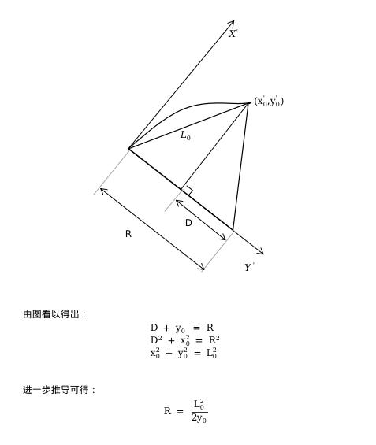

```c++
double PurePursuit::calcCurvature(const geometry_msgs::Point& target) const
{
     double kappa;
     const geometry_msgs::Point pt = calcRelativeCoordinate(target, current_pose_);
     const double denominator = pt.x * pt.x + pt.y * pt.y;
     const double numerator = 2.0 * pt.y;

     if (denominator != 0.0)
     {
          kappa = numerator / denominator;
     }
     else
     {
          kappa = numerator > 0.0 ? KAPPA_MIN_ : -KAPPA_MIN_;
     }
     return kappa;
}
```

##### ⑥ publishTwistStamped函数

​        publishTwistStamped函数用来发布twist_cmd话题，发布消息主要包含线速度（linear.x)和角速度（angular.z），其值分别为computeCommandVelocity函数的结果和曲率与速度的乘积。

```C++
void PurePursuitNode::publishTwistStamped(const bool& can_get_curvature, const double& kappa) const
{
     geometry_msgs::TwistStamped ts;
     ts.header.stamp = ros::Time::now();
     //计算速度和角速度的值
     ts.twist.linear.x = can_get_curvature ? computeCommandVelocity() : 0;
     ts.twist.angular.z = can_get_curvature ? kappa * ts.twist.linear.x : 0;
     pub1_.publish(ts);
}

double PurePursuitNode::computeCommandVelocity() const
{
     if (velocity_source_ == enumToInteger(Mode::dialog))
     {
          return getSgn() * kmph2mps(const_velocity_);
     }
     return command_linear_velocity_;
} 
```

<span id="jump5.2"></span>

### 5.2    节点twist_filter

​        节点twist_filter的主要作用：对pure_pursuit节点发布的速度进行滤波处理。

#### 5.2.1    启动方法

* 终端启动:
  
  - roslaunch twist_filter twist_filter.launch
  - 从Runtime Manager启动:

​       打开Runtime Manager，上方computing 选项卡 -> motion_planner ->waypoint_follower->twist_filter，单击 [app] 按钮可更改设置等参数。

#### 5.2.2    程序路径

```java
src/autoware/core_planning/twist_filter
```

#### 5.2.3    代码注解

##### ① main函数

​        main函数在twist_filter_node.cpp中,主要作用为构造TwistFilterNode对象node。

```c++
int main(int argc, char** argv)
{
     ros::init(argc, argv, "twist_filter");
     twist_filter_node::TwistFilterNode node;
     ros::spin();
     return 0;
}
```

##### ② TwistFilterNode构造函数

```c++
TwistFilterNode::TwistFilterNode() : nh_(), pnh_("~"), health_checker_(nh_, pnh_)
{
    // 设置参数
    twist_filter::Configuration twist_filter_config;
    nh_.param("vehicle_info/wheel_base", twist_filter_config.wheel_base, 2.7); 
    //...(下略)

    // 订阅者
    twist_sub_ = nh_.subscribe("twist_raw", 1, &TwistFilterNode::twistCmdCallback, this);
    //...(下略)

    // 发布者
    twist_pub_ = nh_.advertise<geometry_msgs::TwistStamped>("twist_cmd", 5);
    ctrl_pub_ = nh_.advertise<autoware_msgs::ControlCommandStamped>("ctrl_cmd", 5);

    //...(下略)
}
```

##### ③ twistCmdCallback函数

​        接收的消息包含速度v和角速度Omega,根据v和Omega进行横向加速度的约束限制，接着对输出的速度和角速度进行一阶低通滤波处理并发布。

```c++
void TwistFilterNode::twistCmdCallback(const geometry_msgs::TwistStampedConstPtr& msg)
{
    const twist_filter::Twist twist = { msg->twist.linear.x, msg->twist.angular.z };
    ros::Time current_time = ros::Time::now();

    static ros::Time last_callback_time = current_time;
    static twist_filter::Twist twist_prev = twist;

    double time_elapsed = (current_time - last_callback_time).toSec();
    health_checker_.NODE_ACTIVATE();
    checkTwist(twist, twist_prev, time_elapsed);
    twist_filter::Twist twist_out = twist;

    // 横向加速度限制
    auto twist_limit_result = twist_filter_ptr_->lateralLimitTwist(twist, twist_prev, time_elapsed);
    if (twist_limit_result)
    {
        twist_out = twist_limit_result.get();
    }
    //...(下略)
    if (enable_smoothing_)
    {
        // 平滑处理
        twist_out = twist_filter_ptr_->smoothTwist(twist_out);
    }
    // 发布滤波后的twist指令
    geometry_msgs::TwistStamped out_msg = *msg;
    out_msg.twist.linear.x = twist_out.lx;
    out_msg.twist.angular.z = twist_out.az;
    twist_pub_.publish(out_msg);
    //...(下略)

    // 记录当前指令和时间
    twist_prev = twist_out;
    last_callback_time = current_time;
}
```

<span id="jump5.3"></span>

### 5.3    节点listener_car_drive

​        listener_car_drive节点主要作用：将Autoware发布的速度信息发送给底盘单片机，控制底盘运动。

#### 5.3.1    启动方法

* 终端启动:
  
  - python3 listener_car_drive.py

#### 5.3.2    程序路径

```java
~/car_av/listener_car_drive.py
```

#### 5.3.    通信协议

​        电脑与底盘通信时，电脑上位机发送14位16进制数据。

​        帧头为`a5 11 01`，帧尾为`0d 0a`，第10位为控制位，`01`为刹车，`02`为前进，`03`为电机初始化。第11、12位为校验位，采用crc16校验。

```python
'a5 11 01 ' + speed_direction + speed + angle_direction + angle + '02' + check_1 + check_2 + ' 0d 0a'
```

##### ① 速度方向控制

​        速度方向控制speed_direction代表线速度方向，`01`为前进，`00`为后退。共1位。

##### ② 速度控制

​        速度控制speed代表线速度(车速)，原始单位为`m/s`，此处将电脑控制端发送的速度值乘以100，便于单片机以`int`形式接收。共两位。

##### ③ 角速度方向控制

​        角速度方向控制angle_direction代表角速度方向，`01`为正向，`00`为反向。共1位。

##### ④角速度控制

​        角速度控制angle代表车辆角速度，原始单位为`rad/s`,此处将电脑控制端发送的角速度值乘以100，便于单片机以`int`形式接收。共两位。

通信协议demo：

```
a5 11 01 01 1f ff 01 0f ff 02 check_1 check_2 0d 0a
```

#### 5.3.3    代码注解

##### ① main函数

​        main函数启动了三个独立的线程来接收转换过的控制命令、获取车辆速度、将速度发送给底盘单片机控制线控底盘运动。

```python
if __name__ == '__main__':
    rosrun_start = Thread(target=start_rosrun)
    speed_angle = Thread(target=get_value)
    car = Thread(target=car_control)

    rosrun_start.start()
    speed_angle.start()
    car.start()

    rosrun_start.join()
    speed_angle.join()
    car.join()
```

##### ② start_rosrun函数

​        start_rosrun函数相当于在终端启动了`rosrun vehicle_ctl vehicle_cmd_`命令来转换速度消息。

```python
# 启动控制命令转换节点
def start_rosrun():
    os.system('rosrun vehicle_ctl vehicle_cmd_')
```

##### ③ get_value函数

​        get_value函数初始化了ros节点，并定义了callback回调函数接收车辆速度及角速度信息。

```python
def get_value():
    global break_f
    time.sleep(0.5)

    def callback(data):
        global angle
        global speed
        global break_f
        value = data.v_cmd
        speed = value[0]
        speed = round(float(speed), 4)
        angle = value[1]
        angle = round(float(angle), 4)
    rospy.init_node('listener', anonymous=True, disable_signals=True)
    rospy.Subscriber('speed_pub', cmd, callback)
    rospy.spin()
```

##### ④ car_control函数

​        car_control函数打开名为/dev/car的串口，将速度、角速度信息发送给线控底盘单片机，控制车辆运动。

```python
def car_control():
    global speed
    global angle
    global break_f
    ser = car_drive()
    # 打开串口
    ret = ser.open_car('/dev/car', 115200)
    # 判断串口是否打开，当串口成功打开，则将接收到Autoware反馈的速度信息发送给串口
    if ret == 1:
        while True:
            print('速度=', speed)
            print('角速度=', angle)
            if break_f == 0:
                ret = ser.write_car(run(speed, angle))
                if ret == 1:
                    print('write ok')
                else:
                    print('write error')
            time.sleep(0.033)
```

### 5.4    参考文献

 [1] 龚建伟，姜岩，徐威. 无人驾驶车辆模型预测控制[M]，北京：北京理工大学出版社，2014.

 [2] 田大新,段续庭等. Autoware与自动驾驶技术，北京：科学出版社，2020.

 [3] Jarrod M S. Automatic steering methods for autonomous automobile path tracking[R]. Pittsburgh: Catnegie Mellon University, 2009.

 [4] 陈宁，周志峰，王永泉，等. 一种纯追踪模型改进算法. 轻工机械[J] ,2014,32(4):69-72.

 [5] 韩亚奇. 高速公路环境中智能车辆路径规划与跟踪[D]. 南宁：广西大学，2019.

 [6] ShinpeiKato.Autoware_TierIV_Academy_v1.1[DB/OLJ.[2020-04-22]]. https://github.com/CPFL/Autoware-Manuals/blob/master/en/Autoware_TierIV_Academy_v1.1.pdf.
